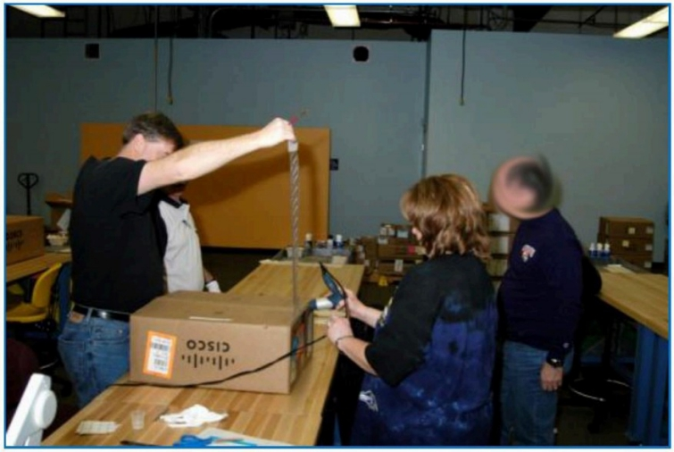
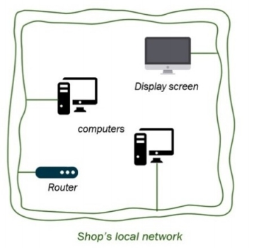
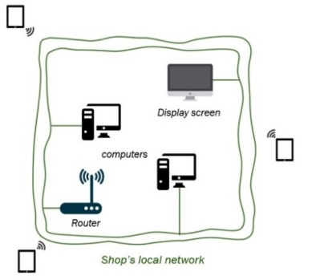
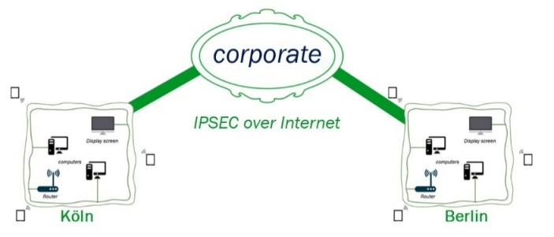

# 准备和鼓舞人心的讲话

"运气是机会与准备相遇的地方。"  --塞内卡(Seneca)

## 你说那件外套要3万美元？
在纽约第五大道或其他高档大街上漫步时，你有没有想过——大型豪华商店明亮、闪亮的外墙背后隐藏着什么？技术如何处理每天数百次的销售？什么信息系统运行电视屏幕广播时尚节目7*24小时？

由于你有天赋的好奇心，我相信你对这些想法并不陌生。 然而，我想与大家分享一个想法这将激起你的好奇心：如果银行，最偏执的私营公司之一，努力保护他们的系统，那么这些豪华制鞋店如何保持他们的系统安全？

为了回答这个问题，使这次旅行尽可能现实和愉快，我们将考虑一个假想的奢侈品牌，称为吉布森鸟。他们在世界各地都有地点，在商场和著名的大街上都有。他们以自己是高科技的现代时尚品牌而自豪。

让我们来谈谈pwning策略吧！

### 圣杯
作为攻击者，我们的目标不是破解所有具有 IP 地址的东西。为什么在只有少数服务器保存我们所追求的数据时，还要经过 50，000 台无用的服务器？

我们将根据吉布森鸟的复杂性和规模来调整我们的努力——当然，除了偶尔的诱惑之外。谁能抵制 Windows 2003 SP2 服务器与开放的 SMB 端口(说明：MS08-067 vulnerability allows remote execution code without authentication on Windows 2003 SP2. The exploit code is publicly available at: `https://www.exploit-db.com/exploits/7104/`)？！

理想情况下，我们希望：
- 窃取国内每家商店的财务记录：信用卡数据、销售数量等。
- 下载每位设计师、经理和执行董事会成员的个人数据
- 记录董事会会议讨论秘密战略计划

这是非常雄心勃勃的，即使是几页内容也够我们忙的。

那么，我们从哪里开始呢？我们如何从互联网地图上的随机点到纽约摩天大楼90楼的董事会会议？

在《How to Hack Like a Pornstar》（参阅`https://github.com/xncoder/HackPornstar`）中，我们使用了两种非常常见的方法来渗透银行网络：
- 攻击银行基础设施上托管的公共网站
- 对员工实施网络钓鱼并诱骗他们执行恶意代码，从而提供远程访问权限

这是所有很好的乐趣，但这次我们想遵循更深奥的道路。我们将展示具有物理访问权限的攻击者如何造成伤害，从而迅速升级为媒体 （错误地） 称为高级持久性威胁 （APT）。

广泛的想法是在吉布森鸟的许多商店之一种植一小块硬件。此硬件充当小型计算机，让我们访问该店的本地网络，然后我们将利用该网络升级为公司，并在全国所有其他商店进行访问。

你会认为我们需要特殊的硬件和工程技能来实现这个好莱坞式的举动。我们没有。我们将逐步介绍如何建立一个有效的小后门，费用约为30美元。

虽然大多数闲暇时间黑客不会选择走种植硬件的道路，这是情报和联邦机构在多个国家的路径。

这是有道理的。当您可以拦截新订购的设备，安装微芯片，并访问流经设备的任何流量时，为什么还要努力查找（通常是不稳定的）0day漏洞？

以国家安全局为例，根据斯诺登的文件，这是他们最喜欢的策略之一。

### 藏宝图
在深入探讨核心主题，黑客吉布森鸟，有必要商定一些基本假设，以充分把握我们即将采取的每一个步骤的目的。我们必须花时间去思考吉布森鸟的环境限制，这可能导致他们做出可预测的网络选择。

此准备阶段非常重要，因为它可以极大地帮助我们制定和明确最佳的攻击计划，尤其是在网络内部。

吉布森鸟有100多家商店。每个商店都必须有一个连接其所有设备的本地网络。就像您的家庭网络一样，商店中的计算机都有专用 IP 地址，可保护它们免受未经请求的传入 Internet 流量的传输。因此，我们预计 192.168.1.0/24 范围内（有时 172.16.0.0/16）的网段。

当我们观览一个本地商店时，我们看到销售人员使用ipad，表面上是为了优化工作流程并快速登录新客户。

因此，让我们在假设的网络布局中添加WiFi连接：

销售记录和报告必须实时或在每个工作日结束时发送给公司，因此应该有某种通道将所有商店连接到总部的主网络。

当然，计算机或销售人员与公司的连接可能有一些限制，但我们稍后会讨论。

我们可以想象每个国家都遵循同样的网络拓扑结构，其中公司是代表任何一个国家内的品牌的法律实体。

公司层面的一些服务甚至可以在国家之间共享，以优化成本，但出于实际和法律原因，商店更可能保持独立。不管怎样，我们一进去就能看得更清楚。

当我们在国外网络中可能像在迷宫中导航时，我们需要将这幅画面记在脑中。我们会一路更新这个布局，但主要的一点是，虽然商店可能会保存一些临时的销售数据，但我们追求的是总部的信息系统。这就是我们的圣杯！

> 翻译：Ryan 2020/1/13 

