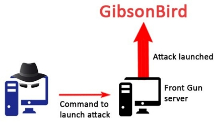
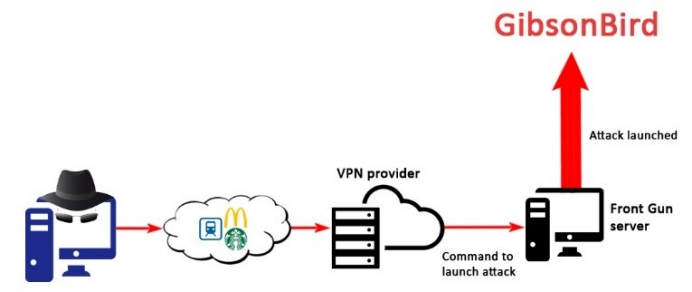
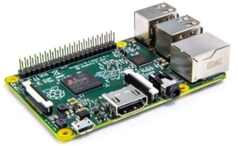
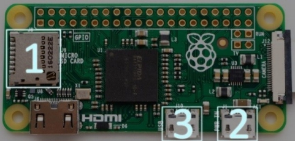
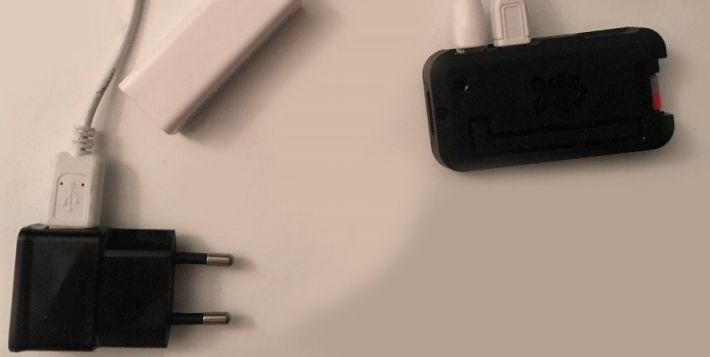
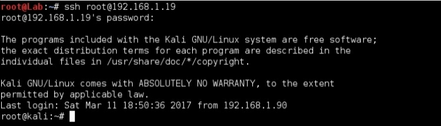

# 整装待发

<b>
"人必须塑造他的工具，以免它们塑造他。"  --阿瑟·米勒(Arthur Miller) 
</b>

<br><br>


如前所述，这个想法是在吉布森鸟的许多商店之一种植一个小硬件后门。
此植入物将连接到我们的计算机，使我们能够远程访问他们的本地网络。我说"我们的电脑"，但它更多的是一个匿名服务器托管在互联网上某处。在我之前的书 - 《How to Hack Like a Pornstar》（参阅`https://github.com/xncoder/HackPornstar`） - 我详细介绍了一些常见的设置，用于渗透工作。不过，为了完整起见，我将简要回顾一些基本的预防措施。

## 多层方法
我们的攻击服务器，一个接收和发出所有攻击命令，是一个使用加密货币比特币租用的私人服务器，使其更难跟踪通过支付系统。

您可以在以下 URL 中找到可行供应商的列表（参考`http://cryto.net/~joepie91/bitcoinvps.html`）。我们将在后续文章内容称此机器为前置服务器（Front Gun Server）。它运行着一个KALI Linux发行版，这是一个专用的操作系统，附带许多渗透测试/黑客工具。


尽管他们公开同意不披露连接日志（以及其用户的源 IP 地址），但完全信任 VPN 提供商或 TOR 是可笑的。

这就是为什么避免使用家庭/大学/工作IP地址至关重要的原因。相反，更应该通过公共Wi-Fi（咖啡厅、火车站等）连接，以确保深度保护。


至于你的本地计算机，你可以选择一个易失性操作系统，它只存在于内存中且像USB插件式插入。这样，每次启动时，你都会重新启动，没有任何数据可以证明你有罪。所有从GibsonBird收集到的黑客工具和数据都只存在于前置服务器（Front Gun Server）上。

在下面的页面中，您可以学习创建一个“live USB”来运行任何Linux发行版(参阅`http://docs.kali.org/downloading/kali-linux-live-usb-install`)。TAILS和WHONIX操作系统在隐私领域取得了一些成功，但是任何Linux发行版都可以做到。

我们的攻击基础设施现在已经完全投入使用了——这是最简单的部分——让我们专注于硬件植入。

## 神奇的berry

### 为成功而购物
与大多数好莱坞电影中可能看到的相反，我们的硬件植入物不会是一英寸芯片，我们粘在某处黑暗的房间里的电缆上，尽管图像离现实不远。我们将依靠在DIY领域取得巨大成功并征服了许多科技爱好者的心的技术：树莓派（the Raspberry PI）。

树莓派是一个光秃秃的电路板，它包含了运行微型计算机的基本部件。它没有屏幕，键盘，鼠标，或任何其他花哨的附加组件，但我们将设法让它恰到好处的工作。


从技术上讲，我们可以使用任何模型（A、A+、B或0）(说明：当前树莓派版本可能已经有变化，具体参阅官网`https://www.raspberrypi.org/products/`)，主要区别在于大小和计算能力。

但为了隐蔽起见，我们会选择最小的一个称为PI 0：长66mm（2.5英寸），宽35mm（1.1英寸）。

PI 0有512MB的RAM和1Ghz的单核CPU。这看起来不算什么，但足以在一个价值数百万美元的品牌网络中造成严重破坏。



1、Micro-SD卡插槽。PI没有硬盘，所以我们需要插入一个包含要启动的操作系统的Micro SD卡。我们将选择Raspberry KALI版本，尽管理论上任何Linux发行版都可以。

2、微型USB为PI供电。

3、第二个微型USB接口，我们可以插入RJ45适配器，例如将PI连接到路由器。

总的来说，我们需要购买以下物品才能拥有一个功能齐全的后门：<br>
- 树莓 PI 0 （约5美元）<br>
- 微型 USB 以太网连接器 （约6美元）<br>
- 微型 USB 电源插头，如果您还没有电源插头（约3美元）<br>
- 16GB 微型 SD 卡 （约8美元）<br>
- 隐藏设备的硬黑色盖盒（约8美元）<br>

总共30美元（当前树莓派的版本和价格可能有变动，请参考官网`https://www.raspberrypi.org/`）！



### 准备启动
一旦我们有了所有的资料，我们就需要准备操作系统，以便在PI 0上运行。如前所述，我们将选择KALI Linux的ARM版本。它附带了执行任务所需的大多数黑客脚本和工具。

从官方网站（下载链接`https://www.offensive-security.com/kali-linux-arm-images/`）下载“.img”文件后，我们需要使用适当的成像工具将其写入SD卡。如果你的实验机在Windows上，Win32DiskImager(下载链接`https://sourceforge.net/projects/win32diskimager/`)就可以。
> 提示：在Linux上运行dmesg命令以了解分配给SD卡的设备名

刻录Kali映像会在SD卡上创建两个分区：
- 启动Kali的引导分区。
- 包含操作系统和未来数据的分区。这个分区的格式是EXT4，所以在Windows上看不到它。

从技术上讲，我们的SD卡包含一个运行正常的操作系统，当我们插入PI 0时，它将完美启动运行。

但是，由于我们没有键盘或监视器来跟踪引导过程并与机器交互，我们需要做一个小调整：我们需要确保SSH服务器在引导时启动！SSH代表Secure Shell并提供对Linux机器的远程访问。

我们将SD卡插入一台运行Linux发行版的机器（例如USB上的Live Ubuntu），然后在第二个分区中的“/etc/rc.local”文件中添加一行。

如前所述，此分区不能在Windows上查看，因此需要一个Unix风格的系统。
```
# Print the IP address
_IP=$(hostname -I) || true
if [ "$_IP" ]; then
 printf "My IP address is %s\n" "$_IP"
fi

# Add the following line to have SSH at boot
sudo /etc/init.d/ssh start
exit 0
```

就这样！一旦我们将PI Zero连接到电源，它将在几秒钟后自动引导并启动SSH服务器。

为了找到PI 0的地址，我们只需“ping”试验网段中的所有可用地址（在我的例子中是192.168.1.0/24）。

ping命令将向所有机器发送一个“hello”数据包，并等待答复以确定哪些机器正在运行。我们可以使用已经默认安装在Kali上的nmap。
```
root@lab:~# nmap -sP 192.168.1.0/24
Starting Nmap 7.01 ( https://nmap.org ) at 2017-03-08 20:27 CET
[…]
Nmap scan report for 192.168.1.19
Host is up (0.0032s latency).
MAC Address: 00:E0:4C:56:19:CD (Realtek Semiconductor)
[…]
```

一旦我们有了PI 0的IP地址，我们就可以在Linux上使用ssh命令或在Windows上使用putty(下载链接`https://www.chiark.greenend.org.uk/~sgtatham/putty/latest.html`)工具连接到它。默认凭据为root/toor：


我们显然要做的第一件事是更改密码和主机名，以便以后可以方便地进行操作：
```
root@kali:~ $ passwd
Changing password for root
(current) UNIX password: 
Enter new UNIX password: 
root@kali:~ $ echo 'PIspy' > /etc/hostname
root@kali:~ $ reboot
```

### 天空中的桥梁
@23page


> 翻译：Ryan 2020/2/17

