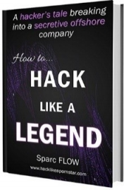

# 闭幕词

我希望你喜欢这本Hack the Planet系列的第二本书(第一本参阅https://github.com/2hu2huxia/HackPornstar)，最重要的是，你学到了新的技术和酷的技巧，帮助你在阅读有关高级持续威胁（APT）攻击的新闻报道时进行交战并形成自己的观点……这并不总是如他们所说的那样。

最后，请记住，黑客攻击并不是关于工具甚至技术的——它们很快就会消失。它是关于好奇心的精神（和强迫症的鞭子）。

Have fun pwning the world!

原文作者：sparc.flow@hacklikeapornstar.com

## 作者还有更多系列书籍
### 《How to Hack Like a LEGEND》
书籍内容描述：这是一个黑客的故事，他面临着机器学习、行为分析、人工智能和一个专门的SOC团队，同时闯入了一家离岸服务提供商。大多数黑客工具只是在如此恶劣的环境中崩溃和烧毁。 

### 《How to Investigate Like a Rockstar》
书籍内容描述：我们跟踪攻击者在各种系统中的足迹，并创建一个感染时间线来帮助我们了解他们的动机。我们深入到内存分析、完美的磁盘拷贝、威胁搜索和恶意软件分析，同时分享对实际危机管理的见解。 

> 翻译：Ryan 2020/2/25

